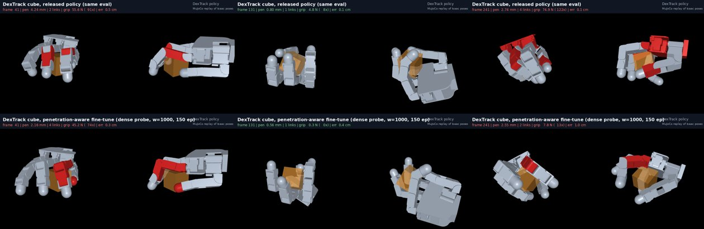
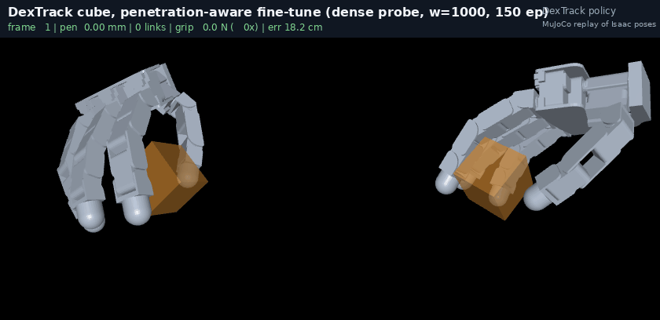
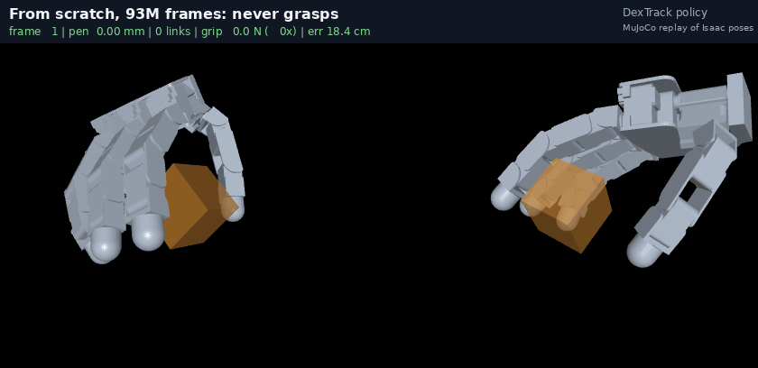
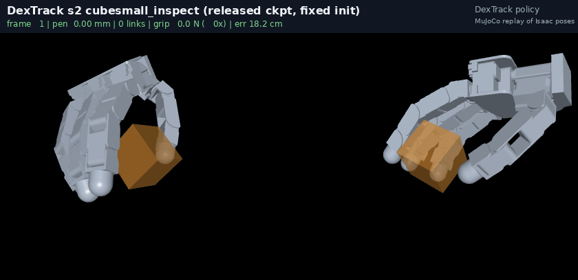
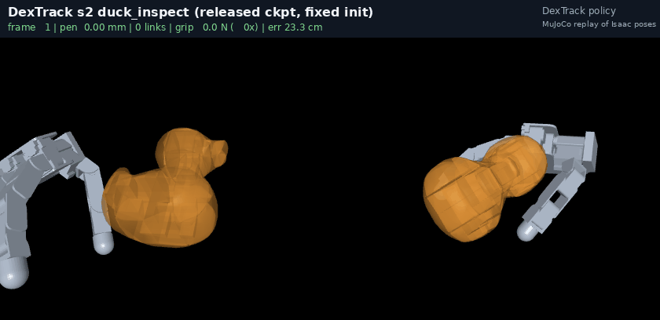
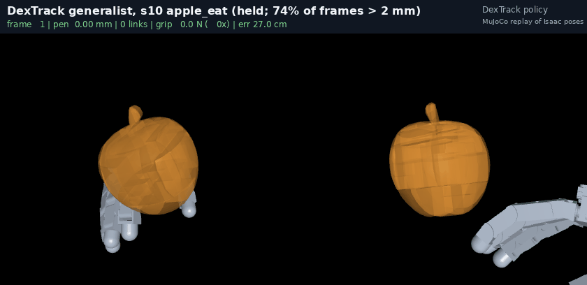
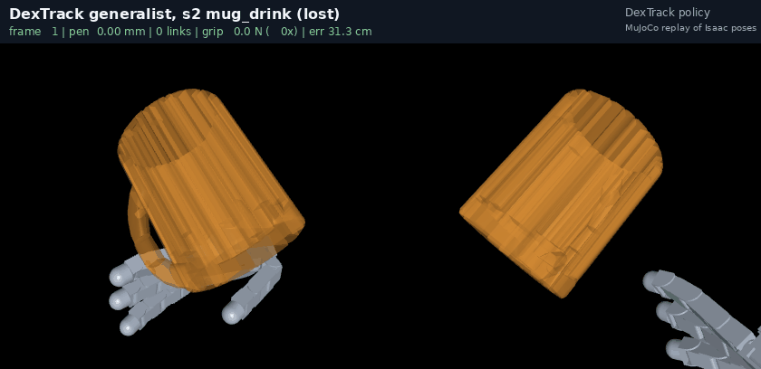
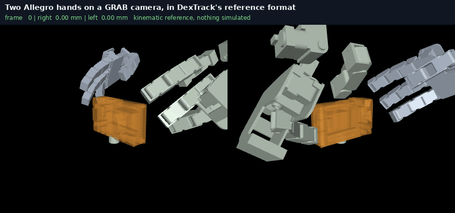

# dextrack-bimanual-sim

[](dextrack/README.md)
[](dextrack/render.py)
[](https://github.com/luaiabuelsamen/dextrack-bimanual-sim/actions/workflows/ci.yml)
[](LICENSE)

Dexterous hand-object tracking from human motion, measured where the
published metric cannot see: **does the hand hold the object, or is it
inside it?** [DexTrack](https://meowuu7.github.io/DexTrack/)'s released
code, data and checkpoints run here in Isaac Gym on a rented GPU with a
per-frame penetration probe in the loop, as an audit of their policies and
as a reward term in their trainer. The target is two hands on one object
from [GRAB](https://grab.is.tue.mpg.de/), trained and evaluated at scale in
the same trainer. Every number below was measured a second way before it
was written down; **[NOTES.md](NOTES.md) is the log and is authoritative.**

## Where this stands (2026-09-18)

| deliverable | state | the number |
|---|---|---|
| **D1 · Audit DexTrack's released policies with penetration read live** | done | their release cannot run its own checkpoints; fixed, two of three per-clip policies track at 1–2 mm of interpenetration; the generalist holds 17 of 43 GRAB clips at a median 1.7 mm |
| **Penetration as a reward term in their trainer** | done, bounded | a per-clip policy gives up a fifth to a quarter of its interpenetration and half its grip (two seeds: one keeps all 16 rollouts, one loses 4 of 16); the generalist on a marginal clip lets go instead |
| **D2 · Our MuJoCo pipeline on DexTrack's rule** | done | 20 of 40 references hold under perturbation; 6 strict / 13 loose of 40 on their rule, 16 of 40 on ours |
| **D4 · One two-handed GRAB clip, two Allegro hands, in their trainer** | two-hand reference built and rendered | the left hand they do not ship is built and verified, and a two-hand reference in their format is rendered with the probe on each hand. Their own references turn out to sit 3.2 to 8.8 mm inside the object before anything is simulated |

The goal, the guardrails and D4's stop rules: **[docs/BRIEF.md](docs/BRIEF.md)**.
The evidence behind every row: **[docs/STAGE2.md](docs/STAGE2.md)**.

## DexTrack's policies, in their simulator, under our probe

**The release does not run its own checkpoints.** The hand is created at
zero joint pose on top of the object, the first physics step launches the
object, and the reset snapshot is taken after that step, so every episode
starts with the object mid-flight. A second bug ejects an object born
exactly on the ground plane. Two switchable fixes
([`dextrack/task_hook.diff`](dextrack/task_hook.diff)) make the released
policies track; the issue text is in
[docs/dextrack_issue_draft.md](docs/dextrack_issue_draft.md).

**What they do to the object once they run.** Penetration is geometric:
the URDF collision primitives against the convex parts their simulator
collides, read every frame from logged poses ([`dextrack/audit.py`](dextrack/audit.py)).

| checkpoint | tracking error | interpenetration | frames over 2 mm | held |
|---|---:|---:|---:|---|
| `s2_cubesmall_inspect` | 0.44 cm | 1.75 mm mean | 33 % | yes |
| `s2_duck_inspect` | 0.26 cm | 2.28 mm | 50 % | yes |
| `s2_flute_pass` | lost mid-clip | | | no |
| generalist, 43 GRAB clips | | median 1.7 mm | 36 % | 17 of 43; their own counter reads 0 of 43 |

Small, real, and not the burial our own pipeline had (8–14 mm at hundreds
of times the object's weight). Their metric never measures it.

**A penetration term in their reward.** The probe made cheap enough to run
every control step for a thousand environments
([`dextrack/penetration_torch.py`](dextrack/penetration_torch.py): 33k
surface points per hand on a 2 mm grid, the object as a 1 mm signed-depth
volume, 64 ms per step at 1024 environments), subtracted from their reward
per metre of depth. Fine-tuned from the released cube checkpoint, 150
epochs, judged at 16 environments by the exact plane test on the same grid,
never by the measure it trained on:

| trained on | interpenetration | frames > 2 mm | grip on touching links | error | held |
|---|---:|---:|---:|---:|---:|
| nothing (released) | 2.87 mm | 60 % | 106× weight | 0.14 cm | 16 of 16 |
| a sparse 20-point probe | 2.23 mm | 47 % | 68× | 0.29 cm | 16 of 16 |
| **the dense probe**, seed 1 | **2.12 mm** | **42 %** | **47×** | 0.41 cm | **16 of 16** |
| the dense probe, seed 2 | 1.87 mm (2.17 on the 12 held) | 34 % | 57× | 5.6 cm | 12 of 16 |

Seed 2 shows the trade the term can make: less interpenetration on the rollouts that hold, and four rollouts lost. Two seeds are not a distribution; the range is what to quote. The sparse row is the record of a mistake: that probe reported 1.18 mm for
its own policy, because the policy had learned to keep the sampled points
shallow while the surface between them went deeper. The measure a policy
optimises has to be as dense as the one that judges it.

On the generalist's apple clip the same term fails by two exits: at weight
300, gated or not, the policy lets go (0 of 16 held, from 13); at weight
100 it keeps the apple and halves the grip but penetration does not move.
Only a quarter of training environments hold that clip under exploration,
so the hold was never worth enough to reshape. The term is a specialist's
tool for now; the levers are a held bonus or per-clip policies.

### Renders

Logged Isaac Gym poses replayed in MuJoCo as a camera
([`dextrack/render.py`](dextrack/render.py)): object translucent, any link
past 2 mm red, the audit's numbers on every frame.

| Released policy (top) vs the same policy after 150 epochs with the probe in its reward (bottom) |
|---|
|  |
|  |

| From scratch, 93 M frames: the hand follows the reference and the cube never moves |
|---|
|  |

| Small cube, released, 0.44 cm | Duck, released, 0.26 cm |
|---|---|
|  |  |

| Generalist, apple: held, 74 % of frames over 2 mm | Generalist, mug: never grasped, lost |
|---|---|
|  |  |

## Two hands



A two-hand reference in DexTrack's own format, rendered by forward
kinematics on their URDFs with the penetration probe on each hand. Three
pieces had to be built: the left Allegro hand they do not ship
([`dextrack/left_hand.py`](dextrack/left_hand.py), whose own left urdf
carries a mirroring bug worth 19 mm at the ring fingertip), the second
trajectory ([`dextrack/bimanual_reference.py`](dextrack/bimanual_reference.py),
the right hand reflected across the object, exact because the left model is
the right model mirrored), and the renderer
([`dextrack/render_reference.py`](dextrack/render_reference.py)).

Measuring the reference rather than a rollout turned up the thing that
explains the rest of this page: **none of their references are clean.**
Across nine clips the kinematic hand sits 3.2 to 8.8 mm inside the object,
68 to 100 % of frames past 2 mm, before any policy exists. Their retarget
has no penetration term, so a policy rewarded for tracking is rewarded for
going in, and a penetration term added later is fighting the tracking
reward rather than correcting a drift. On the small cube the reference asks
for 4.26 mm, their policy delivers 2.87 mm and ours 2.12 mm.

## Next

One GRAB two-handed clip tracked by two Allegro hands in DexTrack's trainer,
both hands scored on their rule and on ours, rendered. GRAB records both
hands and 63 of its sequences hold the object two-handed for 15 frames or
more; DexTrack ships a left Allegro URDF but its references are right-hand
only, so the left hand is retargeted here. In order, each with a stop rule
([docs/BRIEF.md](docs/BRIEF.md#d4-the-bimanual-deliverable-proposed-2026-09-17)):
their per-clip policy from scratch as the control, the two-hand reference,
the two-hand environment, training and the score. Not in scope: a bimanual
generalist, more than one clip.

## Infrastructure

| | |
|---|---|
| training and evaluation | Isaac Gym Preview 4 (PhysX), DexTrack's trainer unmodified except for the env-var-gated hook; 1024 environments for training, 16 for evaluation |
| machine | a RunPod community RTX 3090 at $0.22 per hour, `/workspace` persistent; rebuilt from [`dextrack/pod/setup_pod.sh`](dextrack/pod/setup_pod.sh) in ten minutes after a host lost its GPU mid-run |
| cost | a 150-epoch fine-tune on the cube is 25 minutes; the 43-clip generalist audit an hour; the from-scratch control about six hours; everything to date under $5 |
| the Jetson | renders, offline audits, docs, and the earlier MuJoCo pipeline |
| tracking | every run has a row in `results/dextrack_audit/runs.jsonl`, a [W&B](https://wandb.ai/luai-abuelsamen-university-of-california-berkeley/dextrack-bimanual) run with its metrics and render, and a folder in a private Hugging Face dataset (`dextrack/track.py`) |

The workflow, the protocol and every script: **[dextrack/README.md](dextrack/README.md)**.

## The MuJoCo side: our own pipeline, and what it found first

Before the GPU, the DexTrack-shaped pipeline was rebuilt here on GRAB with a
Shadow hand in MuJoCo (`src/handsim/human/`). Its finding is the reason the
probe exists: **a static hold test selects burials.** Every tracking policy
it trained was tracking a hand inside the object, and every clean grasp seed
dropped. The fix was to score the *end of an open-loop carry* instead
(`experiments/tracking/stage2_carry.py`): held, under 3 mm, two or more
links, opposed, under 40× the weight, over the whole remaining reference.
Carriers start buried and relax into a grasp under motion; the property is
dynamic. Over four search seeds, **20 of 40 references** have a pose that
carries clean and survives half of eight wrist perturbations, 5 survive all
eight; PPO from those seeds halves the tracking error and rescues nothing
where the feedforward drops. On DexTrack's own rule: 6 of 40 strict, 13
loose, 16 on ours. The four buried and twelve non-contacting references are
each a paragraph in [docs/STAGE2.md](docs/STAGE2.md).

| Flashlight — no controller, 18.1 mm | Flashlight — PPO, 5.6 mm |
|---|---|
|  |  |

More: cube ([feedforward](figures/physics_carry_cube.gif), [PPO](figures/physics_carryppo_cube.gif)),
banana with the rotation term ([feedforward](figures/physics_carry_banana_eat_1_d2.gif), [PPO](figures/physics_carryppo_banana_eat_1_d2.gif)),
the five robust seeds [reset → end](figures/carry_robust_five_fcap.jpg),
the [relaxation from burial to grasp](figures/burial_relaxation.png), and
the four burials this project was first measured on
([mug](figures/physics_mug.gif), [bowl](figures/physics_bowl.gif),
[binoculars](figures/physics_binoculars.gif), [camera](figures/physics_camera.gif)).
`python experiments/tracking/render_tracking.py carry_flashlight carryppo_flashlight` regenerates a pair.

## Layout

```
dextrack/               DexTrack in Isaac Gym: the hook, the probe, the audit, the renderer, pod scripts
docs/                   BRIEF.md (goal, D1–D4, guardrails) · STAGE2.md (the evidence) · PIPELINE.md
                        dextrack_issue_draft.md · archive/ (pre-registrations, reviews, old plans)
src/handsim/            the MuJoCo pipeline: human/ (GRAB → retarget → carry search → PPO → distil → two hands),
                        grasping/, hands/, envs/, learning/ and the shared abstractions
experiments/tracking/   experiments on that pipeline (stage2_carry.py, stage3_carry.py, render_tracking.py, dextrack_metric.py)
experiments/infra/      backend benchmarks
results/                live results with provenance; results/dextrack_audit/ holds everything from the pod
figures/                live renders, each with its per-frame JSON manifest
tests/                  invariants of the MuJoCo pipeline (`make test-fast`)
legacy/                 the retired grasp-metrics benchmark, retracted experiments, their results and figures (read-only)
CLAUDE.md               how to work here: layout, the measurement rules, the pod protocol
NOTES.md                the dated lab log and every retraction
```

## Reproduce

```bash
# GPU side (a RunPod pod with DexTrack, its data and Isaac Gym under /workspace)
bash dextrack/pod/setup_pod.sh
cd /workspace && ./scratch_cube.sh cube_scratch 3000                 # from-scratch control
./ft_any.sh cube_w1000 ori_grab_s2_cubesmall_inspect_1 train_cmd_cube.txt \
    ./ckpts/s2_cubesmall_inspect_ckpt.pth 1000 0.002 0.001 150      # fine-tune + exact evaluation
# Jetson side
PYTHONPATH=src:. python dextrack/audit.py  --log out/x.npy --hand-urdf <allegro urdf> --obj-dir <coacd dir> --out out/x.json
PYTHONPATH=src:. python dextrack/render.py --log out/x.npy --audit out/x.json --obj-dir <coacd dir> --out figures/x.gif
make render-tracking                                                 # the MuJoCo carries
```

DexTrack's data and checkpoints come from their release; GRAB and MANO are
licensed and not redistributed. Renders need `MUJOCO_GL=egl`.

## Earlier work, kept for the record

The repository began as a grasp-quality benchmark (238 sampled grasps, 4
hands, 4 shapes, 2 carry tasks, pre-registered): a wrench objective beat the
shipped keypoint retarget (n = 60, McNemar p = 0.0075), contact force
predicted task success (AUC 0.800), and every metric inverted on capsules
([figure](legacy/figures/g3_metrics.png), [docs/archive/TASKS.md](docs/archive/TASKS.md)). Four
claims from that programme were retracted, including the "opposition
deficit" the repository was named after (all four hands oppose within 2.8
mm once measured at the right point). Every withdrawn result is kept under
`legacy/results/retracted/`, `legacy/figures/retracted/` and `legacy/experiments/retracted/`
with a note saying what was wrong. The Python package was renamed from `oppdef` to `handsim` with the cleanup of 2026-09-18; the old `OPPDEF_*` environment variables are still honoured.

## How this repository is meant to be read

A large effect is a bug in the measurement until it survives being measured
a second way. Tonight's example: a fine-tune that halved interpenetration on
the probe it trained on had halved half of it, and the difference was the
policy learning the probe. Numbers enter a document after a second
measurement or carry a note that they have not had one; renders precede
counts; the measure a policy optimises is never the measure that judges it.
