# dextrack-bimanual-sim

[](src/oppdef/human/track.py)
[](LICENSE)

A simulation workbench for **two-handed dexterous tracking from human motion**,
and a public measurement log. Real [GRAB](https://grab.is.tue.mpg.de/) hand-object
references drive retargeting, grasp synthesis, per-reference PPO and two-hand
experiments, following [DexTrack](https://meowuu7.github.io/DexTrack/).

The log is the point. Every claim this project has had to withdraw is recorded
here with the measurement that killed it, including the one it used to be named
after. **[NOTES.md](NOTES.md) is authoritative — read it before quoting any
number.**

> **Renamed from `opposition-deficit`** (2026-09-15). That name referred to a
> deficit that does not exist: the measurement behind it was taken at the wrong
> point on every hand, and the claim is retracted. The Python package is still
> `oppdef`; renaming it is a mechanical change deliberately deferred so it does
> not collide with active work.

## What this repository establishes

Two research programs share this codebase. Both are measured; one is finished
and one is live.

### A · Grasp quality and retargeting objectives — settled

Does the objective everyone retargets against actually predict whether a grasp
does the job? 238 sampled grasps × 4 hands × 4 shapes × 2 carry tasks,
pre-registered, clustered by grasp.

| finding | |
|---|---|
| **A wrench objective beats the shipped keypoint pipeline** | pre-registered, n=60, McNemar p = 0.0075 — and by *selecting* better, not searching more |
| **Contact force predicts task success** | ρ +0.325, **AUC 0.800**; the strongest single predictor tested |
| **Every metric inverts on capsules** | survived three bug fixes and an external audit — whatever these metrics capture does not transfer across object geometry |
| ε is informative but weak | AUC 0.684, below the pre-declared threshold |
| Outcomes are reproducible under perturbation | 0.928 unanimity, CI [0.897, 0.956] |
| The peg task genuinely requires two hands | 13.49 cm vs 5.32 cm, by force balance |

Four claims from this program were **retracted or withdrawn**, including the one
the repository was named after. That history is in [Status](#status) and
[NOTES.md](NOTES.md), not buried.

### B · Human motion → robot tracking — live, blocked at stage 2

The DexTrack pipeline rebuilt on real [GRAB](https://grab.is.tue.mpg.de/)
references: retarget contacts, form a grasp, train a tracker per clip, distil,
extend to two hands, then test under depth perception.

| built and validated | |
|---|---|
| GRAB reconstruction | recall **0.919** against the dataset's own contact labels (0.158 under a transposed-rotation bug, since fixed) |
| Convex decomposition | a mug handle is a genuine hole, not a filled hull — 0.92× volume |
| Instrumentation | every rollout GIF carries penetration, grip force and contact count on its face, with a per-frame JSON manifest and a replay check |
| Stages 1, 4 | human reference, homotopy curriculum. *Stage 7 (depth → pose) is not on this list: its stored result was one clip from the approach frame, dropped in all three conditions — see [PIPELINE.md](docs/PIPELINE.md)* |

**Stage 2 — the retarget — moves most references from dropped to held:
0.275 → 0.850 hold rate** on a 40-object sweep (95 % CI [0.725, 0.950],
clustered by object), from a wrist search scored by a physical hold test. The
figure reproduces exactly: a clean sweep at frozen `HEAD` (`b7e2e49`,
`results/stage2_grips_clean.json`, commit recorded beside it) matches the
original on 0 of 40 references differing — same hold flags, same drop
distances to the nanometre. It was withdrawn for most of a night as "not
reproducing across code versions"; the three disagreeing rows were different
*subjects'* recordings of same-named clips compared as if they were one, the
same key collision that voided a training run. What the 34 holds *are*
matters more than the headline: 20 grasps (≤ 12 contacts, median 8, median
drop 6.6 mm), 8 mixed, and **6 burials** — the hand inside the object, up to
94 contacts and 35.5 kN. The six failures are one geometric class:
featureless convex primitives, five of six `inspect` intent, at 0–1 contacts
and equilibrium 0.99–1.00. Every tracking number reported before this was
measured on a burial and is withdrawn.

| | state | |
|---|---|---|
| arm inside the object | **fixed** | `W_PEN_ARM`: `binoculars_see_1` 175 m → 106 mm |
| the search rewards burial | **objective replaced — measured** | the static hold cannot tell a grasp from a burial. Scoring the **end of an open-loop carry** instead (`stage2_carry.py`: held, < 3 mm, ≥ 2 links, opposed, over the whole remaining reference) takes clean end states from **1 to 19 of 40** on the same seeds — every one rebuilt from its stored offset, re-carried under 8 wrist perturbations of 0.5 mm / 0.6° (19 survive at least half, **5 survive all**), and rendered ([the five](figures/carry_robust_five.jpg)). All start buried and relax out under motion. The search is seed-dependent (15 vs 21 clean on two seeds; quote the union), a 25-frame window overfits (4 of 5 longer references drop past it), and one in-process "clean" pose dropped when rebuilt — the perturbation test exists because of it. Twelve references never touch the object from their seed; four stay buried under every offset. **PPO on the five robust seeds lowers tracking error on all five (1.4–3.2×, e.g. flashlight 18.1 → 5.6 mm) and ends exactly where the feedforward ends: out of the object, held** — the first stage-3 rows that track a grasp rather than a burial (`results/stage3_carry.json`; scored at the training start, n = 5). Rendered with the README’s own verdict rule, one of the five (camera) squeezes at 65–100× weight for its whole clip; the score now carries a 40× grip cap. **With the cap, over four search seeds: 20 of 40 references have a pose that carries the whole reference clean under at least half of 8 wrist perturbations** (8–13 per seed; the union grows with seeds, so restarts are the method), 5 under all 8 ([reset → end](figures/carry_robust_five_fcap.jpg)). From held-out starts PPO halves the error wherever the feedforward carries and rescues nothing where it does not. Softer MuJoCo contact, weaker servos and a compliant wrist each make the carry worse; the four references that stay buried stay buried. **On DexTrack's own success rule, scored beside ours on the same rollouts** (`dextrack_metric.py`): with rotation in the carry score and a linear rotation reward, per-clip PPO on the 18 robust seeds passes their strict rule on 6 of 40 and loose on 13 of 40 (their per-clip baseline: 39 % and 55 % of 197 sequences), while 16 of 40 pass ours; 13 of the 18 seeds that exist pass loose, so the gap is seed coverage, not tracking. Two policies dropped a grasp the feedforward kept (binoculars, small cube). **DexTrack's released checkpoints, audited on a rented GPU with the same instruments** (`experiments/tracking/audit_dextrack.py`, `results/dextrack_audit/`): their release cannot run its own checkpoints (the reset restores an object already launched by a zero-pose hand); with two initialization fixes, two of three track to millimetres while holding the object at 1–2 mm of interpenetration, 5–10 mm on 5–8 % of frames — small, real, and not the burial this pipeline had. See [docs/STAGE2.md](docs/STAGE2.md) |
| a policy trained on a real grasp | **measured — it lets go, six of six** | Shadow right hand on GRAB, seeds keyed on their own subject: every grasp-class reference (2–8 contacts, 2–35 N, equilibrium 0.01–0.16) trains a PPO policy that ends the rollout with the object on the floor — 0.00 mm penetration, 0 contacts, 0 N, in all six — including the three largest training sets of the run (camera 33 start frames, mouse 32, hammer 11). At 160k control steps per reference in 12 environments; a separate 845k-step run on a valid mug grasp also dropped from every start. At a fixed initial condition the policy barely moves the outcome — camera from its valid grasp: feedforward 2256 mm, PPO 2587 mm; from a burial: feedforward 36 mm, PPO 35 mm — so nothing in this pipeline, open-loop or learned, keeps hold of a valid grasp, and everything holds a burial. Policies that track exist only from burial-class seeds, on both runs, and end with the hand 9–17 mm inside the object (v2: `mug_drink_2` 26.7 mm at 11.1 mm inside, on 4 start frames). Sorted by tracking error, the ten rows separate perfectly by seed class — burial median 17.5 mm, grasp median 17,525 mm, no row crosses — and nothing else measured predicts the outcome: not start frames, subject, clip, object or budget. The tracking class has two members, so burial is observed, not characterised. Stages 3, 4 and 5 each do what they were built to do — on these seeds the distilled network beats feedforward on 3/3 held-out objects, the direction DexTrack predicts — and none of it matters, because all three are downstream of an initial condition that either buries the hand or drops the object: rolled open-loop with no controller, burial seeds carry the object through the whole reference in 10 of 13 (bowl at 9.9 mm mean, against 8.2 mm for the policy trained on it), grasp seeds in 3 of 13. One reference, `stamp_lift`, ends its open-loop carry at 35 mm mean, **0.3 mm inside at 3.4 N on five fingers** — the first held, un-buried end state here, n = 1; rendered, it starts as a burial (14 mm, 878 N) and relaxes into a grasp as the hand moves ([figure](figures/stamp_lift_carry.jpg)) — as do all three grasp seeds that carried to the end. **The property the search needs is dynamic, not static**: not a pose that touches without penetrating (three searches found none), but one that penetrates enough to relax into contact under motion; the stage-2 objective should score the end of a short carry. On all 30 seeds, 14 carry through the whole reference with no controller, and they start *more* buried than the 16 that drop (median 17.7 mm on 42 contacts vs 11.8 mm on 12); no reset quantity discriminates (depth is the worst, 70 %), and the fully clean end state is n = 1 ([the three grasp-class carriers, reset → end](figures/burial_relaxation.png)). Nothing in the reward asks for a grasp. See [docs/STAGE2.md](docs/STAGE2.md) |

**→ [docs/STAGE2.md](docs/STAGE2.md)** is the full diagnosis and where to pick
up. The live experiment is the carry-scored search and what a policy adds
to its seeds (`experiments/tracking/stage2_carry.py`, `stage3_carry.py`).

### Where to start

| you want to | read |
|---|---|
| know the goal, the guardrails and what is solvable | [docs/BRIEF.md](docs/BRIEF.md) |
| continue the live work | [docs/STAGE2.md](docs/STAGE2.md) |
| know what a number means before quoting it | [NOTES.md](NOTES.md) — authoritative |
| find your way around the code | [src/oppdef/README.md](src/oppdef/README.md) |
| see what an external review found | [docs/REVIEW_HANDOFF.md](docs/REVIEW_HANDOFF.md) |
| reproduce a figure | [Reproduce](#reproduce) |

---

## Status

| claim | status | evidence |
|---|---|---|
| A wrench objective beats the shipped retargeting pipeline | **supported** | pre-registered, n=60, McNemar p = 0.0075 |
| …by *selecting* better, not searching more | **supported** | finds fewer valid grasps, survives 2.3× as often |
| References improve the earlier synthetic objectives | **benefit not established** | G1 initialisation p = 1.0000; G2 specification p = 0.180; this does not test all uses of human data |
| Contact **force** predicts task success | **supported** | ρ +0.325, AUC 0.800, clustered by grasp; survives G4 |
| ε predicts task success | **weakly** | AUC 0.684 (0.679 excluding non-reproducible grasps), below the pre-declared ρ = 0.3 |
| Every metric inverts on capsules | **robust across three bug fixes and an audit** | see the figure below |
| GRAB tracking rollouts are physically valid | **NOT SUPPORTED** | 8–14 mm penetration on 541/541 frames at 1530–7549 N mean on a 1.96 N object; grasp search was climbing toward it |
| The retarget can produce a usable grasp | **NOT SUPPORTED** | its grasps are either interpenetrating or non-contacting; on `phone_call_1` the only 0 mm-penetration grasp found never touches the object |
| Scoring the grasp search on tracking improved it (`d5b49ca`, 248 m → 35 mm) | **WITHDRAWN** | compared an unphysical grasp against a failed one; the 35 mm is achieved at 19.4 mm penetration and 4551 N |
| Perturbed repeats agree | **high agreement, with replay failures** | G4: 0.928 unanimity, CI [0.897, 0.956]; five grasps did not re-form |
| The peg task requires two hands | **supported** | 13.49 cm vs 5.32 cm, by force balance |
| An opposition deficit exists among these hands | **RETRACTED** | all four oppose within 2.8 mm once measured correctly |
| A second hand repairs that deficit | **WITHDRAWN** | force-only data labelled as wrench; budget uncontrolled |
| Earlier peg-task BC / action chunking demonstrate feedback | **RETRACTED** | open-loop replay scores 8/8 on that task; separate from the new GRAB PPO result |
| "No metric predicts task success" (earlier G3) | **WITHDRAWN** | it was three bugs — see below |

**[NOTES.md](NOTES.md) is the authoritative log. Read it before quoting any
number.** Withdrawn work lives under `results/retracted/`,
`figures/retracted/`, `experiments/retracted/`, each with a README saying what
was wrong.

## Physics rollouts

### Carry-scored seeds — the ones that hold (2026-09-16)

Same renderer and the same verdict rule as the failures below: object
translucent, any link deeper than 2 mm red, and the banner turns red whenever
penetration passes 2 mm **or grip passes 40× the object's weight**, read live
each frame. Every clip starts red — the seed is a burial at reset, 16–32 mm
inside at 75–2600 N — and turns green within a few frames as the contact set
relaxes. Left, the retargeted trajectory with **no controller**; right, the
PPO policy trained from that start.

| Flashlight — no controller, 18.1 mm | Flashlight — PPO, 5.6 mm |
|---|---|
| 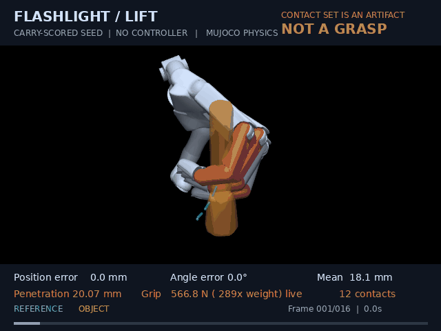 |  |

| Cube — no controller, 7.1 mm | Cube — PPO, 3.5 mm |
|---|---|
| 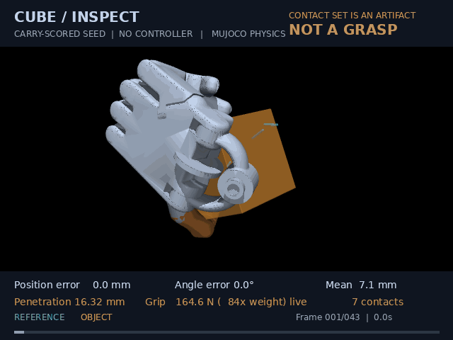 |  |

| Banana, after D2 — no controller, 17 mm, 38° | Banana, after D2 — PPO with a rotation term, 8 mm, 11° |
|---|---|
|  | 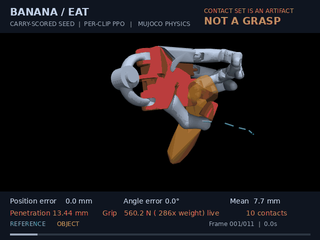 |

Eyeglasses, the same pair: [no controller](figures/physics_carry_eyeglasses_clean_1_d2.gif), [PPO](figures/physics_carryppo_eyeglasses_clean_1_d2.gif), 34° → 16°.
And a failure the end-state rule passed and the rotation bound catches:
[binoculars](figures/physics_carry_binoculars_lift_d2.gif) ends "held" at 0.65 mm on 19 contacts — lying upside-down across the fingers of an upturned hand at 137°, a shelf, not a grasp; [its policy](figures/physics_carryppo_binoculars_lift_d2.gif) drops it.

The other three of the five robust seeds:
[pyramid](figures/physics_carry_pyramid.gif) ([PPO](figures/physics_carryppo_pyramid.gif)),
[doorknob](figures/physics_carry_doorknob.gif) ([PPO](figures/physics_carryppo_doorknob.gif)),
and [camera](figures/physics_carry_camera1.gif) ([PPO](figures/physics_carryppo_camera1.gif)) —
**which stays red for the whole clip**: it is under 3 mm and held, and it
squeezes at 130–200 N, 65–100× the weight. The carry gate had no force
term; the renderer's did, and caught it. Each GIF has a JSON beside it with
the per-frame live values and a replay check against the evaluator.
`python experiments/tracking/render_tracking.py carry_flashlight carryppo_flashlight …`
regenerates them from the stored offsets and checkpoints.

### The four failures this project was measured on


The first time this pipeline was stepped as real physics rather than kinematic
playback. **All four fail**, and the GIFs are built to show *why* rather than
assert it: the object is translucent, so the hand inside it is visible, and any
link buried deeper than 2 mm turns **red**.

| Mug — per-clip PPO | Bowl — bimanual grasp search |
|---|---|
| 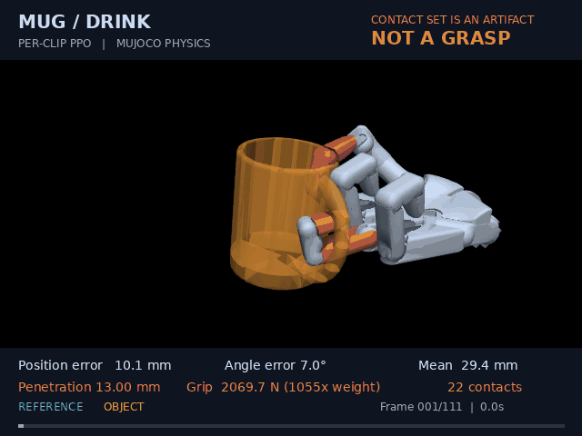 | 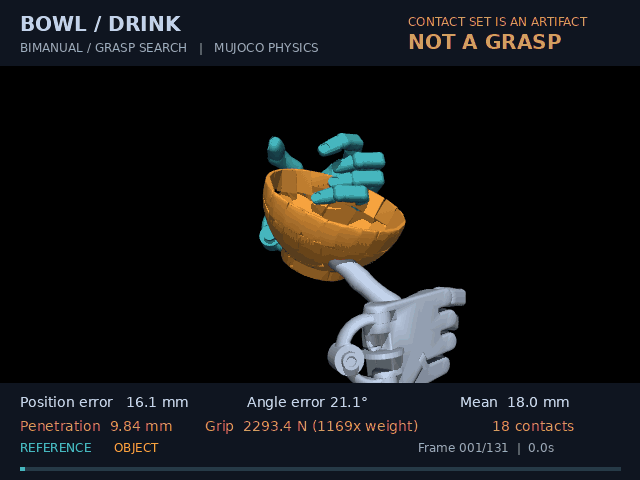 |

| Binoculars — bimanual grasp search | Camera — bimanual grasp search |
|---|---|
| 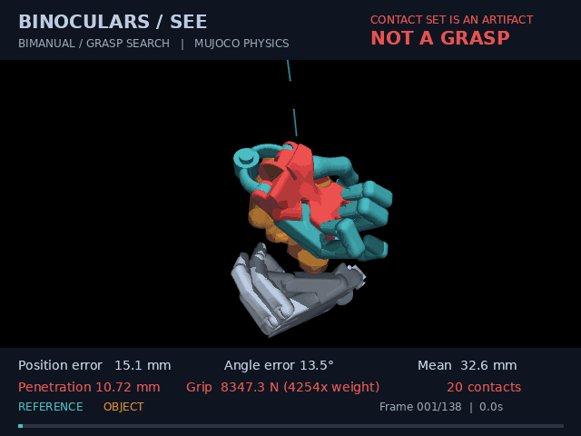 | 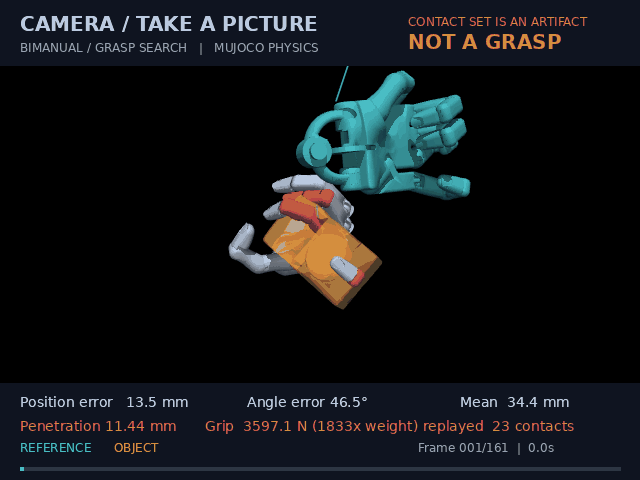 |

| Clip | Position error | Orientation error | Max penetration | Mean placement force (replayed) | placement force vs object weight |
|---|---:|---:|---:|---:|---:|
| [Mug](figures/physics_mug.json) | 29.4 mm | 44.8° | 13.8 mm | 1562 N | 796× |
| [Bowl](figures/physics_bowl.json) | 18.0 mm | 45.9° | 9.8 mm | 2325 N | 1185× |
| [Binoculars](figures/physics_binoculars.json) | 32.6 mm | 20.0° | 10.9 mm | 7553 N | 3850× |
| [Camera](figures/physics_camera.json) | 34.4 mm | 138.4° | 11.4 mm | 5353 N | 2729× |

The object weighs **1.96 N**. The force column is read by *replaying* each
saved state (`qpos` + `mj_forward`) — the force a fresh placement needs to
resolve the penetration, not the grip the rollout carried live (the live
end-of-rollout grip on the mug is 2832 N; same verdict, different quantity).
Penetration and contact count are geometric — fixed by `qpos`, which replay restores exactly — so they are identical either way; force depends on velocity and the warm-started constraint solution, which replay does not reconstruct. Live columns follow when
the four are re-captured. The position-error column is what this project
used to report; watch the red links and the two columns after it for why that
column meant nothing. `make render-tracking` reproduces the set, and every
figure is saved per frame in the manifests beside the GIFs.

**→ [docs/STAGE2.md](docs/STAGE2.md)** — the full diagnosis and where to pick up.

## The question, and where it has moved

It started as: *human hand-object data is retargeted by matching the hand's
pose; should it instead specify the wrench the object requires?*

Two earlier synthetic experiments found no demonstrated benefit from their
specific use of a reference: as an initialisation (G1), and as a task
specification (G2). These comparisons do not rule out useful information in
real human demonstrations. They motivated a narrower diagnostic question:

**Do the metrics this field optimises actually predict whether a grasp does the
job?** That is G3, and the answer is *partly, and not the one you would expect*.

The current work uses real [GRAB](https://grab.is.tue.mpg.de/) human motion
with a pipeline inspired by [DexTrack](https://meowuu7.github.io/DexTrack/):
retarget contacts, establish a feasible grasp, train a tracker per reference,
then distil a shared policy. Two-hand experiments currently use joint
retargeting and grasp search. See [docs/PIPELINE.md](docs/PIPELINE.md).

## Earlier benchmark: which metrics predict task success?

238 sampled grasps across 4 hands and 4 object shapes, evaluated on 2 carry
tasks. Grasps are **sampled, not optimised** — an optimiser would remove the
quality variation being tested. Inference is clustered **by grasp**, since the two tasks share one.

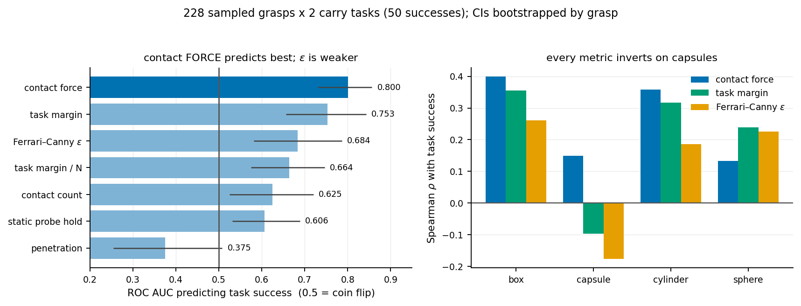

Exactly one tested metric crosses the pre-declared ρ = 0.3: **total contact
force** (AUC 0.800). Ferrari–Canny ε is informative at AUC 0.684. These are
predictive associations in this sampled benchmark; they do not establish that
extra squeeze causes success or that contact placement is unimportant.

The robust observation is the right panel: **every metric inverts on capsules.**
Whatever these metrics capture does not transfer across object geometry, and
that survived three separate bug fixes.

## Tasks

Full protocols and validity gates: **[docs/TASKS.md](docs/TASKS.md)**.

### T1 — grasp and hold under a wrench probe

Pre-grasp → close → squeeze → release, then push and twist along 14 force and
14 torque directions until it slips. No floor and no gravity, so a dropped
object is unambiguous and a resting one cannot be mistaken for a held one.

| wrench objective | pose objective |
|---|---|
| 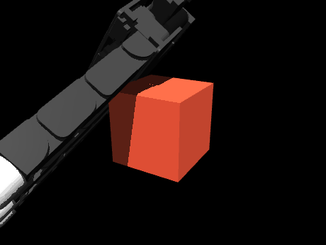 | 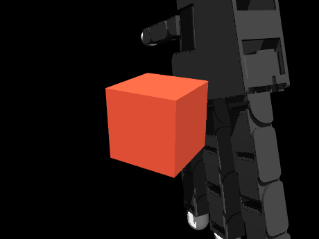 |
| ε 0.642 · 9 contacts · holds **1.345 N** | ε 0.358 · 4 contacts · holds **0.000 N** |

Same hand, same 6 cm cube, same seed, same budget — only the objective differs.

### T3 — carry under gravity

Lift 8 cm, tilt 60° **about the object's own centre**, carry 8 cm, set down.
Scored by *slip in the palm frame*, because the base is position-controlled and
tracking error would measure controller lag rather than the grasp. Two variants
with genuinely different wrench profiles: task A loads torque about x (peak
0.0113), task B about y (0.0307).

### T2 — bimanual peg extraction

Socket friction (1.20 N) exceeds the base's weight (0.78 N), so a one-handed
pull lifts the base instead of extracting the peg. Two-handed by force balance,
not by assumption.

| two-handed expert | one-handed control |
|---|---|
| 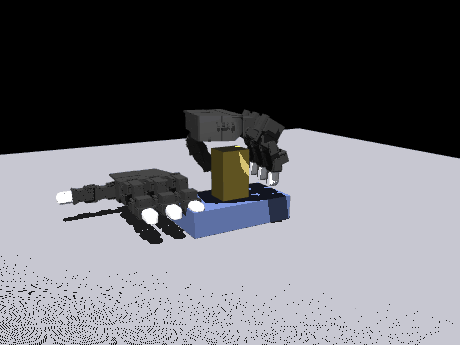 | 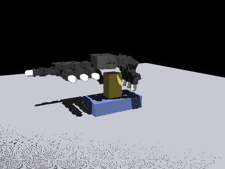 |
| peg out **13.49 cm**, base lift +0.44 cm — success | peg out 5.32 cm, base lift **+10.26 cm** — failure |

### M1 — the opposition axis

`make axis`. Fingertips derived from each distal link's collision geometry,
mimic couplings enforced, self-collision scoped to the fingers, distance to the
*nearest* fingertip.

| hand | floor | aperture | DoF |
|---|---:|---:|---:|
| Allegro | 0.06 cm | 30.44 cm | 16 |
| Shadow | 0.21 cm | 25.18 cm | 24 |
| Dexmate f5d6 | 0.26 cm | **12.73 cm** | 11 |
| LEAP | 0.34 cm | 31.95 cm | 16 |

All four oppose within 2.8 mm — there is no deficit. The spread that *does*
survive is **aperture**, where f5d6 is an outlier by 2.4×.

## The pipeline

Seven stages from a GRAB clip to a tracked object: human reference → retarget →
per-reference PPO → homotopy curriculum → distillation → two hands → depth
perception. **Stage 2 now has a measured hold rate — and a burial caveat; see [above](#b--human-motion--robot-tracking--live-blocked-at-stage-2).**

**→ [docs/PIPELINE.md](docs/PIPELINE.md)** — every stage, what it measures, what
it established, and what was withdrawn, including the GRAB reconstruction
validation, the convex-decomposition fix, the PPO horizon result and the
perception finding.

**→ [docs/STAGE2.md](docs/STAGE2.md)** — the live problem.

## Layout

```
src/oppdef/        package README: src/oppdef/README.md
  human/           THE LIVE PIPELINE. GRAB -> retarget -> grasp -> PPO -> distil
                   grab.py mano.py decompose.py  data in
                   retarget.py                   human contacts -> joint traj
                   scene.py track.py             one hand or two, in physics
                   rl.py distill.py homotopy.py  PPO, distillation, curriculum
                   grasp.py perception.py        grasp fitting; depth -> pose
  grasping/        grasp quality and synthesis, shared by both bodies of work
                   epsilon.py                    Ferrari-Canny from real contacts
                   synth.py hold.py task.py      synthesis, wrench probe, carry
                   retarget_pose.py              single-pose retarget (keypoint vs eps)
  hands/           tips.py (fingertip derivation, load-bearing) · model.py
                   axis.py (the opposition metric) · specs.py · f5d6.py
  envs/            simulation environments; bimanual.py provides _add_base_dof
  learning/        bc.py is imported by human/distill.py
  track_core.py    reference-agnostic tracking core (not the GRAB tracker)
  embodiment.py paths.py objects.py   hand/object abstractions, asset paths
  bench.py policy.py sensing.py data.py vec.py control/ sim/ viz/
                   earlier synthetic-grasp work; backs the supported G3 findings
experiments/       grouped by program -- see experiments/README.md
  grasp_metrics/   program A: g1-g5, matched, the peg task, figures
  tracking/        program B: grab_*, render_tracking, g7-g9
  infra/           backend parity and batched-stepping benchmarks
  retracted/       withdrawn experiments, each saying what was wrong
docs/              task definitions, pre-registrations, external reviews
results/ figures/  live results with provenance; retracted/ holds the rest
attic/             superseded scripts, two kept as retraction evidence
NOTES.md           the measurement log and every retraction
```

`human/` imports from `grasping/`, `hands/`, `envs/`, `learning/`,
`embodiment.py` and `paths.py`, so none of those are removable legacy.
[`src/oppdef/README.md`](src/oppdef/README.md) says what each module is for and
which are load-bearing. The package is still named `oppdef` after the retracted
claim; renaming it is mechanical and deferred.

## Reproduce

```bash
make install
make test                 # fast + slow invariants
make axis                 # the opposition axis, with provenance
make g1 && make g1-analysis    # pre-registered three-arm comparison
python experiments/grasp_metrics/g3.py       # metric-vs-task dataset
python experiments/grasp_metrics/g3_analysis.py
make expert               # the bimanual peg task and its one-handed control
make render-tasks         # synthetic grasp / peg GIFs
make render-tracking     # the physical GRAB rollouts at the top of this README
```

Tracking renders require the local GRAB/MANO assets, Menagerie models, and
`pip install -e ".[viz,learn]"`. Install `coacd` if the convex-decomposition
cache has not been generated yet. Set `OPPDEF_DATA` and `OPPDEF_MENAGERIE`
to those local assets when they are outside the default workspace layout.
The mug demo uses the checked-in PPO checkpoint and its original hold-scored
grasp setup. Each new GIF has an adjacent JSON
manifest with the exact source hashes, search settings, errors, and replay check.
The full physics-state cache stays in `out/tracking_gifs/`; use
`python -m experiments.tracking.render_tracking mug bowl binoculars camera --render-only`
to adjust presentation without rerunning the experiment.

Renders need `MUJOCO_GL=egl`. GPU stepping uses `mujoco_warp`; **MJX-JAX does
not run on this machine** — `gpusolverDnCreate` fails, so no MJX number should
be quoted from it.

## How this repository is meant to be read

**In this pipeline a large effect is a bug in the measurement until it survives
being measured a second way.** Both agents that worked it on 2026-09-15
derived that rule independently and paid for it separately — a 103 s/iteration
that was elapsed time divided by log lines, a "3486 mm, the scenes disagree
completely" that was an open hand sent by mistake, a 312 km tracking error that
was an integrator artifact. Every number in the documents below survived a
second measurement or is marked as not having had one.

Experiments that can decide something are **pre-registered** — hypotheses,
analysis and decision rule committed before the code exists. Results carry
provenance and, for every selected grasp, the placement, finger targets,
per-direction probe values and rejection counts, so a figure traces back to the
pose behind it without re-running a search. Withdrawn work is kept, labelled,
and its generator made to refuse to run.

The measurement log is longer than the results. Three of this project's
headline findings were killed by its own later checks, and one of those checks
(G4) found a bug on its first smoke run that invalidated the result it was
built to test. That ratio is the honest one so far.
