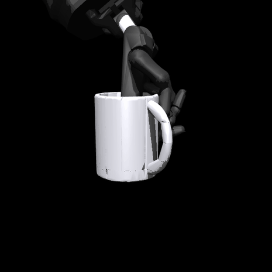
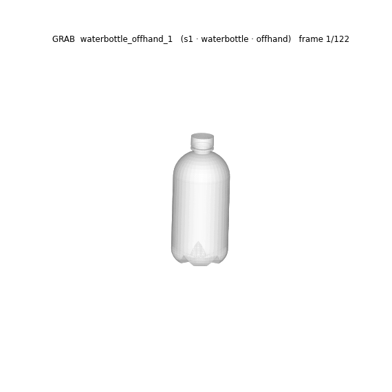

# dextrack-bimanual-sim

[](src/oppdef/human/track.py)
[](LICENSE)

A simulation workbench for **two-handed dexterous tracking from human motion**,
and a public measurement log. Real [GRAB](https://grab.is.tue.mpg.de/) hand-object
references drive retargeting, grasp synthesis, per-reference PPO and two-hand
experiments, following [DexTrack](https://meowuu7.github.io/DexTrack/).

The log is the point. Every claim this project has had to withdraw is recorded
here with the measurement that killed it, including the one it used to be named
after. **[NOTES.md](NOTES.md) is authoritative — read it before quoting any
number.**

> **Renamed from `opposition-deficit`** (2026-09-15). That name referred to a
> deficit that does not exist: the measurement behind it was taken at the wrong
> point on every hand, and the claim is retracted. The Python package is still
> `oppdef`; renaming it is a mechanical change deliberately deferred so it does
> not collide with active work.

## Where this stands

Honest summary, because the stage table below is mostly red and that needs
context: **the pipeline runs end to end and its numbers were wrong.** On
2026-09-15 the tracking stage was stepped as real physics for the first time
rather than kinematic playback, and the instrumentation immediately showed that
every rollout was a contact artifact — the hand placed *inside* the object,
which manufactures contacts, which inflates grip, which flatters every metric
downstream. Tracking numbers across stages 2, 3 and 6 are withdrawn.

The cause is understood and the fix is identified, small, and in progress: the
retargeted pose was being *placed* interpenetrated instead of closed onto the
object under simulation. Closing under physics takes `gamecontroller_play_1`
from 4411 N to **10.5 N** on a 0.2 kg object — 2250× object weight down to 5.4×,
a plausible grip — and recovers the case where the alternative was a hand that
never touched the object at all.

So this is not a project that is stuck. It is a project whose measurement log
caught a systematic error that had been inflating everything in it, which is
what the log is for.

---

---

## Physics rollouts — four failures

These four recordings are the first time this pipeline was stepped as **real
physics** — free-jointed object, gravity on, no weld — rather than the kinematic
playback shown [further down](#from-human-motion-to-a-robot-hand). All four
fail. They are kept because the failure is measured, and because the position
error alone hides it completely.

| Mug — per-clip PPO | Bowl — bimanual grasp search |
|---|---|
|  |  |

| Binoculars — bimanual grasp search | Camera — bimanual grasp search |
|---|---|
|  |  |

The object is not grasped in any of these. It is trapped inside overlapping
finger geometry and dragged along by the externally driven wrists, while the
contact solver applies kilonewtons trying to push it back out:

| Clip | Mean position error | Mean orientation error | Max penetration | Mean grip force | Peak | vs object weight |
|---|---:|---:|---:|---:|---:|---:|
| [Mug](figures/physics_mug.json) | 29.4 mm | 44.8° | 13.8 mm | 1563 N | 2323 N | 796× |
| [Bowl](figures/physics_bowl.json) | 18.0 mm | 45.9° | 9.8 mm | 2325 N | 3708 N | 1185× |
| [Binoculars](figures/physics_binoculars.json) | 32.6 mm | 20.0° | 10.9 mm | 7554 N | 12109 N | 3850× |
| [Camera](figures/physics_camera.json) | 34.4 mm | 138.4° | 11.4 mm | 5353 N | 13205 N | 2729× |

**The object weighs 1.96 N.** These rollouts apply 796×–3850× its weight to it,
on every frame, with 8–14 mm of interpenetration present in **541 of 541 frames**
that never settles. Every figure here is drawn on the GIFs themselves and saved
per-frame in the linked manifests; `make render-tracking` reproduces them.

Three consequences:

1. **The position error is measuring squeeze-out, not tracking.** 18–34 mm is
   the scale at which the object is being extruded from a cage of overlapping
   geometry. It is not evidence of a working controller.
2. **The object spins freely inside that cage**, which is the 45°/138°
   orientation error. The camera clip ends inverted.
3. **Two of the three "bimanual" clips are one-handed.** Per-hand contacts are
   17.4 left / 1.4 right on binoculars, where the right hand has *zero* contacts
   in 35 of 138 frames; and 21.0 right / 2.2 left on camera, left absent in 49 of
   161. Only the bowl is balanced (6.9 / 7.2) — and its fingers are visibly
   through the bowl wall.

**The orientation error is a kick at t=0, not drift.** The reset is clean — the
object is placed exactly on the reference, 0.000 mm and 0.000°. One control
block later, 66 ms in, the camera has rotated **46.5°** and the bowl 21.1°. That
is the stored penetration energy discharging, and because the overlap is deep
and asymmetrically distributed across 20–42 contacts, most of the ejection
impulse comes out as *torque* rather than translation. The object is spun out of
the grasp before the controller has done anything, then tumbles inside the cage
for the rest of the clip; the camera peaks at 178.5°, fully inverted.

This also means **orientation error is the sensitive detector here and position
error is the misleading one**. The cage constrains translation, so position error
stays in the tens of millimetres no matter how badly the grasp is failing;
rotation inside the cage is nearly unconstrained. The 138.4° on the camera was
the honest signal all along.

The reference itself is sound, which was worth checking given this project's
[retracted transposed-rotation result](NOTES.md): the reference quaternions are
unit-norm to six decimals and smooth at 1.3–3.2° per frame, sweeping 280–430°
over a clip. This is not a convention error.

**The cause is upstream of the simulator.** At the reset state, before a single
`mj_step`, grasp synthesis already hands MuJoCo 13.2 / 14.3 / 16.2 / 20.8 mm of
penetration across 20–42 contacts. The solver relaxes that to a steady 8–14 mm
and it stays there. No contact solver is obligated to resolve an overlap that
deep: settling with gravity off moves 12.7 mm to 11.8 mm while ejecting the
object 28 mm and losing every contact, so the only alternatives are to leave the
overlap or convert it into ejection.

**And the search climbs toward it.** `synthesize_grasp` scores candidates on
whether the object stays held and, since `d5b49ca`, on tracking error — neither
term can see penetration, and both are improved by it, because depth buys
contacts, contacts buy normal force, and force buys grip. Measured on
`mug_drink_2`: retarget alone gives 11.08 mm over 15 contacts at 4411 N; after
grasp synthesis, 17.47 mm over 32 contacts at 8815 N.

The optimizer is using a contact artifact as a grasp strategy, and the
generalisable lesson is that **a rejection filter would not have fixed it** —
the objective climbs toward penetration, so it would simply have walked up to
whatever threshold the filter set. The term has to be in the objective. It now
is: a penetration residual taken from MuJoCo's own narrowphase, 3 mm allowance
at the fingertips and none elsewhere, weighted so that 10 mm of excess costs
about what dropping the object costs. With it, `mug_drink_2` stays at the
retarget's 11.08 mm instead of climbing to 17.47 mm.

**Every static grasp metric is corrupted by this, including ε.** Ferrari–Canny
on the four reset contact sets gives ε = 0.204 / 0.155 / 0.263 / 0.344 and
δ = 0.0005–0.0045, i.e. all four are strongly force-closed on paper and could
resist 200–2000× the gravity wrench. The ranking is *backwards*: the camera has
the highest ε of the four and the worst orientation error, the binoculars the
second-highest and the best. ε takes the contact set as given, and the contact
set is fictitious — deep penetration manufactures 21–42 contacts with
well-distributed normals and wide friction cones, which is an excellent grasp by
any static wrench-space measure. Held-ness, contact count, normal force, ε and
force closure are all corrupted by the same artifact, so none of them can be
used to detect it. (This is [G3](#earlier-benchmark-which-metrics-predict-task-success)'s
deflating ε result arriving from a second direction.)

What does detect it is a single cheap scalar: the **net unbalanced wrench on the
object at the reset configuration, with gravity included**, in multiples of
object weight. **0× is equilibrium** — the contacts balance gravity and nothing
else. **1× is freefall**, nothing supporting the object at all. These four
configurations measure 194× / 237× / 142× / 337×.

It cannot be gamed by manufacturing contacts, since more penetrating contacts
worsen the imbalance rather than improving it, and unlike penetration depth it
rejects *both* failure ends: a non-contacting grasp scores exactly 1× because
the object is in free fall. Every zero-contact candidate in the sweep below
scored exactly 1.000×, which is what identifies them.

**Why depth alone cannot be optimised away.** Sampling 40 wrist-offset
candidates around the `bowl_drink_1` retarget and measuring each at its reset
state (one `mj_forward`, ~0.07 s each): penetration ranges 0.00–21.35 mm and
contacts 0–68, correlated at **+0.597** — contacts are manufactured by burial.
Three candidates achieve both a near-balanced wrench and under 2 mm of
penetration. **All three have fewer than three contacts.** Zero of 41
configurations both touch the object and stay out of it; the best-scoring
candidate has 0.00 mm penetration, a balanced wrench, and *no contacts at all*.
Direct placement offers burial or thin air, and reweighting cannot find a middle
that is not there.

**The defect is in the retarget, not the grasp stage.** Scanning every frame of
the retargeted trajectory across 20 GRAB sequences — object at its reference
pose, no closure applied — **23 of 2866 frames are under 1 mm of penetration**.
Thirteen of the twenty never reach a collision-free frame at all.

| reference | min | median | frames < 1 mm | deepest body |
|---|---:|---:|---:|---|
| `binoculars_see_1` | 17.15 mm | 25.12 mm | 0/155 | **forearm** |
| `flashlight_on_2` | 12.82 mm | 13.66 mm | 0/144 | **palm** |
| `cup_drink_2` | 11.73 mm | 12.28 mm | 0/117 | ffproximal |
| `mug_drink_1` | 6.81 mm | 10.82 mm | 0/116 | ffproximal |
| `camera_takepicture_1` | 0.00 mm | 14.09 mm | 13/143 | forearm |
| `gamecontroller_play_1` | 0.00 mm | 5.46 mm | 1/192 | ffdistal |

The split is structural. Sequences that never come clean are dominated by a
large **non-finger** body — forearm, palm, proximal links — while those that do
reach clean frames are dominated by distal links. On `binoculars_see_1` the
forearm is the deepest penetrating body on all 155 frames: the Shadow forearm
occupies the space the binoculars are in for the entire clip.

That is what a retarget with no non-penetration constraint produces. Matching
the human's fingertip *positions* is a kinematic proxy, and for this hand on
these objects the position-matching optimum is inside the object continuously.
No closure routine, opening schedule or wrist retraction downstream repairs it —
each was tried and measured, and retracting along contact normals actively
diverges, because a hand wrapped around an object cannot be translated out of
it (measured normal alignment 0.325 on the mug, where 0 is fully opposed).

### The fix, half of it

Weighting non-penetration on the **arm-side** bodies — forearm, wrist, palm,
knuckles, anything not strictly below a knuckle — at 60× the finger weight:

| reference | w_arm | arm penetration | force | residual | tracking |
|---|---:|---:|---:|---:|---:|
| `binoculars_see_1` | 1 | 5.20 mm | 117 N | 29.5× | 175528 mm |
| `binoculars_see_1` | **60** | 2.47 mm | 2473 N | 15.4× | **106.2 mm** |
| `flashlight_on_2` | 1 | 12.96 mm | 782 N | 1.7× | 8.5 mm |
| `flashlight_on_2` | 60 | 1.39 mm | 386 N | 4.3× | 107.5 mm |

`binoculars_see_1` is the result: **175 metres to 106 millimetres**, on the
reference whose forearm was the deepest penetrating body at every one of its 155
frames and which had no collision-free frame anywhere in the clip.

**`flashlight_on_2` getting worse is not a regression.** It was tracking at
8.5 mm with its palm 12.96 mm inside the object — the burial *was* the grip, and
removing the penetration removed the fake grip. That is the 0-of-283 result
arriving as a consequence rather than a prediction, and any reading of that row
as damage has it exactly backwards.

**Necessary, not sufficient.** Across 40 sequences the constraint drives
arm-side penetration to **0.00 mm at the median**, but finger penetration
remains at **6.26 mm** and the equilibrium residual stays at 4.3–15.4× with
361–2488 N on a 1.96 N object. None of these is an equilibrium yet: the arm is
out of the object, and the finger contact is still an overlap rather than a
grasp. Eleven of the forty still have a median arm-side problem, and they
cluster on **vessels** — four `mug_drink` variants and `mug_toast_1` sit at
33–39 mm arm-side with *exactly zero* finger contact, which is a hand through
the cup rather than around it.

The second half is closing the fingers under simulation, which is built and
works when the hand starts outside the object.

**It helps the sequences whose wrist already lands
outside the object.** It is to stop *placing* the hand
and start *closing* it — backing the fingers off along the derived flexion
direction, then closing under simulation to a force target:

| reference | | penetration | force | torque | 66 ms kick |
|---|---|---:|---:|---:|---:|
| `gamecontroller_play_1` | direct | 0.00 mm | 0.0 N | 0.00 N·m | 44.1° / 16.8 mm |
| `gamecontroller_play_1` | **close** | 5.53 mm | **10.5 N** | **0.33 N·m** | **12.1° / 10.1 mm** |
| `mug_drink_2` | direct | 11.08 mm | 4410.8 N | 54.35 N·m | 23.1° / 24.3 mm |
| `mug_drink_2` | close | 16.45 mm | 5049.0 N | 72.52 N·m | 21.3° / 9.8 mm |

`gamecontroller` is the result: 2250× object weight down to **5.4×**, a
plausible grip, on the same reference that direct placement leaves with zero
contacts and a 44° kick. One change recovers both failure ends. `mug_drink_2`
does not improve, instructively — its retarget starts buried and the pre-grasp
opens the fingers by only 0.30 rad, not enough to clear an 11 mm overlap. The
procedure works when the pre-grasp is outside the object and fails when it is
not, which is a parameter, not a wall.

**Direct placement cannot produce a usable grasp.** Re-running the search
with the penetration term active, and reporting penetration and normal force
alongside tracking error for the first time:

| reference | tracking error | held | penetration | force |
|---|---:|---:|---:|---:|
| `gamecontroller_play_1` | 35.4 mm | 173/192 | 19.40 mm | 4551 N |
| `phone_call_1` | 245179.2 mm | 1/200 | 0.00 mm | 0 N |

`phone_call_1` is the informative row. The only non-penetrating grasp the search
can find for that reference is one that **never touches the object** — 0.00 mm,
0.0 N, object on the floor. The retarget's grasps are either interpenetrating or
non-contacting, with nothing usable in between, so the penetration term stops
the search climbing but has nothing clean to climb toward. The baseline is bad,
not the selection.

`d5b49ca`'s **"248 m → 35 mm" is therefore withdrawn**, not qualified. It
compared an unphysical grasp against a failed one, which is not a result. The
stage-3 numbers resting on that initial condition go with it, `gamecontroller`'s
27.2 mm PPO figure in particular, since the policy was trained on it. **No
tracking number in this repository should be quoted as physical** until the
retarget can produce a grasp that both contacts the object and does not bury
itself in it. What this section does establish is that the
renderer and its manifests work: `make render-tracking` reproduces the set, and
[`experiments/render_tracking.py`](experiments/render_tracking.py) saves
per-frame errors, contact counts, source/model hashes, and search settings
beside every GIF. That instrumentation is what made the failure visible.

## The question, and where it has moved

It started as: *human hand-object data is retargeted by matching the hand's
pose; should it instead specify the wrench the object requires?*

Two earlier synthetic experiments found no demonstrated benefit from their
specific use of a reference: as an initialisation (G1), and as a task
specification (G2). These comparisons do not rule out useful information in
real human demonstrations. They motivated a narrower diagnostic question:

**Do the metrics this field optimises actually predict whether a grasp does the
job?** That is G3, and the answer is *partly, and not the one you would expect*.

The current work uses real [GRAB](https://grab.is.tue.mpg.de/) human motion
with a pipeline inspired by [DexTrack](https://meowuu7.github.io/DexTrack/):
retarget contacts, establish a feasible grasp, train a tracker per reference,
then distil a shared policy. Two-hand experiments currently use joint
retargeting and grasp search. See [From human motion to a robot hand](#from-human-motion-to-a-robot-hand).

## Status

| claim | status | evidence |
|---|---|---|
| A wrench objective beats the shipped retargeting pipeline | **supported** | pre-registered, n=60, McNemar p = 0.0075 |
| …by *selecting* better, not searching more | **supported** | finds fewer valid grasps, survives 2.3× as often |
| References improve the earlier synthetic objectives | **benefit not established** | G1 initialisation p = 1.0000; G2 specification p = 0.180; this does not test all uses of human data |
| Contact **force** predicts task success | **supported** | ρ +0.325, AUC 0.800, clustered by grasp; survives G4 |
| ε predicts task success | **weakly** | AUC 0.684 (0.679 excluding non-reproducible grasps), below the pre-declared ρ = 0.3 |
| Every metric inverts on capsules | **robust across three bug fixes and an audit** | see the figure below |
| GRAB tracking rollouts are physically valid | **NOT SUPPORTED** | 8–14 mm penetration on 541/541 frames at 1530–7549 N mean on a 1.96 N object; grasp search was climbing toward it |
| The retarget can produce a usable grasp | **NOT SUPPORTED** | its grasps are either interpenetrating or non-contacting; on `phone_call_1` the only 0 mm-penetration grasp found never touches the object |
| Scoring the grasp search on tracking improved it (`d5b49ca`, 248 m → 35 mm) | **WITHDRAWN** | compared an unphysical grasp against a failed one; the 35 mm is achieved at 19.4 mm penetration and 4551 N |
| Perturbed repeats agree | **high agreement, with replay failures** | G4: 0.928 unanimity, CI [0.897, 0.956]; five grasps did not re-form |
| The peg task requires two hands | **supported** | 13.49 cm vs 5.32 cm, by force balance |
| An opposition deficit exists among these hands | **RETRACTED** | all four oppose within 2.8 mm once measured correctly |
| A second hand repairs that deficit | **WITHDRAWN** | force-only data labelled as wrench; budget uncontrolled |
| Earlier peg-task BC / action chunking demonstrate feedback | **RETRACTED** | open-loop replay scores 8/8 on that task; separate from the new GRAB PPO result |
| "No metric predicts task success" (earlier G3) | **WITHDRAWN** | it was three bugs — see below |

**[NOTES.md](NOTES.md) is the authoritative log. Read it before quoting any
number.** Withdrawn work lives under `results/retracted/`,
`figures/retracted/`, `experiments/retracted/`, each with a README saying what
was wrong.

## Earlier benchmark: which metrics predict task success?

238 sampled grasps across 4 hands and 4 object shapes, evaluated on 2 carry
tasks. Grasps are **sampled, not optimised** — an optimiser would remove the
quality variation being tested. Inference is clustered **by grasp**, since the two tasks share one.


Exactly one tested metric crosses the pre-declared ρ = 0.3: **total contact
force** (AUC 0.800). Ferrari–Canny ε is informative at AUC 0.684. These are
predictive associations in this sampled benchmark; they do not establish that
extra squeeze causes success or that contact placement is unimportant.

The robust observation is the right panel: **every metric inverts on capsules.**
Whatever these metrics capture does not transfer across object geometry, and
that survived three separate bug fixes.

## Tasks

Full protocols and validity gates: **[docs/TASKS.md](docs/TASKS.md)**.

### T1 — grasp and hold under a wrench probe

Pre-grasp → close → squeeze → release, then push and twist along 14 force and
14 torque directions until it slips. No floor and no gravity, so a dropped
object is unambiguous and a resting one cannot be mistaken for a held one.

| wrench objective | pose objective |
|---|---|
|  |  |
| ε 0.642 · 9 contacts · holds **1.345 N** | ε 0.358 · 4 contacts · holds **0.000 N** |

Same hand, same 6 cm cube, same seed, same budget — only the objective differs.

### T3 — carry under gravity

Lift 8 cm, tilt 60° **about the object's own centre**, carry 8 cm, set down.
Scored by *slip in the palm frame*, because the base is position-controlled and
tracking error would measure controller lag rather than the grasp. Two variants
with genuinely different wrench profiles: task A loads torque about x (peak
0.0113), task B about y (0.0307).

### T2 — bimanual peg extraction

Socket friction (1.20 N) exceeds the base's weight (0.78 N), so a one-handed
pull lifts the base instead of extracting the peg. Two-handed by force balance,
not by assumption.

| two-handed expert | one-handed control |
|---|---|
|  |  |
| peg out **13.49 cm**, base lift +0.44 cm — success | peg out 5.32 cm, base lift **+10.26 cm** — failure |

### M1 — the opposition axis

`make axis`. Fingertips derived from each distal link's collision geometry,
mimic couplings enforced, self-collision scoped to the fingers, distance to the
*nearest* fingertip.

| hand | floor | aperture | DoF |
|---|---:|---:|---:|
| Allegro | 0.06 cm | 30.44 cm | 16 |
| Shadow | 0.21 cm | 25.18 cm | 24 |
| Dexmate f5d6 | 0.26 cm | **12.73 cm** | 11 |
| LEAP | 0.34 cm | 31.95 cm | 16 |

All four oppose within 2.8 mm — there is no deficit. The spread that *does*
survive is **aperture**, where f5d6 is an outlier by 2.4×.

## Where this is headed

Each goal is pre-registered before it is written, with its decision rule fixed
in advance, including the branch where the result kills the idea.

| | question | outcome |
|---|---|---|
| **G1** | does a wrench objective beat the pipeline people ship? | **yes** (p = 0.0075); the demonstration adds nothing (p = 1.0000) |
| **G2** | does the demonstration specify the *task*? | **no** — and conditioning on it costs grasp strength |
| **G3.1** | can all four hands even be placed? | **fixed** — Shadow went from 0/320 valid grasps to 16–38% |
| **G3.2** | do grasp metrics predict task success? | contact force does (AUC 0.800); ε weakly (0.684) |
| **G4** | how sensitive are outcomes to small perturbations? | 0.928 unanimity, CI [0.897, 0.956]; exact replay failures remain |

**G4 measured perturbation sensitivity.** Under ±1 mm and ±2% perturbations,
92.8% of the sets of five repeats were unanimous (clustered CI [0.897, 0.956]),
and majority outcomes agreed with G3 at 99.6%. Its 80% threshold was fixed
before the code was written. One caveat is recorded rather than buried: 5 of
228 G3 grasps (2.2%) do not re-form standalone — they existed only given
accumulated scene state — and excluding them moves ε from AUC 0.684 to 0.679
and contact force from 0.800 to 0.795. Exact replay failures remain a limitation;
unanimity under perturbations alone does not validate physical realism.

**G5:** the raw retarget held in 0.318 of trials, below its registered 0.50
threshold. This triggered grasp synthesis before tracking (details below).

**The pipeline being built**, stage by stage. Each stage is gated on a
measurement, not on the previous stage having compiled:

| stage | what it does | state |
|---|---|---|
| 1. human reference | GRAB clip → object pose over time, both MANO hands | **done** — hand closes to 0.1–0.6 mm of the object and holds |
| 2. retarget | human contact points → robot joint trajectory | **half fixed** — an arm-side non-penetration constraint takes `binoculars_see_1` from 175 m to 106 mm; arm-side penetration is now 0.00 mm at the median over 40 sequences, but finger penetration remains 6.26 mm |
| 3. per-reference tracking | **PPO** per clip (plus MPPI + homotopy) | **not physical** — 29.35 mm is achieved on 13.8 mm of penetration at 1530 N; `gamecontroller`'s 27.2 mm withdrawn; see [above](#physics-rollouts--four-failures) |
| 4. homotopy curriculum | solve an easier reference, deform it into the hard one | **built** — walks λ 0.35 → 1.0 holding throughout |
| 5. distillation | one neural tracking controller across references | **incomplete** — reported held-out position error is 158–456 mm; that error alone does not verify continued grasp retention |
| 6. bimanual | joint retargeting + wrist-offset search | **fails under physics** — and 2 of 3 clips are effectively one-handed; see [above](#physics-rollouts--four-failures) |
| 7. perception | depth → pose estimator → evaluate the *frozen* tracker | **built** — and it already says something (below) |

Every number in this section is from the **corrected** pipeline. An earlier set
was computed with the object's rotation transposed and is
[retracted](NOTES.md).

## From human motion to a robot hand


*GRAB `s1/mug_drink_1`: the human right hand (red) reaching, taking the mug **by
its handle**, drinking, and setting it down. The left hand stays 53 cm away,
which is what "drink" should look like. Drawn as the MANO surface — a stick
skeleton cannot show whether a hand is curled.*

> Two earlier versions of this caption were wrong, and the second one was wrong
> because the pipeline was. It first claimed the handle from a thumbnail, then
> claimed the **body** on the strength of a measurement taken while the object's
> rotation was **transposed** (GRAB poses objects as `v @ R`, not `v @ R.T`).
> GRAB's own per-vertex contact labels put 41–100% of this clip's contacts on
> the handle. See [the retraction](NOTES.md).

The reference is validated against **GRAB's own per-vertex contact labels**, not
against itself. Every earlier check here compared the reconstructed hand to the
reconstructed object and asked whether they were close; they always were, and
for a while they were close in the wrong place — the object's rotation was
transposed and a 0.1 mm minimum-distance check passed the whole time.

`experiments/grab_validate.py` scores the reconstruction against the labels the
dataset ships: **recall 0.919, minimum 0.846** over the sequences checked, where
recall is the fraction of GRAB's own contacted vertices the reconstruction also
marks as touched. Under the transposed transform that number was 0.158.



*The end of the pipeline so far: the retargeted Shadow hand carrying the real
GRAB mug along the human's own trajectory, including the tilt of the "drink"
intent. **Kinematic playback** — the object is placed at the reference pose and
the hand at the pose the SE(3) feedforward produces. Whether the grasp survives
physics is exactly what G5 and the tracking stage measure, and is not claimed
here.*


*The same grasp retargeted onto a Shadow hand, rendered in MuJoCo against the
real GRAB mesh. The handle is a genuine hole, not a filled-in hull.*



*GRAB `s1/waterbottle_offhand_1`: the left hand (blue) holds the bottle, both
hands share it through the transfer, then the right hand (red) carries it away.
The `offhand` intent is a genuine hand-to-hand handover, which is what makes the
bimanual stage a data problem already solved rather than one to be invented.*

Surveying all **291 sequences** (`s1` + `s2`, 51 objects) for frames where both
hands are within 5 mm of the object at once — `results/grab_inventory.json`:

| | sequences | bimanual | rate |
|---|---|---|---|
| `offhand` (hand-to-hand transfer) | 40 | 37 | **92.5%** |
| `lift` | 62 | 30 | 48.4% |
| `pass` | 74 | 25 | 33.8% |
| `inspect` | 33 | 11 | 33.3% |
| all intents | **291** | **136** | **46.7%** |

63 of those hold with both hands for ≥15 consecutive frames, which identifies
reference windows for the bimanual stage. "Bimanual" here is measured contact, not the fact
that GRAB happens to track two hands.

The robot side now fits both Shadow hands in one scene, commands both hands
during physics, and searches constant wrist offsets against tracking over the
full reference. The physical rollouts at the top of this README show this
version. Earlier independently fitted hands interpenetrated; that failure and
its corrections remain in [NOTES](NOTES.md). A successful two-hand clip does
not establish that two hands are necessary: a matched one-hand comparison is
still needed for that claim.

Two things had to be fixed before this picture was honest:

**MuJoCo collides a mesh as its convex hull.** For GRAB that is not a small
approximation — the mug's hull is **3.52×** the mug's own volume, because it
fills both the cup's cavity and the handle's hole. Every handle grasp in the
dataset would have been physically impossible, and a correctly placed hand reads
as 20–40 mm of penetration that is not there. Convex decomposition brings the
mug to 0.92× (`src/oppdef/human/decompose.py`).

### Stage 3: a per-reference PPO result, on an invalid initial condition

| controller | mean | final | frames within 50 mm |
|---|---|---|---|
| open-loop feedforward | 8197.3 mm | 52878 mm | 53/111 |
| PPO, training horizon 64 | 10535.3 mm | 62601 mm | 57/111 |
| **PPO, training horizon 160** | **29.4 mm** | **31.9 mm** | **111/111** |

844,800 control steps. Extending the training horizon was the useful change
in this comparison: evaluation spans 111 steps. The reproduced checkpoint
also depends on the hold-scored grasp setup used during training; its weights
alone do not specify a reproducible episode.

**This whole table is measured on a penetrated grasp** and none of it should be
read as physical. The 29.4 mm is achieved at 13.8 mm of interpenetration under
1530 N on a 1.96 N object, and the accompanying 44.8° orientation error is the
object rotating inside a cage it was never held by — see
[Physics rollouts](#physics-rollouts--four-failures). The comparison between
rows may still be informative about horizon, since all three share the same
initial condition, but the winning row is not a working controller. The
`gamecontroller` 27.2 mm figure reported elsewhere from this stage is
**withdrawn**: its policy was trained on the same invalid initial condition.


A tracking episode has to START from a formed grasp. The hold window begins
where the human's hand first comes within 5 mm of the object — contact
starting, not the grasp being formed — and an episode begun there drops the
object before it has tracked anything. **17 of 24 sampled frames hold the object
on their own**, and from one of those:

| start | frames kept | mean position error |
|---|---|---|
| 60 | **59 of 59** | **11.9 mm** |
| 75 | 44 of 44 | 14.4 mm |
| 35 | 24 of 84 (drops) | — |

MPPI over the feedforward closes that marginal case: from frame 35 it tracks to
the end at **53.0 mm** mean, against a feedforward that drops the object and
ends 76 m away. From frame 20 both fail, correctly — the hand has not closed yet.

Getting here required fixing a defect that invalidated every earlier physical
number: the retargeter targeted fingertip **body origins**, and Shadow's real
tip is 32–36 mm beyond one, so the tip geom was buried by its own radius —
**4469 N** of contact force on a 0.2 kg mug. Targeting the derived tip gives
64 N and zero penetration.

That fix is real, but the number it earned was measured on a retargeted pose in
isolation, under settling, and **it does not survive the rest of the pipeline**.
On `mug_drink_2` the retarget alone still leaves 11.08 mm and 4411 N before
grasp search runs at all. Settling cannot recover it either: with gravity off
for 0.5 s, 12.7 mm becomes 11.8 mm while the object is ejected 28 mm and every
contact is lost. A penetrated pose is not a grasp the simulator can repair.

### Establishing a grasp before tracking

G5 asked whether a retargeted pose holds the object under gravity. Pre-registered
threshold 0.50; measured **0.318**, clustered CI [0.270, 0.367] over 279
sequence-clusters. **FAIL.** Its failures make **0.1 contacts at reset** against
17.4 for its successes — they are not slipping grasps, they are poses that never
touch. The retargeting solves fingertip positions against a static object;
nothing in it asks the result to close on anything.

G5's decision rule, fixed before the experiment ran, says to initialise tracking
from a grasp **synthesised near the human's contact set**. It is right:

| initialisation | holds the object |
|---|---|
| retargeted pose, as fitted | 4/24 = **0.167** |
| closing the fingers on it | 0.276 (from 0.288 — no effect) |
| **searching near it for a pose that holds** | 19/24 = **0.792** |

Closing alone cannot work, because the failures are not touching anything to
close on. The hand has to be repositioned. The correction is a constant wrist
offset in the object frame — the trajectory's shape is untouched, only the grasp
moves — and it is kept only when it improves the whole reference (unguarded, it
took one clip from 6 graspable frames to 1). Guarded: **16 → 38** graspable
frames over six references, never worse.

### Stage 7: the estimator's error is structured, and that is the finding

The controller is frozen and only the object pose it reads is swapped. Scored on
the truth in every condition, on `mug_drink_1`:

| pose the controller reads | pose error | tracking error | outcome |
|---|---|---|---|
| simulator ground truth | — | 101.5 mm | held |
| **ICP on rendered depth** | 38.4 mm | **637.3 mm** | **dropped** |
| ground truth + Gaussian noise | **61.8 mm** | 102.5 mm | held |

The larger independent-noise perturbation preserves tracking in this example,
while the ICP estimate does not. That suggests temporal structure, bias, or
outliers matter beyond average pose error. It motivates tests of estimator
latency and drift, and of controller recovery; one clip does not isolate the
cause or establish that control changes cannot help.

**Retargeting cannot be done in the dataset's world frame.** GRAB puts the
object 0.8–1.7 m above the origin while the floating hand base has 0.6 m of
travel; the fit pins itself against its limits and reports 486 mm of error.
Solved in the *object* frame — which is the frame the result is used in — the
same fit reaches 6.7 mm.

## Layout

```
src/oppdef/        package README: src/oppdef/README.md
  human/           THE LIVE PIPELINE. GRAB -> retarget -> grasp -> PPO -> distil
                   grab.py mano.py decompose.py  data in
                   retarget.py                   human contacts -> joint traj
                   scene.py track.py             one hand or two, in physics
                   rl.py distill.py homotopy.py  PPO, distillation, curriculum
                   grasp.py perception.py        grasp fitting; depth -> pose
  grasping/        grasp quality and synthesis, shared by both bodies of work
                   epsilon.py                    Ferrari-Canny from real contacts
                   synth.py hold.py task.py      synthesis, wrench probe, carry
                   retarget_pose.py              single-pose retarget (keypoint vs eps)
  hands/           tips.py (fingertip derivation, load-bearing) · model.py
                   axis.py (the opposition metric) · specs.py · f5d6.py
  envs/            simulation environments; bimanual.py provides _add_base_dof
  learning/        bc.py is imported by human/distill.py
  track_core.py    reference-agnostic tracking core (not the GRAB tracker)
  embodiment.py paths.py objects.py   hand/object abstractions, asset paths
  bench.py policy.py sensing.py data.py vec.py control/ sim/ viz/
                   earlier synthetic-grasp work; backs the supported G3 findings
experiments/       live experiments; retracted/ holds the withdrawn ones
docs/              task definitions, pre-registrations, external reviews
results/ figures/  live results with provenance; retracted/ holds the rest
attic/             superseded scripts, two kept as retraction evidence
NOTES.md           the measurement log and every retraction
```

`human/` imports from `grasping/`, `hands/`, `envs/`, `learning/`,
`embodiment.py` and `paths.py`, so none of those are removable legacy.
[`src/oppdef/README.md`](src/oppdef/README.md) says what each module is for and
which are load-bearing. The package is still named `oppdef` after the retracted
claim; renaming it is mechanical and deferred.

## Reproduce

```bash
make install
make test                 # fast + slow invariants
make axis                 # the opposition axis, with provenance
make g1 && make g1-analysis    # pre-registered three-arm comparison
python experiments/g3.py       # metric-vs-task dataset
python experiments/g3_analysis.py
make expert               # the bimanual peg task and its one-handed control
make render-tasks         # synthetic grasp / peg GIFs
make render-tracking     # the physical GRAB rollouts at the top of this README
```

Tracking renders require the local GRAB/MANO assets, Menagerie models, and
`pip install -e ".[viz,learn]"`. Install `coacd` if the convex-decomposition
cache has not been generated yet. Set `OPPDEF_DATA` and `OPPDEF_MENAGERIE`
to those local assets when they are outside the default workspace layout.
The mug demo uses the checked-in PPO checkpoint and its original hold-scored
grasp setup. Each new GIF has an adjacent JSON
manifest with the exact source hashes, search settings, errors, and replay check.
The full physics-state cache stays in `out/tracking_gifs/`; use
`python -m experiments.render_tracking mug bowl binoculars camera --render-only`
to adjust presentation without rerunning the experiment.

Renders need `MUJOCO_GL=egl`. GPU stepping uses `mujoco_warp`; **MJX-JAX does
not run on this machine** — `gpusolverDnCreate` fails, so no MJX number should
be quoted from it.

## How this repository is meant to be read

Experiments that can decide something are **pre-registered** — hypotheses,
analysis and decision rule committed before the code exists. Results carry
provenance and, for every selected grasp, the placement, finger targets,
per-direction probe values and rejection counts, so a figure traces back to the
pose behind it without re-running a search. Withdrawn work is kept, labelled,
and its generator made to refuse to run.

The measurement log is longer than the results. Three of this project's
headline findings were killed by its own later checks, and one of those checks
(G4) found a bug on its first smoke run that invalidated the result it was
built to test. That ratio is the honest one so far.
