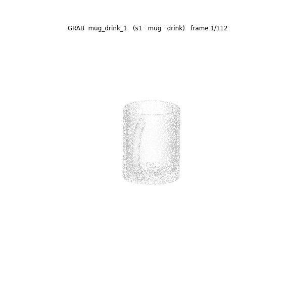
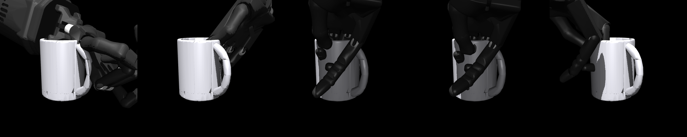

# opposition-deficit

[](tests/)
[](LICENSE)

A simulation workbench for **how a grasp should be specified when transferring
manipulation between embodiments**, and a measurement log that records, in
public, every claim this project has had to withdraw.

> **The name is a historical artifact.** It refers to an "opposition deficit"
> that does not exist — the measurement behind it was taken at the wrong point
> on every hand. See [Status](#status). Renaming is pending G4.

---

## The question, and where it has moved

It started as: *human hand-object data is retargeted by matching the hand's
pose; should it instead specify the wrench the object requires?*

Two pre-registered experiments answered the human-data half: **no**. A wrench
objective does beat the pipeline practitioners ship, but a demonstration adds
nothing to it — once as an initialisation (G1), once as a task specification
(G2). So the live question is now narrower and more basic:

**Do the metrics this field optimises actually predict whether a grasp does the
job?** That is G3, and the answer is *partly, and not the one you would expect*.

Since G4 the project has moved to the thing those experiments were always
circling: **tracking control for dexterous manipulation, learned from real
human hand-object motion** — the DexTrack pipeline, rebuilt here in simulation
and validated locally, then extended to two hands. The first two stages are
built and measured; see [From human motion to a robot hand](#from-human-motion-to-a-robot-hand).

## Status

| claim | status | evidence |
|---|---|---|
| A wrench objective beats the shipped retargeting pipeline | **supported** | pre-registered, n=60, McNemar p = 0.0075 |
| …by *selecting* better, not searching more | **supported** | finds fewer valid grasps, survives 2.3× as often |
| Human demonstration data helps | **not supported, twice** | G1 initialisation p = 1.0000; G2 specification p = 0.180, worse on magnitude |
| Contact **force** predicts task success | **supported** | ρ +0.325, AUC 0.800, clustered by grasp; survives G4 |
| ε predicts task success | **weakly** | AUC 0.684 (0.679 excluding non-reproducible grasps), below the pre-declared ρ = 0.3 |
| Every metric inverts on capsules | **robust across three bug fixes and an audit** | see the figure below |
| Task outcomes are reproducible under perturbation | **supported** | G4: 0.928 unanimity, CI [0.897, 0.956] |
| The peg task requires two hands | **supported** | 13.49 cm vs 5.32 cm, by force balance |
| An opposition deficit exists among these hands | **RETRACTED** | all four oppose within 2.8 mm once measured correctly |
| A second hand repairs that deficit | **WITHDRAWN** | force-only data labelled as wrench; budget uncontrolled |
| BC / action chunking show learned control | **RETRACTED** | open-loop replay scores 8/8 on the same task |
| "No metric predicts task success" (earlier G3) | **WITHDRAWN** | it was three bugs — see below |

**[NOTES.md](NOTES.md) is the authoritative log. Read it before quoting any
number.** Withdrawn work lives under `results/retracted/`,
`figures/retracted/`, `experiments/retracted/`, each with a README saying what
was wrong.

## Headline: which metrics predict task success?

238 sampled grasps × 4 hands × 4 object shapes × 2 carry tasks. Grasps are
**sampled, not optimised** — an optimiser would remove the quality variation
being tested. Inference is clustered **by grasp**, since the two tasks share one.


Exactly one metric crosses the pre-declared ρ = 0.3: **total contact force**
(AUC 0.800). The strongest indicator of whether a grasp completes a carry is
**how hard the hand squeezes**, not where its contacts sit. Ferrari–Canny ε —
the field's geometric quality measure — is genuinely informative at AUC 0.684,
and clearly weaker. That is a deflating result and it is reported as one.

The robust observation is the right panel: **every metric inverts on capsules.**
Whatever these metrics capture does not transfer across object geometry, and
that survived three separate bug fixes.

## Tasks

Full protocols and validity gates: **[docs/TASKS.md](docs/TASKS.md)**.

### T1 — grasp and hold under a wrench probe

Pre-grasp → close → squeeze → release, then push and twist along 14 force and
14 torque directions until it slips. No floor and no gravity, so a dropped
object is unambiguous and a resting one cannot be mistaken for a held one.

| wrench objective | pose objective |
|---|---|
|  |  |
| ε 0.642 · 9 contacts · holds **1.345 N** | ε 0.358 · 4 contacts · holds **0.000 N** |

Same hand, same 6 cm cube, same seed, same budget — only the objective differs.

### T3 — carry under gravity

Lift 8 cm, tilt 60° **about the object's own centre**, carry 8 cm, set down.
Scored by *slip in the palm frame*, because the base is position-controlled and
tracking error would measure controller lag rather than the grasp. Two variants
with genuinely different wrench profiles: task A loads torque about x (peak
0.0113), task B about y (0.0307).

### T2 — bimanual peg extraction

Socket friction (1.20 N) exceeds the base's weight (0.78 N), so a one-handed
pull lifts the base instead of extracting the peg. Two-handed by force balance,
not by assumption.

| two-handed expert | one-handed control |
|---|---|
|  |  |
| peg out **13.49 cm**, base lift +0.44 cm — success | peg out 5.32 cm, base lift **+10.26 cm** — failure |

### M1 — the opposition axis

`make axis`. Fingertips derived from each distal link's collision geometry,
mimic couplings enforced, self-collision scoped to the fingers, distance to the
*nearest* fingertip.

| hand | floor | aperture | DoF |
|---|---:|---:|---:|
| Allegro | 0.06 cm | 30.44 cm | 16 |
| Shadow | 0.21 cm | 25.18 cm | 24 |
| Dexmate f5d6 | 0.26 cm | **12.73 cm** | 11 |
| LEAP | 0.34 cm | 31.95 cm | 16 |

All four oppose within 2.8 mm — there is no deficit. The spread that *does*
survive is **aperture**, where f5d6 is an outlier by 2.4×.

## Where this is headed

Each goal is pre-registered before it is written, with its decision rule fixed
in advance, including the branch where the result kills the idea.

| | question | outcome |
|---|---|---|
| **G1** | does a wrench objective beat the pipeline people ship? | **yes** (p = 0.0075); the demonstration adds nothing (p = 1.0000) |
| **G2** | does the demonstration specify the *task*? | **no** — and conditioning on it costs grasp strength |
| **G3.1** | can all four hands even be placed? | **fixed** — Shadow went from 0/320 valid grasps to 16–38% |
| **G3.2** | do grasp metrics predict task success? | contact force does (AUC 0.800); ε weakly (0.684) |
| **G4** | *is the task outcome even reproducible?* | **yes** — 0.928 unanimity, CI [0.897, 0.956]; the gate says **go** |

**G4 was the gate, and it passed.** Under ±1 mm and ±2% perturbations the same
grasp gives the same outcome 92.8% of the time (clustered CI [0.897, 0.956]),
and the majority outcome reproduces G3 at 99.6%. Its 80% threshold was fixed
before the code was written. One caveat is recorded rather than buried: 5 of
228 G3 grasps (2.2%) do not re-form standalone — they existed only given
accumulated scene state — and excluding them moves ε from AUC 0.684 to 0.679
and contact force from 0.800 to 0.795. Nothing changes.

| **G5** | does a retargeted human grasp hold the real object? | pre-registered; running |

**The pipeline being built**, stage by stage. Each stage is gated on a
measurement, not on the previous stage having compiled:

| stage | what it does | state |
|---|---|---|
| 1. human reference | GRAB clip → object pose over time, both MANO hands | **done** — hand closes to 0.1–0.6 mm of the object and holds |
| 2. retarget | human contact points → robot joint trajectory | **done** — ~13 mm to the human's contacts, ~4 mm penetration |
| 3. per-reference tracking | RL + trajectory optimisation, one controller per clip | gated on **G5** |
| 4. homotopy curriculum | solve an easier reference, deform it into the hard one | not started |
| 5. distillation | one neural tracking controller across references | not started |
| 6. bimanual | both hands on one object | **75+ GRAB sequences** have both hands in contact |
| 7. perception | depth → pose estimator → evaluate the *frozen* tracker | not started |

## From human motion to a robot hand



*GRAB `s1/mug_drink_1`: the human right hand (red) reaching, grasping the mug by
its handle, drinking, and setting it down. The left hand stays 53 cm away, which
is what "drink" should look like.*

The reference is validated by a measurement that cannot succeed by accident: the
minimum distance from any hand vertex to any object vertex falls from **1.28 m**
to **0.1–0.6 mm**, stays there for the whole grasp, then recedes. The MANO
skinning, the pose convention, the subject-specific template and the object
transform all have to be right simultaneously for that to happen.



*The same grasp retargeted onto a Shadow hand, rendered in MuJoCo against the
real GRAB mesh. The handle is a genuine hole, not a filled-in hull.*

Two things had to be fixed before this picture was honest:

**MuJoCo collides a mesh as its convex hull.** For GRAB that is not a small
approximation — the mug's hull is **3.52×** the mug's own volume, because it
fills both the cup's cavity and the handle's hole. Every handle grasp in the
dataset would have been physically impossible, and a correctly placed hand reads
as 20–40 mm of penetration that is not there. Convex decomposition brings the
mug to 0.92× (`src/oppdef/human/decompose.py`).

**Retargeting cannot be done in the dataset's world frame.** GRAB puts the
object 0.8–1.7 m above the origin while the floating hand base has 0.6 m of
travel; the fit pins itself against its limits and reports 486 mm of error.
Solved in the *object* frame — which is the frame the result is used in — the
same fit reaches 6.7 mm.

## Layout

```
src/oppdef/
  hands/      tips.py (fingertip derivation) · model.py (shared kinematics)
              axis.py (the opposition metric) · specs.py (closure synthesis)
              f5d6.py (URDF repairs: tip frames, mimic couplings, torque limits)
  synth.py    grasp synthesis by closing in simulation
  task.py     object trajectories, required wrenches, the carry executor
  hold.py     the 6-D wrench probe
  bench.py    the shared benchmark cell
  metrics/    Ferrari-Canny epsilon from real MuJoCo contacts
  human/      mano.py (MANO without chumpy) · grab.py (GRAB references)
              decompose.py (convex parts) · retarget.py (human -> robot)
              scene.py (hand + real object) · track.py (tracking env)
  vec.py      batched stepping (CPU / MJX / Warp) with measured parity
experiments/  live experiments; retracted/ holds the withdrawn ones
docs/         task definitions, pre-registrations, external reviews
results/      live results with provenance; retracted/ holds the rest
NOTES.md      the measurement log and every retraction
```

## Reproduce

```bash
make install
make test                 # fast + slow invariants
make axis                 # the opposition axis, with provenance
make g1 && make g1-analysis    # pre-registered three-arm comparison
python experiments/g3.py       # metric-vs-task dataset
python experiments/g3_analysis.py
make expert               # the bimanual peg task and its one-handed control
make render-tasks         # re-render every GIF by replaying saved grasps
```

Renders need `MUJOCO_GL=egl`. GPU stepping uses `mujoco_warp`; **MJX-JAX does
not run on this machine** — `gpusolverDnCreate` fails, so no MJX number should
be quoted from it.

## How this repository is meant to be read

Experiments that can decide something are **pre-registered** — hypotheses,
analysis and decision rule committed before the code exists. Results carry
provenance and, for every selected grasp, the placement, finger targets,
per-direction probe values and rejection counts, so a figure traces back to the
pose behind it without re-running a search. Withdrawn work is kept, labelled,
and its generator made to refuse to run.

The measurement log is longer than the results. Three of this project's
headline findings were killed by its own later checks, and one of those checks
(G4) found a bug on its first smoke run that invalidated the result it was
built to test. That ratio is the honest one so far.
