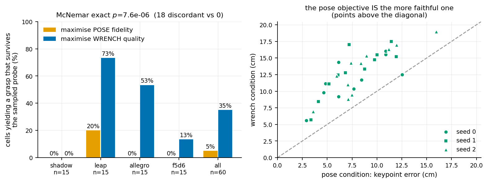

# opposition-deficit

[](tests/)
[](LICENSE)

A simulation workbench for **how a grasp should be specified when transferring
manipulation between embodiments** — and a measurement log that records, in
public, every claim this project has had to withdraw.

> **The name is a historical artifact.** It refers to an "opposition deficit"
> that does not exist: the measurement behind it was taken at the wrong point on
> every hand. See [Status](#status) and [NOTES.md](NOTES.md). Renaming is
> pending the outcome of the next experiment.

---

## The question

Human hand-object data is usually retargeted by matching the **hand's pose** —
fingertip positions, joint angles, contact points. An alternative is to specify
what the **object** requires — the wrench its contacts must resist — and let the
robot's own kinematics find a way to supply it.

Which produces grasps that actually hold, on hands that are not shaped like a
human's?

## Status

| claim | status | evidence |
|---|---|---|
| A wrench-space objective beats the retargeting pipeline practitioners ship | **supported** | pre-registered, n=60, McNemar p = 0.0075 |
| It wins by *selecting* better, not by searching more | **supported** | finds fewer valid grasps (19.8 vs 23.9 per 144), survives 2.3× as often |
| Human demonstration data helps | **not supported** | exact tie, p = 1.0000 — generic synthesis with no demonstration does as well |
| ε from real contacts predicts physical holding | **supported** | monotone, ~5× across its range, 57 grasps |
| The peg task requires two hands | **supported** | 13.49 cm vs 5.32 cm, force balance by construction |
| An opposition deficit exists among these hands | **RETRACTED** | all four oppose within 2.8 mm once measured correctly |
| A second hand repairs that deficit | **WITHDRAWN** | force-only data labelled as wrench; budget not held during disturbance |
| BC / action chunking show learned control | **RETRACTED** | open-loop replay scores 8/8 on the same task |

Everything withdrawn is preserved under `results/retracted/`,
`figures/retracted/` and `experiments/retracted/`, each with a README saying
what was wrong. **[NOTES.md](NOTES.md) is the authoritative log — read it before
quoting any number.**

## Headline result

Three arms, identical budget (144 executor calls each), identical executor and
probe. Pre-registered in [docs/G1_PREREGISTRATION.md](docs/G1_PREREGISTRATION.md)
*before* the code existed; the analysis script was committed before any result
did.

| arm | specification from | survives probe | hold (N) | valid/144 |
|---|---|---:|---:|---:|
| `pose_squeeze` | the human's **hand pose** (retarget + budgeted squeeze) | 9/60 | 0.118 | 23.9 |
| `eps_synth` | a generic **object-side** requirement, no human data | 21/60 | 0.223 | 29.2 |
| `wrench_refine` | object-side, started from the demonstration | **21/60** | **0.525** | 19.8 |

* **H1 — the objective matters.** `wrench_refine` > `pose_squeeze`: discordant
  15 vs 3, McNemar exact **p = 0.0075**; magnitude 18 wins vs 6, Wilcoxon
  p = 0.0018.
* **H2 — the demonstration does not.** `eps_synth` uses no human data anywhere
  and ties exactly: 21/60 vs 21/60, discordant 7 vs 7, **p = 1.0000**.

So the thesis splits and the halves go opposite ways: *specify the wrench, not
the pose* holds against a real baseline; *human hand-object data* does not earn
its keep — for static grasps.



## Tasks

Full definitions, protocols and validity gates: **[docs/TASKS.md](docs/TASKS.md)**.

### T1 — grasp and hold under a wrench probe

Pre-grasp → close → squeeze → release, then push and twist the object along 14
force and 14 torque directions until it slips. No floor and no gravity, so a
failed grasp is unambiguous and a resting object cannot be mistaken for a held
one.

| wrench objective | pose objective |
|---|---|
|  |  |
| ε 0.642 · 9 contacts · holds **1.345 N** | ε 0.358 · 4 contacts · holds **0.000 N** |

Same hand, same 6 cm cube, same seed, same budget. Only the objective differs.

### T2 — bimanual peg extraction

Socket friction (1.20 N) exceeds the base's weight (0.78 N), so a one-handed
pull lifts the base instead of extracting the peg. The task is two-handed by
force balance, not by assumption.

| two-handed expert | one-handed control |
|---|---|
|  |  |
| peg out **13.49 cm**, base lift +0.44 cm — success | peg out 5.32 cm, base lift **+10.26 cm** — failure |

### M1 — the opposition axis

`make axis`. Fingertips derived from each distal link's collision geometry,
mimic couplings enforced, self-collision scoped to the fingers, distance to the
*nearest* fingertip.

| hand | floor | aperture | DoF |
|---|---:|---:|---:|
| Allegro | 0.06 cm | 30.44 cm | 16 |
| Shadow | 0.21 cm | 25.18 cm | 24 |
| Dexmate f5d6 | 0.26 cm | **12.73 cm** | 11 |
| LEAP | 0.34 cm | 31.95 cm | 16 |

All four oppose within 2.8 mm of one another — there is no deficit. The spread
that *does* survive is **aperture**, where f5d6 is an outlier by 2.4×. That is a
hypothesis with a mechanism, not a result.

## Layout

```
src/oppdef/
  hands/      embodiment models — tips.py (fingertip derivation), model.py
              (shared kinematics), axis.py (the opposition metric),
              specs.py (closure synthesis), f5d6.py (URDF repairs)
  synth.py    grasp synthesis by closing in simulation
  hold.py     the wrench probe
  bench.py    the shared benchmark cell
  metrics/    Ferrari-Canny epsilon from real MuJoCo contacts
  retarget.py keypoint / epsilon / blend objectives
  envs/       the bimanual peg scene
  vec.py      batched stepping (CPU / MJX / Warp) with measured parity
  embodiment.py, sensing.py, policy.py, data.py, objects.py
experiments/  live experiments; retracted/ holds the withdrawn ones
docs/         task definitions, pre-registrations, external reviews
results/      live results with provenance; retracted/ holds the rest
NOTES.md      the measurement log and every retraction
```

## Reproduce

```bash
make install
make test                 # 44 fast + slow invariants
make axis                 # the opposition axis, with provenance
make matched              # budget-matched pose vs wrench
python experiments/g1.py  # the pre-registered three-arm comparison
make expert               # the bimanual peg task and its one-handed control
```

Renders need `MUJOCO_GL=egl`. GPU stepping uses `mujoco_warp`; **MJX-JAX does
not run on this machine** — `gpusolverDnCreate` fails, so no MJX number should
be quoted from it (`NOTES.md`, 2026-09-12).

## How this repository is meant to be read

Results carry provenance (commit, package versions, machine) and, for every
selected grasp, the placement, finger targets, per-direction probe values and
rejection counts — so a figure can be traced to the pose behind it without
re-running a search. Experiments that can decide something are pre-registered
before they are written. Withdrawn work is kept, labelled, and its generator
made to refuse to run.

The measurement log is longer than the results. That is the honest ratio for
this project so far.
