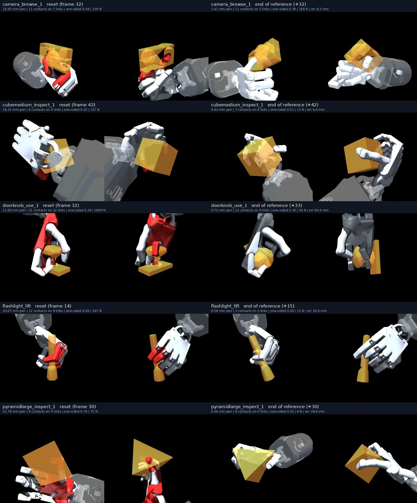
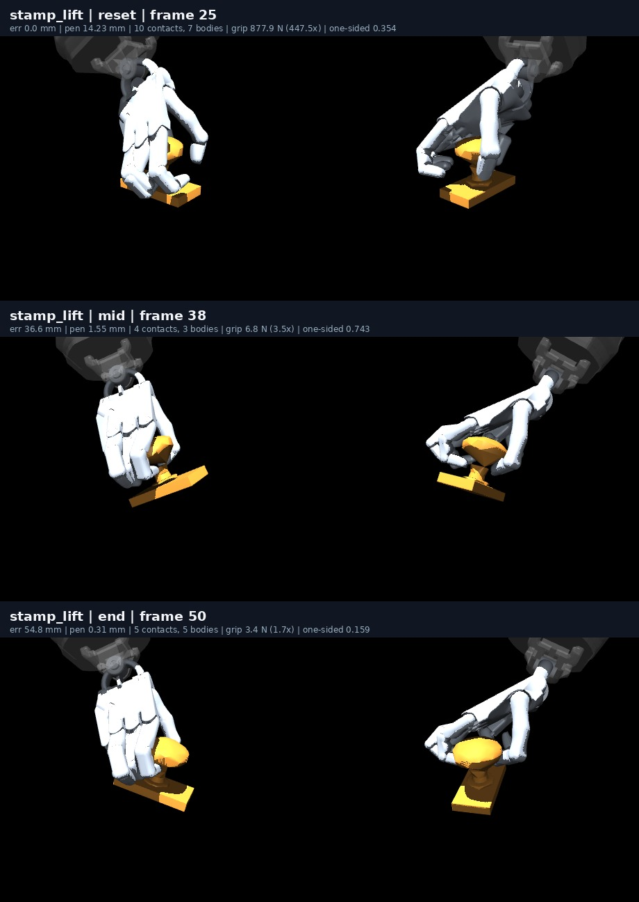
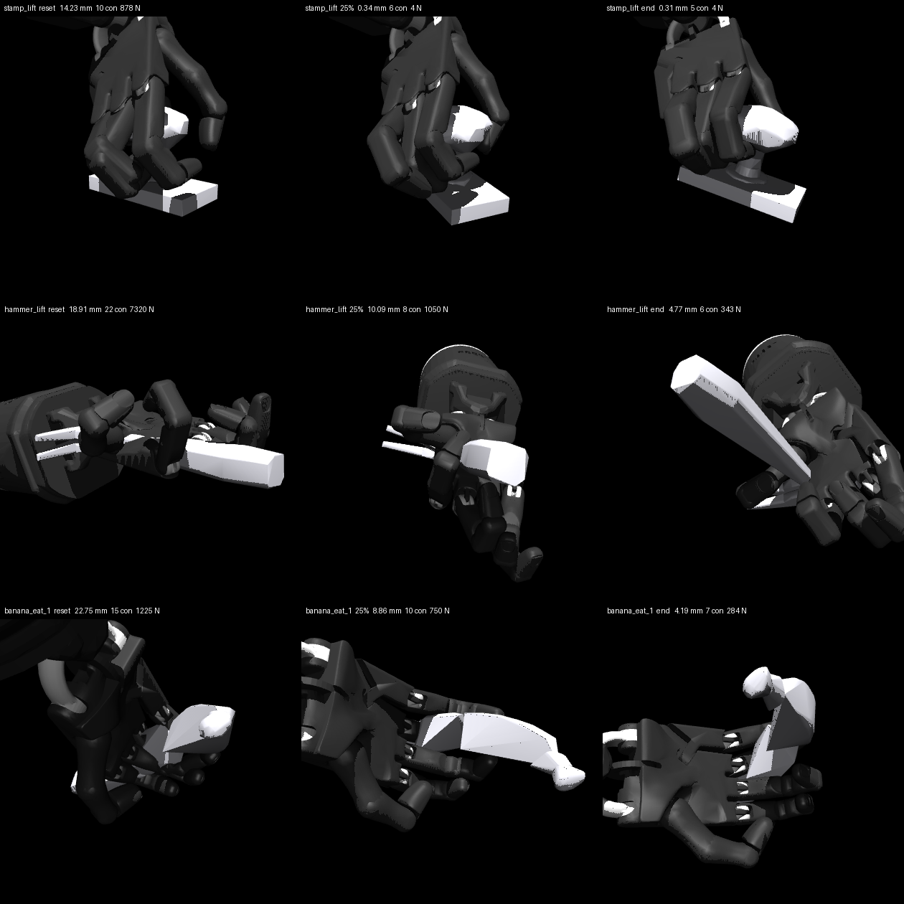
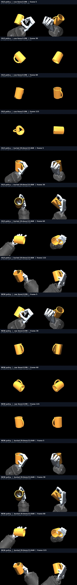

# Stage 2: the retarget

**Start here if you are picking this up.** Stage 2 turns a GRAB clip into a
robot joint trajectory. It is the blocker for everything downstream: stages 3–6
were all reporting numbers measured on poses that intersect the object, and
those numbers are withdrawn.

## The carry-scored search (2026-09-16, afternoon)

The objective was swapped, as the morning's status proposed: stage 2 now
scores a wrist offset by **the end of an open-loop carry**, not a static
hold. `experiments/tracking/stage2_carry.py` carries the retargeted hand
along its reference from the middle of the hold window with no controller,
reads the last five frames — object still in hand, worst penetration, how
many distinct links touch it, how one-sided the contact normals are — and
hill-climbs the wrist offset from the stage-2 seed on that score. A clean
end state is *held, under 3 mm, on at least two links, one-sidedness under
0.8*. One carry costs a quarter of a second, so the search is cheap: 73
carries per reference, 30 minutes for all 40.

**What it found, in the order the instruments were checked:**

| count of references (of 40) | static-hold seeds | 25-frame carry | whole-reference carry, seed 0 | seed 1 | union of the two seeds |
|---|---:|---:|---:|---:|---:|
| end the scored carry held | 15 | 28 | 26 | 29 | — |
| end it **clean** (search's own reading) | 1 | 14 | 15 | 21 | 24 |
| …and carry the whole reference when rebuilt from the stored offset | — | 10 | 14 | 21 | — |
| …and stay clean under ≥ 4 of 8 wrist perturbations (0.5 mm / 0.6°) | — | — | 10 | 16 | **19** |
| …under all 8 | — | — | 2 | 4 | **5** |

1. **The 25-frame window overfits.** Fourteen clean by the search's reading,
   ten still held at the end of the reference — but for nine of those ten the
   remainder *was* the window. Of the five whose reference ran on past it,
   one carried (`cubemedium`) and four did not: airplane and duck ended the
   window on one or two links and fell; the mug fell during the drink tilt;
   the knife stayed in hand and rotated 108 mm off pose
   (`results/stage2_carry.json`, `figures/carry/`). So the score is now the
   whole remaining reference (`--frames 1000`, 10–100 frames, still under a
   minute per reference).
2. **The search is seed-dependent.** The same hill-climb from the same seeds
   finds 15 clean end states with one random seed and 21 with another, and
   the sets differ: doorknob, elephant, flute and the large pyramid — four of
   the references the morning called "featureless convex primitives the
   search cannot grasp" — are clean under seed 1 and never touch the object
   under seed 0. A 15 mm / 20° Gaussian from a seed that makes no contact
   reaches contact by luck. The count to quote is therefore the union over
   restarts, and a real search should run several.
3. **Some clean poses are seams in the contact model, not grasps.**
   `hand_inspect_1` scored clean over all 50 frames inside the search
   process and dropped at frame 22 when the same stored offset was rebuilt
   and rolled by a second script. The two trajectories differ by the
   round-off of adding and subtracting the rejected perturbations. A hold
   that depends on the last bits of the wrist pose is not a grasp, so
   `experiments/tracking/carry_robust.py` re-carries every accepted pose
   under eight perturbations of half a millimetre and half a degree — well
   inside the retarget's own error. The small sphere survives none of eight,
   the elephant and the seed-1 mug one of eight; nineteen references have a
   pose that survives at least half, five survive all eight
   (`results/stage2_carry_robust*.json`). Where a pose is *held* under every
   perturbation but not *clean*, it is almost always the 3 mm penetration
   gate on a single tail frame (airplane, fryingpan, mug): held is robust,
   the millimetre is not.
4. **Every one was looked at.** `render_carry.py` rolls each clean pose from
   its stored offset to the end of its reference and renders reset, scored
   end and reference end from two viewpoints, object translucent, any link
   deeper than 2 mm painted red (`figures/carry_full/`,
   `figures/carry_full_seed1/`). The mechanism is the one the morning
   inferred from three examples, now seen on twenty: **at reset every one is
   a burial** — 9–32 mm inside, 50–13,600 N, red palm or fingers — and by
   the end of the reference the hand is out of the object and holding it:
   the hammer by its handle on seven links, the camera and airplane in a
   full wrap, the cube, pyramid, flashlight, sphere and doorknob in a
   thumb–finger pinch, the scissors by a finger through the loop. Two are
   not grasps although they pass the gate: the small cube rests in the
   cupped fingers of an upturned hand, and the seed-0 mug hangs by two links
   through its handle. The five that survive all eight perturbations:

   

5. **The failures are one class, still.** The twelve references no seed
   touches — the large cube, the three cylinders, the small and medium
   pyramids and spheres, phone, piggybank, game controller — start from a
   stage-2 seed with zero contacts, and a local search from a hand beside
   the object finds nothing. The alarm clock, apple, bowl and bunny start
   buried and *stay* buried under every accepted offset (4–10 mm at
   150–4300 N): the search reduces their penetration and cannot get them
   out. Those four are where a different objective or a different
   simulator would be tested first.

**Instrument notes, recorded because each one moved a number.** The tail is
averaged over five frames because a single end frame is noisy — the same
stamp carry read 5 contacts after frame 26 and 2 after frame 25. The
per-row `frame1_*` fields are read one control frame *after* reset, not at
it (the reset numbers are in `stage2_survives.json`); they were first
written as `reset_*` and renamed. `stage3_carry.feedforward` must call
`reset_at` — `rollout()` does not, and the first smoke test reported a
2423 mm feedforward from a state left over by training. And the hold count
above is not the hold rate the README headline was measured on: that was a
static hold at one frame, this is a carry over the reference, and the two
agree on nothing but the reference names.

**Stage 3 on these seeds — the first policies that improve a grasp.**
`experiments/tracking/stage3_carry.py`: PPO from the carry start frame
(±2 frames, never from `grasp_frames()`), 160k steps in 12 environments,
horizon 64, deterministic evaluation from the carry start against the
feedforward on the identical state, live end state on both
(`results/stage3_carry.json`, policies in `results/ppo_carry/`):

| reference | feedforward mean | PPO mean | feedforward end | PPO end | end state (both) |
|---|---:|---:|---:|---:|---|
| `camera_browse_1` | 9.7 mm | **5.2 mm** | 8.3 mm | 2.0 mm | 1.4–1.5 mm, 5 links, held |
| `cubemedium_inspect_1` | 7.1 mm | **3.5 mm** | 6.4 mm | 5.2 mm | 0.4 mm, 4 links, held |
| `doorknob_use_1` | 51.3 mm | **37.4 mm** | 84.4 mm | 69.8 mm | 0.7 mm, 9 links, held |
| `flashlight_lift` | 18.1 mm | **5.6 mm** | 16.6 mm | 4.0 mm | 0.6 mm, 3 links, held |
| `pyramidlarge_inspect_1` | 34.8 mm | **16.7 mm** | 39.6 mm | 22.1 mm | 0.4 mm, 4 links, held |

Five of five: the policy lowers the tracking error, by 1.4× to 3.2×, and
ends where the feedforward ends — same penetration to the hundredth of a
millimetre, same links, held. Every stage-3 row before this either tracked a
burial or dropped a grasp; these track a grasp and keep it. The feedforward
was rolled again after training and matched itself to the decimal, so the
gap is the policy's. What this is *not*: an evaluation from held-out start
frames (the policy is scored at the start it trained around), a comparison
against the earlier runs' budgets (same 160k steps, different horizon), or
evidence that a policy can *make* a grasp — it was handed one. 9–14 minutes
per reference on the Jetson.

**The gate has no force term, and the README renderer caught it.** Rendered
with `render_tracking.py` (`figures/physics_carry_*.gif`, ten clips, no
controller and PPO for each of the five robust seeds, live per-frame
values, replay delta 0 against the evaluator), every clip starts red and
turns green as the burial relaxes — except the camera, which stays red for
all 32 frames: 1.4–3.4 mm inside, held, at 130–200 N, **65–100× the
object's weight**. The clean criterion above is penetration, links and
one-sidedness; the renderer's verdict also caps grip at 40× weight, the
threshold this repository has used since the first physics gallery. Under
that cap two of the nineteen robust poses fail — camera (88×) and banana
(67×) — and the count to quote with a force cap is **17 of 40, 4 of them
under all eight perturbations** (cube 6.5×, flashlight 7.7×, pyramid 2.7×,
doorknob 24×). The camera is a squeeze that happens not to penetrate. The
next revision of the score should carry the cap; it was left out here
because the first three searches had been gamed by contact *count*, and
force had read as a symptom of penetration rather than a failure of its
own.

**The force-capped score, four search seeds, held-out starts, and the
physics grid (2026-09-16, evening).** The three experiments the afternoon
proposed, run and looked at.

*Force cap in the score.* Grip under 40× weight is now part of the clean
criterion and a capped penalty in the score (`stage2_carry.py`). The first
version of the cap was uncapped and taught a lesson: a 2500× burial seed
scored 5, the hill-climb accepted the first pose that let go (score 0.4),
and could never re-enter contact — alarm clock, apple and bowl all "dropped"
under a score meant to relax them (`results/stage2_carry_fcap_uncapped_*`,
kept). Capped at 0.3, a buried hold (~0.45) still beats a drop (0.75+).

*Four seeds, whole reference, capped score* (`results/stage2_carry_fcap_s{0..3}*.json`,
every clean pose re-carried from its stored offset and under 8 wrist
perturbations; renders in `out/carry_fcap_s*/`, not committed):

| per seed | seed 0 | seed 1 | seed 2 | seed 3 | union |
|---|---:|---:|---:|---:|---:|
| clean, search's reading | 14 | 17 | 18 | 14 | 26 |
| clean under ≥ 4 of 8 perturbations | 10 | 13 | 9 | 8 | **20** |
| under all 8 | 1 | 2 | 2 | 2 | **5** |

So a single run of this search finds 8–13 robust clean poses out of 40;
four runs together find 20, and the union has not stopped growing (10 → 15
→ 18 → 20 over seeds 0–3). Restarts are the method, not a refinement. The
five that survive all eight — banana, cube, flute, headphones, scissors
([reset → end](../figures/carry_robust_five_fcap.jpg)) — are not the five
from the two-seed run: flashlight survives 7, 1, 7 and 0 of 8 under the four
seeds, so "all eight" is itself a per-seed lottery and the ≥ 4 count is the
one to quote. Twelve references never contact the object from their seed
under any of the four seeds and one seed each rescues the medium cylinder
and the phone at 0 and 3 of 8; the four that stay buried (alarm clock,
apple, bowl, bunny) stay buried.

*Held-out starts for the five policies* (`stage3_carry_eval.py`,
`results/stage3_carry_eval.json`; every second frame of each reference,
feedforward against PPO from the same state):

| reference | starts | feedforward held | PPO held | median error, FF → PPO |
|---|---:|---:|---:|---|
| camera | 27 | 26 | 26 | 15.1 → 6.7 mm |
| cube | 37 | 32 | 31 | 11.4 → 8.4 mm |
| flashlight | 9 | 9 | 9 | 17.8 → 7.4 mm |
| doorknob | 27 | 4 | 5 | drop → drop |
| pyramid | 25 | 3 | 3 | drop → drop |

The policy halves the error on every start the feedforward already carries
from and rescues nothing where it does not. The doorknob and pyramid seeds
carry from a window of about ten frames around the frame they were searched
on and from nowhere else — the wrist offset is fitted to that start. A
policy trained around one start is a tracker for that start's grasp, which
is what stage 3 was always going to be.

*Physics grid* (`carry_softcontact.py`, `results/stage2_carry_softcontact.json`;
the stuck four plus cube and flashlight as controls, same search and score):

| setting | stuck four | cube (control) | flashlight (control) |
|---|---|---|---|
| default | buried or dropped, 0 of 8 robust each | clean 8/8 | clean 7/8 |
| contact solref 0.02 → 0.06 s | deeper: 4–11 mm | **drops** | sinks to 9.3 mm |
| + finger force ×0.3 | same | drops | 9.3 mm |
| weld solref 0.01 → 0.10 s | alarm clock 2362×, bowl 9602× | drops | drops |
| all three | nothing held clean | drops | drops |

Softer MuJoCo contact means deeper penetration at the same load, which the
score sees and the controls fail on; a compliant wrist lets the object push
the hand away and the controls drop. None of it relaxes the four. This is
not DexTrack's physics — PhysX with a depenetration cap is a different
model, not a softer version of this one — and it says the MuJoCo knobs that
sound like "softer" are not the way to it. The four stuck references are a
geometry problem (vessels and a wide clock the fingers cannot span) until
someone shows otherwise.

**D2, rotation into the score and the reward (2026-09-17).** The
milestone from `BRIEF.md`: rotation error in the carry score (0.06 per
radian of mean rotation), a linear non-saturating rotation term in the PPO
reward (`w_rot_lin` 0.5, `w_rot` 1.0), four search seeds, every pose
rebuilt, perturbed and validated, PPO on the 18 robust seeds, both rules
scored on the same rollouts (`results/stage2_carry_rot_*`,
`results/stage3_carry_rot.json`, `results/dextrack_metric_rot.json`).

| of 40 references | before D2 (20 seeds, FF) | D2 feedforward (18 seeds) | D2 PPO (18 policies) | target |
|---|---:|---:|---:|---:|
| DexTrack strict (10 cm, 20°, hand) | 2 | 2 | **6** | |
| DexTrack loose (10 cm, 40°, hand) | 8 | 11 | **13** | 22 |
| ours (held, < 3 mm, ≥ 2 links, opposed, < 40×) | 17 | 17 | **16** | 16 |

The rotation term moved what it was aimed at: PPO mean rotation fell on
16 of 18 (banana 38° → 11°, eyeglasses 34° → 16°, flute 23° → 17°,
flashlight 41° → 32°), strict passes went from 2 to 6, and the robust seed
set became more robust (9 under all eight perturbations, up from 5). **The
loose target was not met, and it could not have been from this seed set:
18 references have a robust seed, so 18 is the ceiling, and 13 of those 18
pass loose.** The 22 that cannot pass are the 12 whose stage-2 seed never
touches the object, the 4 that stay buried, and 6 whose best pose fails
the perturbation test. The gap to DexTrack's baseline is now seed coverage,
not tracking. Two regressions: binoculars and the small cube hold under the
feedforward and drop under their policy (212 and 35 mm), the first time a
policy here has lost a grasp the feedforward kept; both are light two-link
pinches at 2 and 63 N, and both are recorded as failures, not excluded.
Rotation that remains (knife 41°, duck 44°, bunny 43°, binoculars 68°) is
the object turning in a fingertip pinch, and the reward did not fix it.

## D1, the audit of DexTrack's released checkpoints (2026-09-17)

Run on a rented RTX 3090 (RunPod community cloud, $0.22/h, about $1.50 of
GPU time in total, pod stopped afterwards). Their code, data, assets and the
three released GRAB checkpoints (`s2_cubesmall_inspect`, `s2_duck_inspect`,
`s2_flute_pass`), Isaac Gym Preview 4, their `run_tracking_headless_grab_single_test.sh`
path at 4 environments instead of 100, headless as their maintainer
recommends in issue #3. A 30-line env-var-gated hook in their task records,
for environment 0 at every control step, the object pose, every hand link's
pose and PhysX's net contact force on every link
(`results/dextrack_audit/audit_hook.diff`). Penetration is then measured
geometrically with the same shapes PhysX collided: the URDF's box and sphere
collision primitives on the Allegro links, densely sampled, against the
convex decomposition their loader gives PhysX
(`experiments/tracking/audit_dextrack.py`).

**The released code does not run its own checkpoints as released.** Their
environment creates the hand at its zero joint pose, palm at the origin on
top of the object, and steps physics once before it snapshots the root
states it later resets from; the snapshot therefore holds the object
mid-flight (0.14 m up, 2.5 m/s, 63 rad/s), and every reset re-launches it.
With that repaired, the object born exactly on the ground plane is still
ejected at 9 m/s in the first step by PhysX's depenetration. Under the
unmodified release all three checkpoints lose the object at step one and
their own success counter reads 0 of 4 environments. Two fixes make the
policies work: settle the hand's links to the reference pose with the
object parked, and create the object 3 mm above the plane at rest. Both are
in the diff, both are switchable, and neither touches the policy, the
reward or the reference. A stub replaced the `datasetv4.1` archive for a
field their code reads but never uses (`target_qpos`); the object scale it
also carries is 1.0 for GRAB, matching the only decomposition present.

**With those fixes, two of the three track and one holds then loses it.**
Per rollout, 298 frames, frame 0 excluded; grip is the sum of PhysX net
contact force over links that geometrically touch the object, in multiples
of the object's weight at their density of 500 kg/m³:

| clip | object weight | position error | penetration mean / median / max | frames > 2 mm | > 5 mm | grip median / mean / max | frames > 40× |
|---|---:|---:|---:|---:|---:|---:|---:|
| small cube | 0.61 N | **0.44 cm** | 1.75 / 1.1 / 10.6 mm | 99 (33 %) | 15 (5 %) | 25× / 52× / 269× | 152 |
| duck | 2.44 N | **0.26 cm** | 2.28 / 2.0 / 7.5 mm | 150 (50 %) | 23 (8 %) | 3× / 13× / 255× | 28 |
| flute | 0.41 N | 0.1–3 cm to frame 160, then lost (93 cm) | 0.74 / 0.0 / 3.5 mm | 57 (19 %) | 0 | 0× / 19× / 152× | 73 |

**What that says.** Their successful rollouts are not the 10–17 mm burials
this pipeline produced; they hold the object at 1–2 mm of interpenetration
most of the time, with excursions to 5–10 mm on 5–8 % of frames, at forces
that are mostly modest on these light objects and spike to 250× weight.
Against our rule (held, under 3 mm, under 40× weight) the duck passes on
most frames, the cube fails the force half on about half of its frames, and
the flute passes while it holds and then drops. Against their own rule, all
three read 0 successes in these runs: the cube and duck track position to
millimetres but the object rotates in the hand by 40–150° over the lift
(orientation is not in the reward for these checkpoints,
`w_obj_ornt=False`), and the flute is lost. The penetration their metric
never sees is real but small; the mechanism that made ours large — a stiff
weld, stiff servos and an impulse-resolved contact model — is not theirs.

**Caveats, all of them.** Three clips, one environment read per clip, from
subject s2's training split, not the 197-clip test set. The initial
conditions are mine, not theirs, and their released initialization does not
run. Sampled surface points underestimate penetration between samples.
Rotation error is measured against the logged `goal_rot` and may include a
frame convention I have not verified. The audit is of the checkpoints they
released, which may differ from the ones behind Table 1. Everything is
under `results/dextrack_audit/`: per-frame logs, audits, launch command,
and the diff.

**D1 at scale: their generalist on 43 clips (2026-09-17, evening).** The
released `grab_trajs_tracking_ckpt.pth`, their generalist over the GRAB
training split, run with the same hook and the two initialization fixes on
43 clips drawn across subjects s1, s2 and s10 and one per object
(`results/dextrack_audit/generalist/`, summary in `summary.json`). Their own
success counter reads 0 on every clip. By the object alone: **17 of 43 hold
the object to the end of the clip** (final error under 10 cm), 19 track
under 10 cm mean error. Over the 17 that hold: penetration mean, median
across clips, **1.68 mm** (0.24 to 3.23), frames over 2 mm median **36 %**
(5 to 74), frames over 5 mm median 2 %, grip on touching links median of
medians 11× weight. The picture, rendered from the logged poses under our
camera: the apple is held by a palm and two fingers 2 to 3.5 mm inside it on
three quarters of its frames ([gif](../figures/dextrack_gen_apple.gif)); the
mug is never grasped, nudged, and lost ([gif](../figures/dextrack_gen_mug.gif)).
So the released generalist, initialized so that it can run at all, holds
about 40 % of these clips by the object criterion, and does so at 1 to 3 mm
of interpenetration on a third to three quarters of frames. Not our burial;
not zero either; and invisible to their metric.

## Penetration-aware training in their framework (2026-09-17, night)

The audit's probe, made cheap enough to run every control step for thousands
of environments (`experiments/tracking/penetration_torch.py`: the hand's
collision primitives as sampled surface points, the object as the face
planes of its convex parts, a bounding-sphere cull, batched on the GPU;
correlation 0.88 with the offline audit on the same rollout at its sparse
setting (see the correction below: too sparse to train against), 3.5 ms per
step at 4096 environments on a one-hull object, about 100 ms per 1024 on a
64-hull one), and added to DexTrack's reward as an env-var-gated term
(`AUDIT_PEN_W` per metre of depth, `AUDIT_FORCE_W` per unit of grip above
40× weight; the diff is in `results/dextrack_audit/audit_hook.diff`).
Fine-tuned from their released small-cube checkpoint, 1024 environments,
their trainer otherwise untouched.

| checkpoint, 16 environments each, same starts | penetration mean | frames > 2 mm | grip on touching links | position error | held at the end |
|---|---:|---:|---:|---:|---:|
| released `s2_cubesmall_inspect` | 2.18 mm | 45 % | 54× weight | 0.14 cm | 16 of 16 |
| + depth term 100/m + force term, 75 epochs | (evaluated at 4: 2.59 mm on env 0) | 59 % | 39× | 0.38 cm | worse; a miss |
| **+ depth term 300/m, no force term, 150 epochs** | **1.33 mm** | **26 %** | **34×** | 0.41 cm | **16 of 16** |

**Correction (2026-09-17, later the same night): the probe the policy was
trained on was too sparse, and the policy partly learned the probe rather
than the geometry.** The reward term sampled each link's collision box at
twelve random surface points plus its eight corners. The depth of a convex
link into a convex part is the maximum of a concave function over the
link's surface, which can sit in the middle of an edge or a face, so a
policy rewarded on twenty points per link can hold those points shallow
while the surface between them goes deeper. It did. The dense offline
audit of env 0 read the fine-tuned rollouts *worse* than the released one
(2.86 vs 2.40 mm), which the probe's 1.18 vs 2.18 could not explain by
env-to-env variation alone. Re-scoring every checkpoint over all 16
environments with a 2 mm grid on every box face (33,114 points per hand,
`penetration_torch.py --spacing`; the same grid is now what the reward
term uses) gives the honest table
(`results/dextrack_audit/finetune/dense/`):

| depth weight (per metre) | sparse probe (what was trained on) | **dense, 2 mm grid** | frames > 2 mm (dense) | grip on touching links (dense) | position error | held |
|---|---:|---:|---:|---:|---:|---:|
| 0 (released) | 2.18 mm | **2.87 mm** | **60 %** | 106× | 0.14 cm | 16 of 16 |
| 100 | 1.59 mm | **2.43 mm** | **55 %** | 89× | 0.25 cm | 16 of 16 |
| 300 | 1.33 mm | **2.34 mm** | **50 %** | 75× | 0.41 cm | 16 of 16 |
| 1000 | 1.18 mm | **2.23 mm** | **47 %** | 68× | 0.29 cm | 16 of 16 |

**Trained on the dense measure** (2 mm grid read through the signed-depth
volume, the same 150 epochs from the released checkpoint, w = 1000;
`results/dextrack_audit/finetune/cubesmall_pen_dense_w1000_ep474.pth`),
judged by the exact plane test on the same 2 mm grid:

| trained on | dense penetration | frames > 2 mm | grip on touching links | position error | held |
|---|---:|---:|---:|---:|---:|
| nothing (released) | 2.87 mm | 60 % | 106× | 0.14 cm | 16 of 16 |
| sparse probe, w 1000 | 2.23 mm | 47 % | 68× | 0.29 cm | 16 of 16 |
| **dense volume, w 1000** | **2.12 mm** | **42 %** | **47×** | 0.41 cm | **16 of 16** |

A 26 % cut in interpenetration, frames over 2 mm from 60 % to 42 %, grip
down 56 %, every rollout held, for 2.7 mm of tracking error. The env-0
rollout under the independent 400-point sampler agrees (2.38 to 1.94 mm,
137 to 91 frames over 2 mm, grip 30× to 16×). Rendered
(`figures/dextrack_cubesmall_penft.gif`, released policy alongside in
`figures/dextrack_cubesmall_base_vs_penft.jpg`): the fine-tuned hand
carries the cube in a lighter, more open grip, 0 to 6× weight on the
touching links through most of the clip, with excursions that are fewer
but not gone (a 9 mm thumb-tip excursion at frame 86). Training-time dense
depth fell from 1.27 to 0.48 mm while the evaluated mean is 2.12 mm: the
gap between what the trainer sees and what the deterministic test rollout
does is the next thing to explain, not to average over.

**On the generalist it collapses.** The same term at weight 300 on the
generalist checkpoint, apple clip (64 hulls, 3.5 N), 150 epochs: the
policy learned to let go. Exact test at 16 environments: released 2.34 mm,
46 % over 2 mm, 13 of 16 held; fine-tuned 0.31 mm, 5 %, grip 4×, **0 of 16
held**, end error 58 cm in every environment
(`results/dextrack_audit/finetune/dense/apple_w300_sdf.*`). Zero
penetration by not touching is the cheapest solution to a bare penalty,
and it is the same failure this project's own pipeline recorded under
"a penetration penalty in the reward". The per-clip cube policy did not
take that exit because its tracking reward is worth more to it; the
generalist's grip on the apple was worth less than 0.7 per step. Rerun
in progress: weight 100 and the term charged only while the object is
within 10 cm of its target (`AUDIT_PEN_GATE=0.1`), so dropping forfeits
the pose reward without buying relief.

Gated and at weight 100 (charged only within 10 cm of the target), same
clip and epochs: fine-tuned 2.64 mm, 43 % over 2 mm, grip 10×,
14 of 16 held, against the released 2.34 mm, 46 %, 19×, 13 of 16.
The gate keeps the object in hand and halves the grip, and penetration
does not move. So on the generalist the term is either strong enough to
make the policy let go or too weak to change where the fingers sit; the
cube's per-clip policy had a middle. Weight 300 with the gate: the policy lets
go again, 0 of 16 held, 0.17 mm. The gate does not open a middle on the
generalist: the tracked fraction of training environments sat at 26 %
throughout, so for this policy on this clip holding the apple was never
worth much, and any penalty large enough to move the fingers is large
enough to make it stop trying. **Where the term works is where the
tracking reward is strong**: a per-clip specialist gives up 26 % of its
interpenetration and half its grip and keeps every rollout; a generalist
that only marginally holds the clip gives up the clip. Note also that
the trainer's printed depth (0.3 mm) averages over environments that have
already lost the object under exploration noise, which is why it cannot
be compared with the evaluated 2.6 mm; the statistic now reports tracked
environments only.

The effect is real and monotone in the weight but **half of what the sparse
probe reported: at 1000, interpenetration is down 22 % (2.87 to 2.23 mm),
frames over 2 mm from 60 % to 47 %, grip 36 %, every rollout held, for 1.5
mm of tracking error.** The sparse-probe table above is kept as the record
of the mistake. Grip reads higher under the dense grid because more links
register as touching; the ratio is what to compare. The sparse-probe
sweep on the generalist (apple, torus, stamp, flashlight) was stopped
before its first result, since it optimised the gameable measure; the
next fine-tune runs on the dense grid (chunked over environments, 256 at
a time, so the 1024-env tensor fits beside training). Lesson for the file
next to the others: a measurement a policy optimises has to be as dense
as the audit that judges it, or the policy will find the gap.

**What this settles and what it does not.** Settled: the property is
dynamic and searchable — scoring the end of the carry turns one clean end
state into nineteen, on the same seeds, in the same neighbourhood, with
nothing else changed. Not settled: whether the poses are *good* grasps by
any standard other than this one (the tracking errors at the end of the
carry are 7–85 mm, mostly rotation slip); whether the count holds under a
third and fourth search seed (two is the minimum that shows the variance
and does not bound it); and what distinguishes the four that stay buried
from the twenty that relax, which is the same open question as this
morning with a smaller denominator.

---

Status as of 2026-09-16, 06:20 — the state of the six stages after one
night of two sessions measuring each other's claims:

- **Stage 2** is measured and reproducible: hold rate **0.275 → 0.850** on
  40 objects, identical at frozen `HEAD` on every reference
  (`results/stage2_grips_clean.json`). Of the 34 holds, 20 are grasps and 6
  are burials; the 6 failures are featureless convex primitives.
- **Stage 3** is measured twice, the second time on seeds keyed by subject:
  the ten references separate perfectly by seed class — burial median
  17.5 mm, grasp median 17,525 mm, no row crosses — and *nothing else
  measured predicts the outcome*: not start frames, subject, clip, object or
  budget. At a fixed initial condition the feedforward and the policy agree
  to within noise: the **feedforward drops a valid grasp too**. n = 2 on the
  burial arm.
- **Stages 4–5** are measured on correct seeds: distillation is the best of
  three controllers on every held-out object, and every number is a dropped
  object. **Stage 6** has the two-handed gap and its null case; **stage 7**
  is structurally blocked on stage 4.
- **Ruled out tonight, by measurement:** the reward's shape as the cause
  (the feedforward fails the same way); base stiffness (burial tracks at 20×
  the weld compliance and contact displaces the base by nothing); sample
  size (dead in both directions); the policy class (interchangeable).
- **Shown, not inferred, by the open-loop carry sweep** (`2afbaa0`,
  `experiments/tracking/stage2_survives.py`, `results/stage2_survives.json`):
  each of the 30 carried stage-2 seeds rolled along its reference with **no
  controller of any kind**. Burial seeds carry the object to the end in
  **10 of 13** (median 100 % of the reference, ending 10 mm inside); grasp
  seeds in 3 of 13 (median 41 %, ending 0.00 mm — dropped). The sharpest
  pair: `bowl_drink_1` carries its whole 131-frame reference at **9.9 mm
  mean error with nothing controlling it**; the PPO policy trained on that
  reference scored 8.2 mm. The policy bought 1.7 mm. Every stage-3 row had
  a policy in the loop and could not separate "the policy tracks the
  burial" from "the burial carries itself"; this can, and it is the latter.
- **And one positive existence proof, n = 1 — looked at before it was
  believed:** `stamp_lift` carries its 26-frame reference at **35.0 mm
  mean, ending 0.31 mm penetration, 5 contacts on 5 bodies, 3.4 N,
  one-sidedness 0.159**, holding a 2 N object open-loop. It tracks under
  50 mm *and* ends un-buried, which nothing in either stage-3 run did. But
  the render (`figures/stamp_lift_carry.jpg`, reproduced independently:
  same 35.0 mm, same end state) shows what the numbers alone would have
  hidden: **at reset it is a burial** — 14.23 mm inside on 10 contacts and
  7 bodies at 878 N (447×), equilibrium 5.2× — and it *relaxes into a grasp
  as the hand moves*: 1.55 mm / 6.8 N on 3 bodies at mid-reference, then a
  five-finger pinch on the stamp's knob at the end. The stage-2 row calls
  the seed 4 contacts at 16.2 N; the tracking scene's reset reads 878 N —
  the stage 2→3 scene asymmetry again. So this is not "a grasp survives
  being carried"; it is "a burial resolved into a grasp under motion and
  the object stayed held". Still an existence proof of a held, un-buried
  end state, the first here, and still one of thirty on a short reference.
  Three independent searches had concluded the retarget's neighbourhood
  contains nothing that both contacts and does not penetrate; the end
  state of this rollout is such a configuration, reached by physics rather
  than search, with no controller to credit. It is the thing to
  characterise next — point `wrap_score` at its end state, where the
  answer should come out positive, and ask what the motion did that the
  search could not.

  
- **The reframe** (`12205c5`, from rendering the three grasp seeds that
  carried to the end): **all three start buried and relax under motion.**
  `stamp_lift` 14.23 mm / 878 N at reset → 0.31 mm / 3.6 N at the end (46×
  in depth, 244× in force); `hammer_lift` 18.9 mm / 7320 N → 4.8 mm / 343 N;
  `banana_eat_1` 22.8 mm / 1225 N → 4.2 mm / 284 N. It is the contact
  solver resolving an over-constrained pose into a stable contact set in the
  first frames of motion, and what is left is a real grasp. The two grasp
  seeds that failed did not fail by being too buried: `knife_lift` makes
  **zero contacts at reset** — its stage-2 grasp does not touch the object
  in the tracking scene, and its twice-"unexplained" 87.7 mm is an object
  falling beside a hand that never held it (retracted as unexplained here);
  `phone_call_1` is buried at 11.5 mm but engaged at only 78 N, an order of
  magnitude below the carriers, and gone by the first quarter. So the three
  independent searches that concluded *no pose both contacts the object and
  stays out of it* were looking for the wrong object: the property is
  dynamic, not static. You do not need a pose that touches without
  penetrating; you need one that **penetrates enough to relax into contact
  once the hand moves**, and the relaxation produces the grasp. A static
  hold test with a penetration gate rejects every one of these three,
  including the only held, un-buried end state in the repository.
- **On all 30 carried seeds** (`731dc60`): 14 carry the object through
  the whole reference open-loop, 16 do not. The grip-force discriminator
  that was clean on n = 5 **does not survive** — 77 % on 30, a carrier at
  223 N and a failure at 21,178 N — and is retracted rather than hedged;
  contact count is marginally best at 80 %, and none of the four reset
  quantities (depth 70 %, contacts 80 %, grip 77 %, equilibrium 73 %) is a
  discriminator. What survives is the *direction*, and it reverses the
  premise of the whole pipeline: **the references that carry start MORE
  buried** — median 17.7 mm on 42 contacts, against 11.8 mm on 12 for the
  ones that drop — and **penetration depth is the least informative of the
  four**. The quantity this project spent its life minimising is the worst
  predictor in the table. The n to caveat has moved: the relaxation
  mechanism is n = 14, on firm ground; the end state that is *both* held
  and un-buried is n = 1 (`stamp_lift`; the other thirteen carriers end
  4–17 mm inside). Burial-to-grasp relaxation is common; relaxation all the
  way to a clean grasp has been observed once.

  

  The figure (`fbc2437`) is what the table cannot carry: at reset the
  fingers are visibly driven through the stamp's base; by the end the hand
  pinches its knob with the body hanging below. Hammer and banana show the
  same mechanism stopping short, which is what makes stamp legible as the
  exception rather than the rule. Its first version was misleading twice —
  a free camera that filled banana's frame with the object's face, and an
  end frame captured *before* the final step, reporting stamp at 2 contacts
  where the carry ended on 5 — the seventh instrument tonight reporting on
  a moment adjacent to the one asked about, caught because the numbers
  disagreed with a probe already run.
- **So the next real experiment is upstream of all four learning stages,
  and it is now well-posed:** the honest open question is no longer "why
  is the neighbourhood empty" — it is not, there are fourteen worked
  examples of a pose that carries an object through its reference with no
  controller — but **"which buried poses relax well, and what makes one
  relax all the way."** The stage-2 objective should score **the end state
  of a short carry**, not a static hold with a penetration gate. Not the
  reward, not the distillation, not the base. The reward-term branch
  (landed at `423dac9`, off by default) is for whoever wants a policy paid
  to hold; it is not the fix for this.

Earlier status (2026-09-15), kept for the subproblem table:

| subproblem | state | evidence |
|---|---|---|
| **A. Arm-side placement** — forearm/wrist/palm inside the object | **fixed** | `W_PEN_ARM=60` → `binoculars_see_1` 175 m → **106 mm**; arm-side penetration 0.00 mm median over 40 sequences |
| **B + C. The wrist pose** — the arm reaches the object before the fingers do | **open, and now one question** | on `mug_drink_1` the arm penetrates at 0.48 mm while the tips are 42.9 mm out; for vessels the palm is 33 mm inside with **zero** finger contact |

**What stage 2 has to produce — as stated on 2026-09-15, superseded above:**
a configuration with many contacts, on opposing sides, at bounded
penetration — a wrap. That described the *end state* correctly and the
*search target* wrongly: the carry sweep showed the end state is reached by
relaxation under motion from a pose that starts well inside the object, so
the search should score the end of a short carry, not a static wrap.

**The hard finding, and the reason this is not a tuning problem:** across 3019
sampled wrist poses under a 2 mm penetration gate, **not one made contact at
all**. Every configuration that touches these objects penetrates them. That is
the same result as the earlier 0-of-283 over translation, now over orientation.

**Before proposing anything, look at it.** See
[Look at the pose before trusting the number](#look-at-the-pose-before-trusting-the-number).
Three conclusions recorded in this document were wrong until someone rendered
the scene, and the corrections are kept inline rather than deleted.

RL/DexTrack is blocked behind this: every PPO checkpoint is a correction to a
specific initial condition, so changing the grasp invalidates it. Retraining is
~25 min per reference, and nothing should be retrained until a grasp survives a
rollout.

---

## The reference is clean — a sub-millimetre wrap exists

Worth establishing before anything else, because it bounds what stage 2 has to
achieve. Minimum distance from any MANO hand vertex to any object vertex, in the
GRAB reference itself:

| reference | min gap | median during hold | frames < 1 mm |
|---|---:|---:|---:|
| `cup_lift` | **0.19 mm** | 0.99 mm | 194/467 |
| `mug_drink_1` | **0.47 mm** | 1.51 mm | 18/167 |
| `binoculars_see_1` | **0.14 mm** | 0.91 mm | 113/236 |
| `flashlight_on_2` | **0.11 mm** | 0.81 mm | 112/194 |

The human hand closes to a fraction of a millimetre and stops there, for
hundreds of frames. Two consequences:

1. **The 8–17 mm of robot penetration is the retarget's doing**, not a flaw
   inherited from the data. The reference is not asking the robot to intersect
   anything.
2. **A sub-millimetre wrap of these exact objects exists**, because a human
   performs one on every frame. So the earlier result — 3019 sampled wrist poses
   under a 2 mm gate, none making contact — is a statement about the Shadow hand
   and the space being searched, not about the objects being ungraspable.

**Caveat, and it matters.** This is an unsigned point-cloud distance, the same
quantity as `GrabSequence.contact_distance`. It cannot report a negative value,
so it shows the human achieving sub-millimetre contact but does **not by itself
prove non-penetration** — a hand a few millimetres inside would still report a
small positive nearest-vertex distance. Establishing that properly needs a
signed test against the convex decomposition, which has not been run.

### Which links the human uses — and a retraction

**Retracted.** An earlier revision of this section claimed, from MANO joint
positions, that "the human contacts with fingertips and distal phalanges;
middle phalanges sit 14–20 mm out", and used that to argue a middle-phalanx
contact term would be the wrong fix. That argument does not hold and the
measurement behind it could not support it.

`human/retarget.py` already carries `W_MID = 0.6`, a middle-phalanx **contact**
target — explicitly distinguished there from a joint-position target — with
per-finger surface gaps measured against a 15 mm tolerance:

| reference | TIP gaps (mm) | MID gaps (mm) | fires |
|---|---|---|---|
| `binoculars_see_1` | 3.1 7.8 6.5 10.8 0.9 | 5.8 10.3 18.4 24.5 16.1 | 2/5 |
| `flashlight_on_2` | 10.3 15.4 12.8 23.3 27.9 | 7.8 2.9 5.4 24.0 13.1 | 4/5 |
| `cup_lift` | 6.8 21.8 11.6 18.8 5.5 | 4.8 7.7 6.3 5.3 0.5 | 5/5 |
| `mug_drink_1` | 12.8 13.1 13.6 16.4 1.1 | 7.6 8.2 9.8 26.0 27.7 | 3/5 |

On `cup_lift` every middle phalanx is closer to the object than the fingertips
are. The claim that the human holds that cup with the middles of its fingers is
measured, per finger, at the surface.

**Why my contradiction was invalid.** I measured MANO *joint centres*, which sit
roughly 8–10 mm inside the finger, and aggregated as a minimum over the five
fingers then a median over engaged frames. That is a different quantity from a
per-finger surface gap at the grasp, and it cannot refute one. The two are not
comparable and I treated them as though they were.

The general lesson, which cost more than this one entry: **read the module
before contradicting its measurements.** The rationale was in the file, with the
numbers, above the constant it justifies.

What survives from my measurement is only the weakest reading — that the human
engages more than the five fingertips — which `W_MID` already encodes.

## The defect

The retarget matched the human's fingertip **positions** with no non-penetration
constraint. For the Shadow hand on these objects, that optimum is inside the
object continuously — not at the grasp moment, at *every frame*.

Scanned across 20 s1 sequences, object at its reference pose, no closure:

```
23 of 2866 frames are under 1 mm of penetration
13 of 20 sequences never reach a collision-free frame at all
```

| reference | min | median | clean frames | deepest body |
|---|---:|---:|---:|---|
| `binoculars_see_1` | 17.15 mm | 25.12 mm | 0/155 | **forearm** |
| `flashlight_on_2` | 12.82 mm | 13.66 mm | 0/144 | **palm** |
| `cup_drink_2` | 11.73 mm | 12.28 mm | 0/117 | ffproximal |
| `mug_drink_1` | 6.81 mm | 10.82 mm | 0/116 | ffproximal |
| `camera_takepicture_1` | 0.00 mm | 14.09 mm | 13/143 | forearm |
| `gamecontroller_play_1` | 0.00 mm | 5.46 mm | 1/192 | ffdistal |

The split is structural: sequences that never come clean are dominated by a
large **non-finger** body; those that do are dominated by distal links. A Shadow
forearm is not shaped like a human's, so placing the wrist where the human's
wrist was puts the arm inside the object.

## What this invalidated

The penetration manufactured contacts, which produced grip, which flattered
every downstream metric. Measured on the four published rollouts: 8–14 mm of
interpenetration on **541 of 541 frames**, at 796–3850× the object's weight, up
to 13 kN on a 1.96 N object.

Three consequences, each measured:

- **Position error was meaningless.** The cage constrains translation, so
  position error stays in the tens of millimetres however badly the grasp fails.
  Rotation inside the cage is nearly unconstrained — hence 44.8° / 45.9° /
  138.4°. Orientation was the honest signal all along.
- **The grasp search was *rewarded* by penetration.** Depth buys contacts,
  contacts buy force, force buys grip, grip lowers tracking error. On
  `mug_drink_2` the search took the retarget from 11.08 mm / 4411 N to
  17.47 mm / 8815 N.
- **Every static grasp metric is blind to it, ε included.** Ferrari–Canny on the
  four reset contact sets gives ε 0.155–0.344 and δ 0.0005–0.0045 — strongly
  force-closed on paper — and ranks them *backwards*, the camera highest-ε and
  worst-outcome. ε takes the contact set as given, and the contact set is an
  artifact.

## What was ruled out, by measurement

Everything downstream of the retarget. None of these is a matter of tuning.

| remedy | result |
|---|---|
| Reweight `w_pen` | plateaus: 11.08 → 8.29 mm at w=4, then flat at 12 and 30 |
| Search harder for a better pose | **0 of 283** candidates across 3 references both touch the object and stay out of it; every candidate under 2 mm has <3 contacts |
| Open the fingers before closing | clears nothing at any amount: mug 10.13 → 10.64 / 9.91 / 11.35 / 11.36 mm at 0.3 / 0.8 / 1.5 / 3.0 rad; palm invariant at ~6 mm |
| Retract the wrist along the contact normal | **diverges** — binoculars runs to a 186 mm offset with penetration *rising* 17.15 → 62.44 mm, because a wrapped hand cannot be translated out (normal alignment 0.325) |
| Let it settle | gravity off 0.5 s takes 12.7 → 11.8 mm while ejecting the object 28 mm and losing every contact |
| Advance the wrist to contact before closing | **0.0 mm of advance** on 4 references — the arm is already touching while the tips are 43 mm out, so translation drives the arm deeper first |
| Close the fingers to a force target | close stops after **one 0.015 rad step**: penetrating contacts already read 362 N and 2487 N against an 8 N target, so the grip is declared formed before the hand closes |

And the result that explains why: **making the pose feasible makes the tracking
worse**, because the contacts and the penetration are the same thing.

| reference | w_pen | penetration | force | tracking |
|---|---:|---:|---:|---:|
| `mug_drink_1` | 1.0 | 10.13 mm | 2294 N | 33.9 mm |
| `mug_drink_1` | 25.0 | **1.35 mm** | 1202 N | **148.7 mm** |
| `binoculars_see_1` | 1.0 | 0.02 mm | 44 N | 176578 mm |

---

## A. Arm-side placement — fixed

Weight non-penetration on bodies not strictly below a knuckle (forearm, wrist,
palm, knuckles) at 60× the finger weight.

| reference | w_arm | arm penetration | force | residual | tracking |
|---|---:|---:|---:|---:|---:|
| `binoculars_see_1` | 1 | 5.20 mm | 117 N | 29.5× | 175528 mm |
| `binoculars_see_1` | **60** | 2.47 mm | 2473 N | 15.4× | **106.2 mm** |
| `flashlight_on_2` | 1 | 12.96 mm | 782 N | 1.7× | 8.5 mm |
| `flashlight_on_2` | 60 | 1.39 mm | 386 N | 4.3× | 107.5 mm |

**`flashlight_on_2` getting worse is not a regression.** It tracked at 8.5 mm
with its palm 12.96 mm inside the object — the burial *was* the grip.

Across 40 sequences with the constraint active:

```
median arm-side penetration   0.00 mm     <- fixed
median finger penetration     6.26 mm     <- subproblem B
median arm-side > 3 mm        11/40       <- subproblem C
max    arm-side > 3 mm        30/40, but only 6% of frames at the median
```

## B. Finger reach — open

The constraint puts the hand outside the object and thereby out of reach.
Fingertip-to-surface distance after A: **50.1 mm** (mug), **58.1 mm**
(flashlight), **62.3 mm** (binoculars). `establish_grip` closes at most 1.2 rad,
moving a tip 30–40 mm. So the hand is now feasible and cannot reach.

Equilibrium residual remains 4.3–15.4× at 361–2488 N, so no configuration is an
equilibrium yet: the arm is out, the finger contact is still an overlap.

Three attempts at an approach search were made and all three reverted, all on
the same bug class — keeping the hand consistent across `qpos`, the mocap
target, and the weld. **Anything repositioning the wrist must update `qpos`,
then the mocap target, then `mj_forward`, and must not call `palm_pose()` to
read the current palm** (it zeroes `qpos` internally). Two of the three died on
exactly that.

## B and C are probably one defect: the wrist *pose*

Tested 2026-09-15 evening. `advance_to_contact` exists in `human/retarget.py`,
is **never called**, and advances **0.0 mm** on all four references tested.

Its gate is `pen > 0.5 mm`, but the starting pose already carries 0.48–8.17 mm
of residual arm penetration — `W_PEN_ARM` is a soft penalty and never reaches
zero — so the exit condition trips before the first step. That is a one-line
bug, and fixing it does not rescue the idea. With a *relative* gate (terminate
when penetration exceeds its starting value plus 1 mm), three of four still
advance 0.0 mm; only `mug_drink_2` moves, 8 mm, closing its tip gap 17.2 → 12.1 mm.

The reason is structural. On `mug_drink_1` the arm is penetrating at 0.48 mm
**while the fingertips are 42.9 mm away**. The arm is already the binding
contact. Translating the hand toward the object drives the arm deeper before the
fingers get anywhere, so the allowance is zero. No translation brings the
fingers in.

That makes B and C the same defect seen from two sides. The wrist *pose* —
position **and orientation** — presents the arm to the object where the fingers
ought to be. For vessels it shows as 33 mm of arm inside with zero finger
contact; elsewhere as the arm grazing at 0.5–2.5 mm with the tips 43 mm out.
`W_PEN_ARM` constrains where the arm may *be*; nothing constrains where the
fingers *point*.

So the open question is probably one, not two: **how should the wrist be posed
relative to the object, given it cannot be the human's wrist pose?** Orientation
is the part nothing has touched.

### And such poses exist — orientation is the missing degree of freedom

The one constructive result. Sweeping wrist rotation (rx, ry, rz over ±40°,
7 values each) crossed with an advance along the palm axis (−20, 0, +20 mm) —
1029 poses per reference, fitting scene, frame 0:

| reference | start (arm / gap) | best found | arm<1 mm **and** gap<15 mm |
|---|---|---|---:|
| `mug_drink_1` | 0.48 mm / 42.9 mm | 0.00 mm / 23.1 mm | 0/1029 |
| `binoculars_see_1` | 2.47 mm / 44.2 mm | 0.00 mm / **−11.6 mm** | **47**/1029 |
| `flashlight_on_2` | 1.39 mm / 23.5 mm | 0.00 mm / **3.1 mm** | **21**/1029 |

Two of three reach **zero** arm penetration with the fingertips touching, at
rotations of 12–40°. A negative gap means the tip is inside the surface
envelope, i.e. in contact. These are the poses the pipeline has never found, and
they sit within 40° of where the fit was already putting the wrist.

The advance matters but is not sufficient alone: +20 mm was best in all three,
yet translation *by itself* advances 0.0 mm. It only becomes available once
rotation stops the arm being the leading contact.

`mug_drink_1` is the holdout at 0/1029, though its best still improves the gap
42.9 → 23.1 mm with the arm fully clear. A mug is the vessel geometry already
known to be the hardest class.

**Caveats.** Static check at frame 0 in the fitting scene, not a trajectory and
not physics. The 15 mm threshold was chosen because `establish_grip` moves a tip
30–40 mm, so anything under it is reachable — it is not a claim about grasp
quality. A coarse 7³ grid, so the counts are existence evidence rather than a
distribution. And it says nothing about whether the resulting grasp is stable,
only that it is geometrically available.

**What it suggests.** The fit solves fingertip positions and wrist *position*,
with `W_PEN_ARM` constraining where the arm may be. Wrist *orientation* is
inherited from the human and never searched — and it is what decides whether the
arm or the fingers reach the object first.

### Under physics: one real grip, and the score's limit

`orient_to_clear` is implemented in `human/retarget.py` (not wired into the
default fit). Applying its frame-0 delta to the whole trajectory, recomputing
the feedforward, and measuring **in the simulation scene at reset**:

| reference | | penetration | force | ×weight | contacts | residual |
|---|---|---:|---:|---:|---:|---:|
| `binoculars_see_1` | baseline | 56.77 mm | 90888 N | 46324× | 84 | 15.40× |
| | **oriented** | 9.63 mm | **14.3 N** | **7×** | 8 | **4.84×** |
| `flashlight_on_2` | baseline | 17.33 mm | 769 N | 392× | 6 | 4.33× |
| | oriented | 0.00 mm | 0.0 N | 0× | **0** | **1.00×** |
| `cup_lift` | baseline | 11.65 mm | 4642 N | 2366× | 43 | 4.85× |
| | oriented | 0.00 mm | 0.0 N | 0× | **0** | **1.00×** |

`binoculars_see_1` drops from 90 kN to **14.3 N — 7× object weight**, the first
plausible grip this pipeline has produced on a bimanual reference, at 8 contacts
and a residual of 4.84×.

The other two land at residual **1.00×, which is freefall**: zero contacts,
nothing held. Clean, and not a grasp. That is the familiar dichotomy — except
the tips are now 1.5–3.1 mm out rather than 42–62 mm, which is well inside
`establish_grip`'s 30–40 mm of travel.

**Closing afterwards does not help.** `binoculars` 14.3 → 14.8 N, and the other
two stay at zero contacts. So the fingers are near the surface but not *facing*
it: curling them does not engage. A minimum-distance score cannot distinguish a
hand poised to grasp from one merely adjacent, which is exactly what an
opposition or force-closure term is for. `grasp_epsilon` and `one_sidedness`
exist in `human/track.py` for this; combining them with the orientation search
is the obvious next step and has not been tried.

### Targeting light contact, not exact touching: 1–2× object weight

Changing the score's target from *touching* (`gap = 0`) to **1 mm of contact**
(`|gap + 1 mm|`), and allowing a 30 mm advance:

| reference | penetration | force | ×weight | contacts | residual |
|---|---:|---:|---:|---:|---:|
| `binoculars_see_1` | 4.19 mm | **4.2 N** | **2×** | 6 | 1.59× |
| `flashlight_on_2` | 6.46 mm | **1.8 N** | **1×** | 1 | 1.77× |
| `cup_lift` | 0.54 mm | **1.0 N** | **1×** | 1 | 0.94× |

All three make contact at forces of **1–2× object weight**. `binoculars_see_1`
was 46324× that morning, and 7× under the touching target. The two that were in
freefall now hold contact.

A gap target of exactly zero lands just outside contact in physics; a millimetre
of intended overlap lands just inside. That is the whole difference between
freefall and a grip.

**An opposition term does not help, and hurts.** Adding `w_opp · one_sidedness`
to the score changes nothing on two references and wrecks the third:

| `cup_lift` | penetration | force | ×weight | residual |
|---|---:|---:|---:|---:|
| `w_opp` = 0 | 0.54 mm | 1.0 N | 1× | 0.94× |
| `w_opp` = 0.02 | 12.71 mm | 490.5 N | **250×** | **34.37×** |

`one_sidedness` returns 1.0 where no contacts exist, so it drives the search
toward contact — and the search obtains contact by burying. This is the same
corruption as ε: an opposition measure computed on a manufactured contact set
rewards manufacturing one. Any such term needs a penetration gate before it can
be used as an objective.

### Rolled out, it does not track — and that is the real finding

The measurement the section above was missing. Same configurations, rolled out:

| reference | baseline mean | **oriented mean** | frames < 50 mm |
|---|---:|---:|---|
| `binoculars_see_1` | 106.2 mm | **170032 mm** | 2/155 → 1/155 |
| `flashlight_on_2` | 107.5 mm | **149409 mm** | 1/144 → 1/144 |
| `cup_lift` | **23.1 mm** | **116743 mm** | **128/128** → 1/128 |

The oriented poses have plausible contact forces at reset and cannot carry the
object at all. `cup_lift` was tracking at 23.1 mm with every frame under 50 mm —
on 2366× object weight of penetration — and orientation destroys it.

**So do not read the 1–2× weight result as progress toward tracking.** It is
progress toward physical validity, and the two are in direct opposition here.
This is the third independent confirmation of the same fact:

| measured | finding |
|---|---|
| `w_pen` sweep, end to end | 1.35 mm penetration bought at 148.7 mm of tracking |
| 283 sampled candidates | zero both touch the object and stay out of it |
| orientation search, rolled out | 1–2× weight grips fly the object 100+ metres |

**In this pipeline, tracking comes from penetration.** 1–2× object weight is
what a physically valid contact set produces, and it is nowhere near enough to
carry anything. The kilonewtons were doing the carrying.

That reframes what stage 2 has to deliver. A feasible pose is necessary and
nowhere near sufficient: the grasp must also generate real grip force from
non-penetrating contact, which means the fingers have to *wrap*, not merely
touch. Nothing measured so far produces that, and no scoring function tried —
distance, held-ness, tracking error, penetration depth, equilibrium residual,
ε, one-sidedness — distinguishes a wrap from a touch.

### What separates carrying from touching: opposition, measured on real contact

Comparing configurations that carry against ones that do not, same object, same
reference:

| reference | variant | tracking | contacts | **bodies** | **one-sided** | force |
|---|---|---:|---:|---:|---:|---:|
| `cup_lift` | baseline | **23.1 mm** | 43 | **10** | **0.055** | 4642 N |
| | oriented | 116743 mm | 1 | **1** | **1.000** | 1.0 N |
| `binoculars_see_1` | baseline | 106.2 mm | 84 | **3** | **0.191** | 90888 N |
| | oriented | 170032 mm | 6 | **1** | **0.932** | 4.2 N |

The configurations that carry engage **10 and 3 distinct hand bodies** at
one-sidedness **0.055 and 0.191** — contacts distributed on opposing sides. The
ones that fail engage **one body** at one-sidedness ≈1.0: a single fingertip
pressing from a single direction. That is wrap versus touch, and
`one_sidedness` in `human/track.py` measures it correctly.

**This corrects an earlier conclusion recorded here.** One-sidedness was
reported above as harmful because adding it to the orientation score drove
`cup_lift` from 1.0 N to 490.5 N. Both observations are true and the distinction
matters: it is a **valid discriminator** between configurations that already
have contact, and an **unusable gradient** from free space, where it returns its
1.0 default and the search reaches contact by burying. Gate it on penetration
and it is the right quantity; use it unguarded as an objective and it rewards
the defect.

So the target is not "plausible contact force" and not "opposition" alone. It is
**many contacts, on opposing sides, at bounded penetration** — which is a wrap.
`wrap_score` in `human/track.py` measures exactly that (distinct hand links in
contact plus one-sidedness, forced to its worst value past 3 mm of penetration),
and it is validated against the human demonstration **as a discriminator**: it
separates a wrap from a touch. It is **not** validated as a search objective.
Used to steer the retarget, its neighbourhood is empty — the sweep found no
candidate the gate accepts — and the gate saturates on essentially every
configuration this pipeline produces (86–100 % of frames past 3 mm, both arms
of an A/B). So the quantity that identifies a grasp exists; a search that
reaches one does not. `W_PEN_ARM` bounds penetration and the distance score
reaches the surface; neither asks how many links engage or from which
directions.

**Caveats.** Frame-0 delta applied as a constant offset across the trajectory.
Two references in this comparison, three in the rollout. The rollout is
feedforward with no PPO correction, so these are not comparable to per-clip PPO
numbers. The carrying configurations here are themselves unphysical — 4642 N and
90888 N — so this identifies what distinguishes them, not a target to copy.

## C. Vessel wrist target — open, untouched

Eleven of 40 sequences retain a median arm-side problem, and they cluster on
objects with a concavity:

| | arm-side | finger |
|---|---:|---:|
| `mug_drink_3` | 39.28 mm | **0.00 mm** |
| `mug_toast_1` | 34.27 mm | **0.00 mm** |
| `mug_drink_2` | 33.65 mm | **0.00 mm** |
| `mug_drink_4` | 33.30 mm | **0.00 mm** |
| `cup_pour_1` | 25.80 mm | 10.26 mm |
| `bowl_drink_1` | 16.38 mm | 17.42 mm |
| `cup_lift` | 12.26 mm | 13.58 mm |

33–39 mm of arm inside the object with **zero** finger contact is a hand through
the vessel, not around it. It is **not weight-limited** — sweeping `W_PEN_ARM`
on `mug_drink_2`:

| w_arm | 60 | 150 | 400 | 1000 |
|---|---:|---:|---:|---:|
| arm median | 33.65 mm | 32.92 mm | 32.85 mm | 33.30 mm |

A 16.7× increase moves it 0.35 mm. The wrist *target* is wrong for this
geometry; no penalty relocates a wrist that has been told where to be.

These five zero-finger sequences should be held out as a separate category.
"The robot cannot be placed at all" and "the robot is placed and tracks badly"
are different failures, and averaging them makes the distribution unreadable.

---

## Frame 0 is the approach, not the grasp — and what the RL half actually rides on

`reset_at`'s own docstring: *the window begins where the hand first comes within
5 mm, which is the moment contact starts, not the moment the grasp is formed.*
The mug capture uses `start = 5` for that reason. Every `reset_at(0)`
measurement in this document was taken on the approach transient. Rendered, at
frame 0 the deepest bodies are `forearm, palm, wrist` — the arm sweeping
through the object before the hand arrives.

The state at the documented start and at mid-window, feedforward rollout:

| reference | k | penetration | bodies | one-sided | force | ×W | residual | tracking |
|---|---:|---:|---:|---:|---:|---:|---:|---:|
| `mug_drink_1` | 0 | 69.93 mm | 3 | 0.094 | 35987 N | 18342× | 8.25× | 153 mm |
| | **5** | **6.10 mm** | 7 | 0.283 | **119 N** | **61×** | — | 89408 mm |
| | 58 | 6.61 mm | 6 | 0.527 | 204 N | 104× | 2.95× | **32.7 mm** |
| `binoculars_see_1` | 0 | 56.77 mm | 3 | 0.191 | 90889 N | 46324× | 15.40× | 187 mm |
| | **5** | **6.42 mm** | 8 | 0.727 | **37 N** | **19×** | 11.47× | 161401 mm |
| | 77 | 6.03 mm | 5 | 0.486 | 24 N | 12× | 9.60× | 43457 mm |
| `flashlight_on_2` | 0 | 17.33 mm | 3 | 0.218 | 769 N | 392× | 4.33× | 134 mm |
| | **5** | **4.70 mm** | 4 | 0.963 | **27 N** | **14×** | 8.66× | 136177 mm |
| | 72 | 15.41 mm | 10 | 0.134 | 2373 N | 1209× | 10.21× | 59.7 mm |

At frame 5 the arm is clear (deepest bodies are finger links), penetration is
4.7–6.4 mm and force is 14–53× weight. **`W_PEN_ARM` is working.** Those are
the most physically plausible grasps the pipeline has produced — and every one
flies to 89–161 m under feedforward. Rendered, the mug at frame 5 is a correct
**handle pinch**, thumb and index through the loop. Its one-sidedness of 0.571
is not a defect: a handle grip is one-sided about the mug's centre of mass and
carries a lever arm feedforward cannot hold. That is precisely what a per-clip
policy is for.

### What the PPO checkpoint tracks on

| harness | initial condition at frame 5 | PPO tracking |
|---|---|---:|
| exact capture path: `synthesize_grasp("hold")` → `rl.evaluate` | **20.58 mm / 16 bodies / 13579 N** | **23.2 mm**, 111/111 |
| pristine: raw `W_PEN_ARM` fit, nothing before `evaluate` | 6.10 mm / 7 bodies / 119 N | **83984 mm**, 1/111 |

Two conclusions, one of which corrects an earlier expectation in this document:

- **The checkpoint survived `W_PEN_ARM`** — 23.2 mm at HEAD against 29.35 in the
  morning manifest, on a *different* hold-scored offset (36.8 mm vs 21.7 mm).
  The prediction that any change to the initial condition invalidates the
  policy does not hold. It survived because hold-scored synthesis takes the
  6 mm / 119 N raw grasp and re-buries it to 20.58 mm / 13.6 kN wherever the fit
  starts, and *that* is the state the policy was trained on.
- **It cannot hold the plausible grasp.** From 6 mm / 119 N the same policy
  flies. So *tracking comes from penetration* is true of PPO as well as
  feedforward. RL is blocked on retargeting — not because the checkpoint breaks
  when the fit moves, but because it breaks when the hand is un-buried.

**One unreproduced reading.** The mug's frame-5 raw fit read 5.36 mm / 5
bodies / 105 N in one script and **6.10 mm / 7 bodies / 119 N** in four
independent processes since. The fit is deterministic across processes
(identical `tr.q` hash in two separate runs), a deliberate contamination test
(fresh → `reset_at(0)` → `rollout` → re-read) returns 6.10 at every step with the
model untouched, so neither nondeterminism nor state leakage explains the 5.36.
Its cause was not found. The table uses 6.10 / 7 / 119 N; the PPO result below
was measured on that pristine harness and does not depend on which is right.

### Why synthesis re-buries, and the run that tests the alternative

**Corroboration from the other session (`2e4c951`).** A 40-reference sweep — retarget → CEM wrist search scored by drop
distance → hold — with an equilibrium-residual column added:

| reference | drop | contacts | residual |
|---|---:|---:|---:|
| `apple_eat_1` | 5.2 mm | 9 | **0.03×** |
| `banana_eat_1` | 7.2 mm | 5 | 0.09× |
| `binoculars_lift` | 9.1 mm | 10 | 0.10× |
| `airplane_fly_1` | 7.8 mm | 8 | 1.28× |
| `alarmclock_lift` | 6.3 mm | 50 | 1.48× |
| `bowl_drink_1` | **1.6 mm** | **94** | **1.90×** |

Every row "holds" by drop distance. `bowl_drink_1` holds *best* — on 94
contacts at 1.90× weight, which is the re-burial. `apple_eat_1` at 0.03× on 9
contacts is a real equilibrium. **Drop-scored synthesis cannot tell a grasp
from burial**, because burial is a perfectly good way to stop an object moving
and the score asks for nothing else. That is the mechanism behind the 6 mm →
20.58 mm re-burial above, seen from the other side.

**The mechanism — and a refuted prediction** (`2e4c951`, `28e695c`). The
residual discriminates **placement**, not steady state, and both readings are
correct: the sweep's `equilibrium` column reads 0.2 s after the grip forms
(still transient — bowl 1.900, apple 0.034, spread 0.013–5.1 across 40
winners, correlated +0.33 with grip and +0.35 with contacts), while the w_eq
term read after 0.9 s (fully settled — every winner 0.00, forces cancelled).
The obvious inference was that the term should score the transient reading,
since that is where the spread is. **It was tested and it is wrong.** Scoring
`eq_place`, captured right after the grip is established and before any
settling, improves **2 of 6** paired runs against **4 of 6** for the settled
version — worse, not better. So *the quantity that best describes burial is
not the one that best steers a search away from it*. `w_eq` stays 0.0;
`GraspFit.equilibrium` is now the placement reading, kept as a **diagnostic
only** because it is the one with spread. The settled term's own record: helps
4 of 6 (`airplane_fly_1` grip **385 N → 6.9 N** on a 1.96 N object), hurts one,
never gets the bowl below ~10 kN, worsens drop in all six. An improvement in
the right direction, not the term. Reading `equilibrium` is how the burial was
caught; it is not how it gets fixed.

**Stage 2 has a number, and it reproduces exactly.** It was retracted at
`dca903b` as "not reproducing across code versions": two sweeps sharing five
references disagreed on three (`apple_eat_1`, `phone_call_1`,
`cubelarge_inspect_1`), one sweep had run while `src/` was being edited, and
an in-process determinism check had passed — so the inference "the simulator
is reproducible, therefore the difference is the code" was valid, and its
premise, that the two rows described the same clip, was never checked. They
did not: the three rows were s1 against s2 recordings of same-named clips
(`apple_eat_1` s1 5.17 mm vs s2 4.50; `cubelarge_inspect_1` s1 2508 mm vs
s2 7.12; `phone_call_1` s1 8.71 vs s2 15.32) — different clips correctly
giving different answers, the same key collision that voided the g9 run.
The clean sweep at frozen `HEAD` `b7e2e49` (`results/stage2_grips_clean.json`,
commit recorded beside it; restored at `c407fba`) is **identical to the
original on all 40 references**: same hold flags, same drop distances to the
nanometre, same contact counts. Version skew stays in the record as a real
hazard — it crashed an 80-minute run's evaluation — but it did not cause
this, and a test that checks the shape of a lookup does not protect an
analysis that reads two files and assumes their keys mean the same thing.
The failure class is restored intact: six references, `cubelarge` included.

Forty references, one per object:
hold rate **0.275** from the raw retarget → **0.850** after a CEM wrist search
scored by a physical hold test, 95% CI [0.725, 0.950] clustered by object. What
the 34 successes *are* matters more than the headline:

| | count | signature |
|---|---:|---|
| **grasps** | 20 | ≤ 12 contacts, median 8, median drop 6.6 mm |
| **burials** | 6 | > 30 contacts — bowl at 94 contacts and 35.5 kN |
| indeterminate | 8 | between |
| **free fall** | 6 | 0–1 contacts, equilibrium 0.99–1.00 |

A stage reporting hold rate alone would have said 85% and been wrong about a
sixth of it. The six failures are **one geometric class**: `cubelarge`,
`cubesmall`, `pyramidlarge`, `spherelarge`, `spheremedium`, `flashlight` —
every one a featureless convex primitive, every one `inspect` intent, nothing
to hook. A sphere needs opposed normals, which is exactly what a position
objective cannot ask for. The failure class and the missing term are the same
finding from two directions.

**And the score degrades its best input.** The drop-scored search made
`apple_eat_1` — the one genuine equilibrium it was handed (0.034×, 9 contacts)
— *worse*: raw drop 0.23 mm → 5.17 mm. Small, and it is the whole defect in one
row. In the words of the session that recorded it (`e9a77d5`): *the score
cannot tell a grasp from a burial, so it also cannot tell it already had a
grasp — both are "held" and nothing prefers the first. A search that can
degrade its best input is wandering inside a level set, and the burials are
where the wandering ends up when the level set is wide.* Since the first
candidate tried is always the unperturbed retarget, the search can only improve
its own score; it got worse on the quantity that matters while improving the
one it optimises.

Two further items from that session, landed in `2e4c951` and `d517a85`. Frame
0 is the approach on the **bimanual** path too — a reported 312 *km* tracking
error on `gamecontroller_play_1` was an integrator artifact from a diverged
sim, fixed by `BimanualTracker.grasp_frames` and truncating the rollout once
the object is lost. And **stage 6 has a number that discriminates.** Eight
bimanual references, four with a frame that holds on its own, all four hold
after the two-handed search; each rerun with the left hand *parked* rather than
deleted, so the model is identical:

| reference | two-handed | left hand parked |
|---|---:|---:|
| `gamecontroller_play_1` | 97.4 mm / 14% | 2496.7 mm / 1% |
| `binoculars_see_1` | 112.0 mm / 10% | **138.9 mm / 9%** |
| `bowl_drink_1` | 64.5 mm / 54% | 2392.9 mm / 1% |
| `teapot_pass_1` | 115.4 mm / 17% | 2498.5 mm / 2% |

The row to lead with is binoculars showing **no two-handed advantage** — which
is correct, since binoculars are held one-handed and the second hand steadies
rather than carries — because a measure that said two hands always win would be
measuring the harness. The percentages are low and honest: feedforward only,
truncated at the frame the object is lost, stage 6 evaluated at stage 2's level
of machinery. The gap is the result, not the absolute.

**Three refuted hypotheses on the stage 2 → 3 gap** (`d517a85`). Stage 2 holds
34/40, yet the distillation run discarded 4 of 6 references as having no
graspable frame. Chased, and each candidate cause failed:

1. *Stage 3 never closes the grip* — `reset_at` places the retargeted angles,
   an open hand. True as description, irrelevant as cause: carrying stage 2's
   achieved angles across (`adopt_grip`) changes the graspable-frame count by
   **nothing** (0→0, 0→0, 23→23, 27→27, 6→3). It ships with its own refutation
   in the docstring.
2. *The grip needs establishing in the tracking scene* — **worse than
   nothing.** `reset_at(k, grip=8.0)` takes `gamecontroller_play_1` from 30
   graspable frames to **1**. The mocap body is welded to the hand, and closing
   against that weld is a different problem from closing on a hinge base. **Do
   not add grip establishment to the tracking reset without measuring first** —
   it was the obvious next step after the raw-fit PPO run, and it is measured.
3. *The scenes disagree about the grasp* — mostly not. `apple_eat_1` transfers
   at 30.9 mm / 7 contacts / 10.1 N against 875 N in the scene that produced it.
   Only `phone_call_1` fails outright, at 0 contacts.

So the grip transfers, closing it again hurts, carrying it across buys nothing,
and the gap is real and unexplained. That is the well-posed item between a
stage 2 that works and a stage 3 that runs on more than two clips.

**On measurement, from that investigation and this one.** Three probes there
were wrong before any finding was true — a joint-name map returning 0/29
because the mocap scene prefixes every joint with `hand_`, and a transfer of
the seed `q` instead of the achieved state, which sent an open hand and read 0
contacts — each producing a dramatic number ("3486 mm, the scenes disagree
completely") that was entirely the probe's own error. Same family as the
103 s/iteration above. **In this pipeline a large effect is a bug in the
measurement until it survives being measured a second way.**

**On the middle-phalanx term, one more correction.** The retraction above stands
on its data: a joint-centre measurement cannot refute a per-finger surface
measurement. But the other session found that `solve()` scaled every shape
target by `W_JOINT = 0`, so the entire `joint_targets` path — `W_MID`
included — was dead code. Nothing tonight ever measured that term in effect.
Wired properly it buys links *with* burial (4 → 5 links, 3.2 → 5.9 mm), and it
now ships off at `W_MID = 0.0`. The line the session drew from that is the one
this document converges on: **every knob in the retarget objective is a
position, and a position objective has no term that says hold the object.**
Equilibrium residual is the first candidate for such a term — with the caveat
that it only speaks at placement (see the instrumentation note below): it
has spread only at placement, not after settling — and scoring it there
steers the search *worse* (`28e695c`).

**The run.** PPO trained from the raw `W_PEN_ARM` fit on `mug_drink_1`, no
hold-scored synthesis, `Pool.reset` a plain `reset_at` so every environment
starts from the 6.10 mm / 119 N grasp; horizon 160, 12 envs, 440 iterations
= 844,800 control steps, starts `5..115` to match the buried checkpoint's set;
saved to `results/ppo_mug_drink_1_h160_rawfit.pt`, existing checkpoint
untouched; ends with a 2×2 of old/new policy × raw/buried initial condition.
Launched 2026-09-15 late evening. Iteration 0: reward 0.225, **alive 0.770**,
flat through iteration 30. For calibration, the original buried checkpoint's
curve (from the session that trained it):

| iter | 0 | 10 | 20 | 50 | 100 | 200 | 399 |
|---|---:|---:|---:|---:|---:|---:|---:|
| reward | 0.682 | 0.656 | 0.713 | 0.745 | 0.771 | 0.897 | 0.876 |
| alive | 0.984 | 0.985 | 0.979 | 0.984 | 0.986 | 0.979 | 0.984 |

It began at 98.4% alive and never left 0.97–0.99: it was handed a state that
already held and spent 400 iterations polishing it. The raw-fit run at 0.77 is
a different regime from its first sample, not an early transient. Compare
`alive` first — the reward scales may differ — and do not call it before
iteration 100, since the original also dipped before it rose.

**Iteration 100, read as agreed:**

| iter | 0 | 20 | 40 | 60 | 80 | 100 |
|---|---:|---:|---:|---:|---:|---:|
| alive | 0.770 | 0.773 | 0.772 | 0.772 | 0.791 | **0.797** |
| reward | 0.225 | 0.245 | 0.248 | 0.256 | 0.299 | **0.335** |

Alive +2.7 points and reward +49% over 100 iterations, noisy but rising. The
original at the same point: alive 0.986, reward 0.771 (+13% from its start).
So the un-buried grasp is **learnable** — the policy is improving from a low
floor, which is the opposite of "nothing to learn from" — and it sits 19
points below the buried run on the only axis that is comparable. Whether it
climbs far enough to *track* is the 2×2 at the end of the run. Rate settled
at 14.5 s/iteration, matching the original's 14.2.

**Iteration 200:** reward 0.399, alive **0.822**. It did not reach 0.85.

| iter | 140 | 150 | 160 | 170 | 180 | 190 | 200 |
|---|---:|---:|---:|---:|---:|---:|---:|
| alive | 0.816 | 0.821 | 0.810 | 0.799 | 0.810 | 0.809 | **0.822** |
| reward | 0.388 | 0.401 | 0.349 | 0.337 | 0.372 | 0.357 | **0.399** |

A plateau at 0.80–0.82 from iteration 140, with 0.822 and 0.399 both new
highs at 200 — drifting up inside the band, not stuck. The original at 200:
alive 0.979, reward 0.897. So the un-buried grasp is *learnable* and is not
*learned* to the buried run's level at this horizon in 200 iterations: the
policy holds ~82% of the 23 start frames and is not finding the rest, where
the original never had to find anything because the burial held. Whether the
policy *tracks* from the raw fit is the 2×2 at the end of the run, reported
with end-of-rollout penetration and grip so that a policy which has learned
to bury the hand itself cannot pass as a success.

### The result: the policies are interchangeable; the initial condition is everything

Training finished at 439 iterations, 80.6 min: alive 0.839, reward 0.473
(original 0.984 / 0.876). Checkpoint saved *before* evaluation — which paid for
itself, because the in-process evaluation crashed on version skew (below) and
the 2×2 was rerun in a fresh process.

**Each policy from each initial condition at frame 5, with the state at the end
of the rollout:**

| | raw fit (6 mm / 119 N) | buried (20.6 mm / 13.6 kN) |
|---|---|---|
| **OLD** — trained buried | 83972 mm, 1/111 · ends **dropped**, 0 contacts | **23.0 mm**, 111/111 · ends **10.83 mm inside, 12 bodies, 2610 N (1330×)** |
| **NEW** — trained raw | 53080 mm, 16/111 · ends **dropped**, 0 contacts | **22.2 mm**, 111/111 · ends **10.83 mm inside, 12 bodies, 2613 N (1332×)** |



Eighty minutes of training on the physically valid grasp produced a policy
indistinguishable from the buried one in both conditions. **The policy class
does not matter; whether the hand starts inside the object is the entire
story.** And both "successes" end at 10.83 mm / 1330× weight: the tracking
success *is* the burial, first frame to last — rendered, the fingers are
visibly inside the mug wall in every panel of the buried column. A policy
trained on a real grasp, evaluated on a burial, tracks the burial. Nothing in
the reward forbids it.

**Per start frame, on the raw fit** (23 starts, both policies): neither holds
from any of them. End-of-rollout penetration 0.00 and grip 0.0 on every row —
not buried, *dropped*, mean errors in metres. NEW's held-fraction 0.136 against
OLD's 0.091; the one fully held start is 115, with a frame left. On the two
starts `grasp_frames()` accepted (15, 20): 0.42 and 0.11. On the 21 it
rejected: 0.124. So the gate was right that the raw fit is unholdable — and the
hypothesis recorded above, that it rejects frames a policy can hold, is
**refuted**. The gate was costing sample size for a different reason, found by
the other session (`d517a85`, `98997dc`): stage 2's entire output is the
wrist-pose offset, and stage 3 was discarding it. Applying it takes
`phone_call_1` 0 → 1, `banana_eat_1` 0 → 2, `alarmclock_lift` 0 → 8 graspable
frames; carrying the finger angles as well makes it *worse* (`binoculars_lift`
8 → 2), the third independent measurement that grip transfer is useless-to-
harmful. This run trained on the retarget with **no** wrist offset — the
configuration stage 3 was wrongly starting from. On the mug, that offset *is*
the burial. Remove it and nothing holds; keep it and you are tracking a burial.
**That is a property of this clip's seed, not of the mug** (`f12889c`):
`mug_drink_2`'s stage-2 seed is 9 contacts, 11.5 mm drop, equilibrium 0.05 —
and, corrected in `c3271e3`, **528 N of grip, 264× the object's weight**: a
near-burial by force that contact count alone had filed as a grasp. Same
object, different sequence, and *not* the clean control an earlier revision of
this paragraph claimed. That comparison is withdrawn.

**Two corrections to this section's own earlier entries.** *"Alive 0.839"* is
`1 − mean(done)` over control steps, where `done` fires when position error
exceeds `cfg.drop_m` = **0.15 m** or the clip ends, and the environment is
reset on drop. It is a per-step survival fraction under a threshold three times
looser than the 50 mm evaluation criterion — a training signal, not tracking —
and it coexists with 14% of frames held at evaluation. The "different regimes"
comparison drawn from it above (0.984 vs 0.770) was built by both sessions
without either reading the definition. And *"the un-buried grasp is learnable"*
was true of that signal and false of the thing that matters.

**What this decides.** RL is not blocked on retraining; it is blocked on stage 2
producing a **non-burial** wrist offset for the clip being trained. Stage 2's own
sweep says it does so for 20 of 34 successes and not for the mug or bowl. The
right next training run is on a grasp-class seed — and it is not yet done: the
distillation run seeds from stage 2's offset, only 5 of its 16 picks had a seed
at all, stage 2 is being recomputed for exactly those, and the first row back
(`mouse_use_1`, equilibrium 2.62×) is the mixed class. Its analysis now reports
tracking **split by seed class**, with burial-seeded rows labelled *read these
as tracking the contact solver*, and each row's end-of-rollout penetration,
contacts and grip — naming only rows that both track under 50 mm *and* end
un-buried, and printing *no row here is a tracking result* when there are none.
The run is ordered by seed class then fewest contacts (`f12889c`). **The
classifier was corrected mid-run** (`c3271e3`): contact count alone had hidden
both extremes inside "grasp" — `flashlight_on_2` at 3 contacts grips at
**0.6 N, less than the object weighs**, and `mug_drink_2` at 9 contacts grips at
528 N. Now: *burial* above 30 contacts or 200× weight, *thin* below one object
weight, *grasp* at or under 12 contacts and 50× weight, *mixed* otherwise. Under
those labels the first five are `flashlight_on_2` (**thin**, 0.6 N),
`hammer_use_2` (**grasp**, 20.7 N, equilibrium 0.04 — the one reference that
is a grasp by force as well as geometry), `knife_lift` (2.1 N) and
`phone_call_1` (2.8 N, both at the thin end of grasp), `mug_drink_2`
(near-burial by force); then `mouse_use_1` (mixed, 19); then the burials
`camera_takepicture_2` (32), `gamecontroller_play_1` (57), `bowl_drink_1`
(94); `binoculars_see_1` failed stage 2 outright at 1117 mm and trains
unseeded, last — read nothing from that row. Two tail rows from the seed
sweep: `cup_lift` came in at 1.1 mm raw drop and **4.7 mm after the search, on
42 contacts** — the search made it worse *and* landed it in the burial class,
the level-set failure and the burial failure in one row. If grasp-seeded references track, that is the
first tracking number in this repository that is not measuring penetration. No
raw-fit analogues on other objects were run; they would reproduce this table.

**Measurement notes from this run**, for the list above. The in-process 2×2
crashed with `'HoldResult' object has no attribute 'eq_place'`: `grasp.py` and
`track.py` were edited three times during the 80-minute run, `synthesize_grasp`
imports `grasp` lazily inside the method, and the first call at the end-phase
pulled the new module against the old class already in memory. Lazy imports
turn a shared working tree into a version-skew hazard for any process longer
than the interval between commits; save before you evaluate. And the watcher
set to fire on the run's exit was bound to the launch wrapper's pid, not the
worker's, because `pgrep | head -1` returned the wrapper — it would never have
fired. Verify the pid is the process you think it is. And the g9 readout
built to read the *partial* results file early crashed on its first partial
file, on an `obj`/`object` key mismatch between writer and reader — the same
shape as the wrong-pid watcher: **two harnesses tonight failed on exactly the
event they were built to catch.** A harness is untested until it has fired
once on real data; fire it on the first row, not the last. Two more before
the night was out: the watcher armed for hammer's row counted
`d.get('rows', [])` where the file's key is `per_reference`, so it read zero
rows before and after the row landed; and the launcher that was to start the
benchmark when g9 exited tested `pgrep -f g9_ppo_distill.py` — its own
command line contained that string, so it found itself forever (the row
watchers used the same test and only worked because rows landed). A sixth
at the end of the night: the chain that gated the reward-branch push on the
fast suite read `tail`'s exit code, not pytest's, and pushed over one
failing test — the seed-key guard, flagging a bare-`seq` dict in the merged
benchmark script (fixed six minutes later, `7d49f9c`). Six harnesses, one
lesson: an instrument reporting on something other than what it was asked
about. `pgrep -f` must exclude the caller; a push gate must read the test's
status (`set -o pipefail`, or capture it directly), not the last process in
a pipe; a cross-session handoff is a sentinel file, not a pid. And the
argument for the guard test in one sentence: the same bug three times
tonight, its cost falling by three orders of magnitude — a night of
mislabelled rows, a correct headline withdrawn, six minutes — once
something mechanical was watching for it.
Measured rate **18.8 s/iteration, ~2.3 h total** (an earlier figure of
103 s/iteration in this entry divided elapsed time by *logged lines*, which
print every 10 iterations; it was wrong). The original checkpoint took
**6237 s = 14.2 s/iteration** (NOTES.md:3209) using **24 threaded
environments**; this run uses 12. Same 844,800 control steps and horizon, but
half the batch per PPO update and twice the updates — a confound to name: a
marginal result would not be attributable to the initial condition alone, and
would be rerun at 24 environments before anything was drawn from it. Result to
follow.

The 5.36 mm reading noted above was rerun under its exact original sequence and
does not reproduce; five processes agree on 6.10 mm.

### The g9 run: end states survive, the seed labels do not

**Withdrawn, not hedged.** Everything below that described a row by its *seed
class* — grasp, thin, burial, mixed — rested on labels that do not belong to
the rows. GRAB has 80 sequence names that exist under more than one subject;
`camera_takepicture_2` is one (s1: 161 frames, s2: 76). The stage-2 sweep
resolved bare names with `{r["seq"]: r}`, silently keeping one subject, and
g9 looked seeds up the same way — so for **7 of the 10 rows the policy
trained on s1's clip with a wrist offset computed for s2's version of the
same-named sequence**: mouse, phone, gamecontroller, camera, hammer,
flashlight, mug_drink_2. Only knife, bowl and binoculars are matched, and
knife has one start frame and binoculars failed stage 2. The offsets are
still offsets and the training runs are valid training runs, but they are
"retarget plus an arbitrary wrist perturbation", not "seeded from a validated
stage-2 grasp". Found by the other session from the 28-versus-10 start-frame
discrepancy on camera: both probes computed the right number for the wrong
clip. Same shape as the version skew — a silent key collision producing
plausible numbers for two hours. The lookup is being fixed to key on
`subject/seq` and the run repeated.

**What survives** — the end states, because they are live readings of
whatever state each policy reached, and the seed column is shown only to
record what was *believed* at the time:

| reference | seed label (**void**, s2 seed on s1 clip unless marked ✓) | start frames | transitions | PPO tracking | end penetration | end contacts | end grip |
|---|---|---:|---:|---:|---:|---:|---:|
| `flashlight_on_2` | thin 0.6 N | 2 | 148 | 112.9 mm | 4.86 mm | 3 | 207 N |
| `hammer_use_2` | grasp 20.7 N | 4 | 566 | 80,250 mm | 0.00 mm | 0 | 0 N |
| `knife_lift` ✓ | grasp 2.1 N | 1 | 25 | 87.7 mm | 0.00 mm | 0 | 0 N |
| `phone_call_1` | grasp 2.8 N | 9 | 985 | 195,634 mm | 0.00 mm | 0 | 0 N |
| `mug_drink_2` | burial 528 N | 27 | 711 | **5.7 mm** | **13.18 mm** | 15 | **4834 N (2466×)** |
| `mouse_use_1` | burial 4335 N | 2 | 337 | 291,168 mm | 0.00 mm | 0 | 0 N |
| `camera_takepicture_2` | burial 5800 N | 28 | 836 | **34.6 mm** | **9.32 mm** | 8 | 509 N (260×) |
| `gamecontroller_play_1` | burial 14,042 N | 0 | — | no graspable frame | — | — | — |
| `bowl_drink_1` ✓ | burial 35,522 N | 27 | 711 | **8.2 mm** | **17.50 mm** | 81 | **29,118 N (14,850×)** |
| `binoculars_see_1` ✓ | — (failed stage 2 at 1117 mm; unseeded) | 1 | 145 | — | 0.00 mm | 0 | 0 N |

Statements that stand — and the line is sharper than first drawn: they are
about the **population of rows**, not about any named reference, because
*which* reference reached *which* state is a property of a seeding that was
wrong. Row 8 made the point: `gamecontroller_play_1` under s2's offset came
back with **no graspable frame at all**; under its own subject's offset it
may behave completely differently, and so may every other row.

- **No row tracks under 50 mm and ends holding the object un-buried.** The
  g9 readout prints *no row here is a tracking result*, and it is right.
- The rows that track (5.7, 8.2, 34.6 mm) **end with the hand inside the
  object** — 13.18 mm at 2466× weight, 17.50 mm at 14,850×, 9.32 mm at
  260×. The only tracking row whose seed label is its own (bowl, ✓) is the
  deepest and hardest of all.
- Five of nine rows finish at **0.00 mm, 0 contacts, 0 N — because the
  object is on the floor.** The error column alone ranks a dropped object
  above a held one; any quality measure for this pipeline that reports
  penetration must report held-ness beside it.
- One row re-buried from a near-zero contact set to 207 N / 4.86 mm: a
  policy will manufacture penetration to hold on when nothing forbids it.

The fix is `a34adb1`: every seed lookup keyed on `subject/seq` across the
stage-2 sweep, g9, g7, stage3_padded and the analysis; bare names accepted
only when unambiguous, otherwise refused with the list of subjects; the
subject stored on every row. `tests/test_seed_keys.py` guards that the
collision is real, that colliding names are different clips, that every
seed file carries a subject per row, and — the one that would have caught
this on the day it was written — that no file under `experiments/` builds a
dict keyed on a bare sequence name. Two independent computations
disagreeing is what caught it; that is not a mechanism to count on, so it
is a test now.

Statements that are **withdrawn** with the labels: "burial-seeded tracks,
grasp-seeded drops", the seed-class 2×2, the start-count-versus-depth
pre-registration and the prediction scored against it (void, not hit), and
the README sentence that rested on hammer being a grasp seed. The
`mug_drink_1` 2×2 above is unaffected — its buried and raw conditions were
built in-process on one clip, not from the seed file.

**The corrected population is inverted** (`f79b826`). With the lookup keyed
on subject, the s1 seeds are not variants of the s2 ones the run used:

| reference | s2 seed (used, wrong) | s1 seed (correct) |
|---|---|---|
| `mouse_use_1` | 19 contacts, 4335 N — burial | 4 contacts, **3.6 N — grasp** |
| `gamecontroller_play_1` | 57 contacts, 14,042 N — burial | 5 contacts, **1.9 N — thin** |
| `camera_takepicture_2` | 32 contacts, 5800 N — burial | 2 contacts, **6.0 N — grasp** |
| `flashlight_on_2` | 3 contacts, 0.6 N — thin | 8 contacts, **35.4 N — grasp** |
| `hammer_use_2` | 4 contacts, 20.7 N — grasp | 7 contacts, 29.9 N — grasp |
| `phone_call_1` | 6 contacts, 2.8 N — grasp | 3 contacts, 7.5 N — grasp |
| `mug_drink_2` | 9 contacts, 528 N — burial | 8 contacts, 3251 N — burial |
| knife, bowl, binoculars | unchanged (subject-matched) | |

Contaminated: 5 burial, 3 grasp, 1 thin, 1 failed. Corrected: **6 grasp, 2
burial, 1 thin, 1 failed.** Three references flip class outright and
flashlight moves the other way, from a touch below the object's own weight
to a 35 N grasp. Every seed-class statement made tonight was about a
population that was majority-burial when the real one is majority-grasp.

**What v2 decides, stated before it runs.** Six grasp-class policies with
real start counts is the cell that has been missing from every version of
this question. If all six drop, that is the cleanest statement of the
problem this project has produced, and it is a result rather than a failure.
If any one tracks under 50 mm *and* ends under 3 mm of penetration, it is
the first row in this repository that is not measuring the contact solver,
and it goes on the front page with its start count and end state beside it.

**Stages 4–5 did run end to end on the old seeds** (`ca50919`), recorded as
a *mechanism*, not a result. Held out by object — feedforward / own PPO /
distilled: hammer 906.0 / 80,250 / 847.6 mm; knife 2734 / 87.7 / 81.1 mm;
camera 36.0 / 34.6 / **1030.3** mm. "Distilled beats feedforward on 2 of 3"
is true and misleading: camera is the one held-out reference where
feedforward already worked, and distillation made it twenty-nine times
worse; the other two comparisons are between two failures.

**What is needed before stage 3 is written again:** seeds regenerated
subject-qualified for g9's ten picks, stages 3–5 rerun against them
(`results/g9_ppo_distill_v2.json`), then the clean stage-2 sweep; the
seed-class-versus-sample 2×2 goes back in the queue after that, on seeds
that mean what they say. And a row that ends held, un-buried, under 50 mm —
nothing in this table is that row.

### The base is rigid — and that is ruled out, by the rollout sweep

Both scenes pin the hand: stage 2's search runs against base servos
(`x_act`/`y_act`/`z_act` kp = 4000 N/m, rotational kp = 200, force unlimited)
and stage 3 against a mocap weld (`solref` [0.01, 1]). DexTrack's hand is a
free body under PD control. Under a rigid base a contact can only move the
*object* — the hand cannot be pushed out — so the candidate mechanism was
that penetration costs the hand nothing, in both stages.

**A retraction first.** An earlier version of this section claimed the net
force on the hand during tracking was 300–600 N on every frame, from the
per-frame equilibrium residual in `figures/physics_*.json`. That number is a
measurement artifact. The renderer's `--render-only` path *replays* the saved
trajectory by writing `qpos` and calling `mj_forward` at every frame — a
fresh placement, with no velocity and no warm-started constraint state — and
then overwrites the live diagnostics captured during the rollout with the
replayed ones. A fresh placement reads hundreds of object weights *by
construction*; the docstring on the residual says so, and I read the replay
column as if it were live. The live value, measured in the sweep below on
the same policy and start: **median 0.4×, p90 2.8×**. Burial is
self-cancelling during tracking, not only at rest — the prediction that was
stated before the run, and that I argued against with the wrong column. The
renderer is being fixed to keep live diagnostics and label replayed ones.

**The sweep.** Weld time constant raised on the built model (no source edit),
OLD mug policy rolled from the buried and raw starts at frame 5, with a
no-contact control per stiffness (object contacts disabled; the base's own
following error against its mocap target):

| weld tc | control: following error (median / p90) | buried: tracking | buried: end state | base pushed off target by contact | raw start |
|---:|---|---|---|---|---|
| 0.01 (shipped) | 0.41 / 1.11 mm | **23.2 mm, 111/111** | 10.83 mm in, 12 bodies, 1443× | 0.44 mm (= control) | drops, 1/111 |
| 0.03 (20× softer) | 8.9 / 29.0 mm | **29.5 mm, 111/111** | 10.80 mm in, 12 bodies, 1448× | 9.56 mm (= control) | drops, 1/111 |
| 0.10 | 54 / 159 mm | 252 mm, 2/111 | 10.82 mm in, 12 bodies, 1338× | 58 mm (= control) | drops |
| 0.30 | 238 / 443 mm | 642 mm, 2/111 | 10.81 mm in, 12 bodies, 1392× | 246 mm (= control) | drops |

Net hand force in the buried rollouts: 0.4×, 0.4×, 0.2×, 0.3× median. In
every cell the base is displaced from its target by exactly the control's
following error — **contact pushes the hand nowhere, at any stiffness** — and
the hand ends 10.8 mm inside on 12 bodies at ~1400× weight whether the weld
is stiff or 30× softer. At 0.03 the base is 20× more compliant and burial
tracks the same; 0.10 and 0.30 are uninterpretable for tracking (the
control's own error is 54 and 238 mm) but the end state is identical there
too. The raw start drops at every stiffness. This is the clean negative the
sweep was able to establish: **the rigid base is not the mechanism.** A
compliant base has nothing to push against because the buried contact set
cancels while tracking, and the retrain is not needed. The frame-60 looks
confirm each cell (buried: hand wrapped through the mug wall; raw: mug alone
in frame).

What this leaves: the burial is a *geometric* equilibrium — the hand is
inside the object and the contacts balance — so it is not a stiffness
question at any stage. The remaining differences from DexTrack are the
retarget (which produces the buried pose) and the reward (which never asks
for a grasp), and the sample scale.

### v2 — the first policies trained from grasps rather than burials

Subject-keyed seeds (`f79b826`), same stages, cleanest grasp first; rows
read as they land, end states live (`results/g9_ppo_distill_v2.json`):

| reference | s1 seed (force-aware) | start frames | transitions | PPO tracking | end penetration | end contacts | end grip |
|---|---|---:|---:|---:|---:|---:|---:|
| `camera_takepicture_2` | grasp — 2 contacts, 6.0 N, eq 0.01 | **33** | 891 | 2587 mm | 0.00 mm | **0** | **0 N** |
| `phone_call_1` | grasp — 3 contacts, 7.5 N, eq 0.10 | **1** | 120 | 42,603 mm | 0.00 mm | 0 | 0 N |
| `mouse_use_1` | grasp — 4 contacts, 3.6 N, eq 0.10 | **32** | **1176** | 116,130 mm | 0.00 mm | **0** | **0 N** |
| `knife_lift` ✓ | grasp — 4 contacts, 2.1 N | **1** | 25 | 87.7 mm | 0.00 mm | 0 | 0 N |
| `gamecontroller_play_1` | thin — 5 contacts, 1.9 N (below object weight) | 3 | 276 | 51,778 mm | 0.00 mm | 0 | 0 N |
| `hammer_use_2` | grasp — 7 contacts, 29.9 N, eq 0.16 | **11** | **684** | 32,463 mm | 0.00 mm | **0** | **0 N** |
| `flashlight_on_2` | grasp — 8 contacts, 35.4 N (strongest in the set) | 4 | 131 | 218.9 mm | 0.00 mm | 0 | 0 N |
| `mug_drink_2` | **burial** — 8 contacts, 3251 N | **4** | 144 | **26.7 mm** | **11.10 mm** | 9 | **1574 N (802×)** |
| `bowl_drink_1` ✓ | **burial** — 94 contacts, 35,522 N | 27 | 711 | **8.2 mm** | **17.50 mm** | 81 | **29,118 N (14,850×)** |
| `binoculars_see_1` ✓ | — (failed stage 2; unseeded) | 1 | 145 | — | 0.00 mm | 0 | 0 N |

**Camera drops — and it is a within-reference control, not a fresh row.**
The seq-name collision means the same s1 camera clip has now been trained
twice, from two wrist offsets, with identical recording, horizon, seed and
reference:

| same s1 camera clip | start frames | tracking | end state |
|---|---:|---:|---|
| s2 offset — **burial** (32 contacts, 5800 N) | 28 | **34.6 mm** | 9.32 mm inside, 8 contacts, 509 N |
| s1 offset — **grasp** (2 contacts, 6.0 N, eq 0.01) | **33** | 2587 mm | 0.00 mm, 0 contacts, 0 N |

The only difference is the initial hand pose, and the grasp arm has *more*
data. Sample size is not merely "not the explanation" in aggregate — it is
ruled out within a single reference, which no cross-reference comparison
could have done. The collision that cost a night of mislabelled results
produced the one comparison that settles the question, and it could not
have been designed: nobody would deliberately train a clip from another
recording's grasp. **Retracted from beside it:** "the feedforward carries
this object to 36.0 mm and the policy trained from its valid grasp to
2587 mm — worse than no policy by a factor of seventy." That compared the
feedforward *from the s2 burial* against the policy *from the s1 grasp* —
two initial conditions, ninety minutes after establishing that the initial
condition is the only thing that matters. At a fixed initial condition:

| camera, same clip | feedforward | own PPO |
|---|---:|---:|
| from the s1 valid grasp | 2256.4 mm | 2587.1 mm |
| from the s2 burial | 36.0 mm | 34.6 mm |

The policy is marginally worse than feedforward from the grasp and
marginally better from the burial, and both differences are noise beside
the two-orders-of-magnitude gap between the initial conditions. The
feedforward drops a valid grasp too. So this is not "RL fails to learn a
grasp it was given"; it is **nothing in this pipeline, open-loop or learned,
keeps hold of a valid grasp, and everything holds a burial. Stage 3 was
never the variable.** The guard that would have caught the retracted
sentence is the one this document keeps asking for: state the initial
condition beside the number.

Phone (row 2) drops too, but on **one start frame and 120 transitions** —
the same footing as the old run's knife row, and it carries the same weight:
consistent with camera, not independent evidence. Mouse (row 3) is
independent evidence: 32 start frames and 1176 transitions — the
best-supported policy trained tonight on either run — from a 4-contact,
3.6 N seed at equilibrium 0.10, and it drops: 116 m, no contact at the end.
Two well-supported grasp-class rows, two drops. Knife (row 4) was
subject-matched in both runs and reproduces the old row **to the digit**
(87.65951 mm, 1 start frame, 25 transitions, 0/0/0) — one start frame, so
it carries nothing about the question, but it is a free determinism check
on the whole stage-3 path across the seed-file rewrite. Gamecontroller
(row 5, the one thin seed — 1.9 N, less than the object weighs) drops on 3
start frames; consistent, thin, and its s2 burial arm had no graspable
frame at all, so this clip has no pair. Hammer (row 6) is the third
well-supported independent drop: 11 start frames, 684 transitions, from
the heaviest genuine grasp so far (7 contacts, 29.9 N, equilibrium 0.16) —
32 m, no contact at the end. Its old-run arm was also grasp-class (s2's
20.7 N seed, 4 starts) and also dropped, so hammer is a pair in which
*both* arms are grasps and both let go. Flashlight (row 7), the strongest
grasp in the set at 35.4 N on 8 contacts, drops on 4 start frames; its
218.9 mm mean error with no contact at the end is the same shape as
knife's 87.7 mm — a dropped object whose mean error stayed small for a
reason not measured — and carries the same weight. Flashlight is also a
third within-clip pair, and it *inverts*: its old-run arm was the 0.6 N
thin seed that re-buried to 207 N and held on; the real 35.4 N grasp let
go. Not evidence — one row on 4 start frames — but it is the only case in
either run of a policy *acquiring* contact rather than losing it, and it is
recorded as an anomaly for that reason.

**All six grasp-class seeds drop, and so does the thin one.** Seven rows,
seven policies, seven objects on the floor at the end of the rollout: 0.00
mm, 0 contacts, 0 N in every case. Three of the six are well-supported
(camera 33 starts / 891 transitions, mouse 32 / 1176, hammer 11 / 684 —
the three largest training sets of the night); two are within-clip pairs
whose burial arm behaved differently; one (hammer) is a pair in which both
arms were grasps and both dropped. This is the cleanest statement of the
problem this project has produced, and it is a result: **a policy trained
from a physically valid grasp lets go of the object, and more data does
not change that.** Nothing in the reward asks for a grasp, and a policy
cannot keep what it is not paid to keep. The burial arm remains
heterogeneous (camera's tracks, mouse's does not) and is not part of the
claim.

**v2's `mug_drink_2` closes the sample-size question from the direction
the grasp rows could not reach: a burial seed with four start frames
tracks** — 26.7 mm, ending 11.10 mm inside on 9 contacts at 1574 N (802×).

| seed class | reference | start frames | tracking | end |
|---|---|---:|---:|---|
| **burial** | `mug_drink_2` (s1) | **4** | **26.7 mm** | 11.10 mm inside, 9 contacts, 1574 N |
| grasp | `hammer_use_2` | 11 | 32,463 mm | 0.00 / 0 / 0 |
| grasp | `mouse_use_1` | 32 | 116,130 mm | 0.00 / 0 / 0 |
| grasp | `camera_takepicture_2` | 33 | 2587 mm | 0.00 / 0 / 0 |

More data does not rescue a grasp, and very little data does not prevent a
burial from tracking: the confound is dead in both directions. It also
removes the last refuge of the sample-size story — "burial with data
tracks, burial without does not" was the live remaining question after
mouse's burial arm dropped on 2 starts; mug tracks on 4, barely more, so
mouse's burial arm is written as *unexplained* (plausibly something about a
flat object on a surface), not as evidence of a data effect. And
`mug_drink_2` is itself a same-class pair, both arms burial, both tracking,
both ending buried: s2 seed 528 N, 27 starts → 5.7 mm ending 13.18 mm
inside at 4834 N; s1 seed 3251 N, 4 starts → 26.7 mm ending 11.10 mm inside
at 1574 N. Across the four within-clip pairs and this one, **the thing that
predicts the outcome is the seed's class** — not its start count, not its
subject, not the clip. Bowl (subject-matched, so identical to its old row
to the digit) confirms it: 8.2 mm, ending 17.50 mm inside on 81 contacts at
29 kN. Binoculars is unseeded and reproduces its old row too.

**v2 complete, ten rows, sorted by tracking error — and the classes
separate perfectly:**

| reference | PPO | seed class | end penetration | end contacts | end grip |
|---|---:|---|---:|---:|---:|
| `bowl_drink_1` | **8.2 mm** | **burial** | 17.50 mm | 81 | 29,118 N |
| `mug_drink_2` | **26.7 mm** | **burial** | 11.10 mm | 9 | 1574 N |
| `knife_lift` | 87.7 mm | grasp | 0.00 | 0 | 0 |
| `flashlight_on_2` | 218.9 mm | grasp | 0.00 | 0 | 0 |
| `camera_takepicture_2` | 2587 mm | grasp | 0.00 | 0 | 0 |
| `hammer_use_2` | 32,463 mm | grasp | 0.00 | 0 | 0 |
| `phone_call_1` | 42,603 mm | grasp | 0.00 | 0 | 0 |
| `gamecontroller_play_1` | 51,778 mm | thin | 0.00 | 0 | 0 |
| `mouse_use_1` | 116,130 mm | grasp | 0.00 | 0 | 0 |
| `binoculars_see_1` | 131,158 mm | failed | 0.00 | 0 | 0 |

Burial (2): median **17.5 mm**. Grasp (6): median **17,525 mm**. A factor
of one thousand between the class medians and not one row crosses. Both
burial seeds track and end inside the object; everything else ends at
0.00 mm, 0 contacts, 0 N. For GRAB on a Shadow right hand at 160k steps,
whether a tracking policy works is determined by whether its initial hand
pose is inside the object, and nothing else measured here predicts it — not
start frames (burial rows at 27 and 4, grasp rows at 1 to 33, the two
largest training sets both grasp and both dropping), not the subject, not
the clip, not the object, not the budget. **The honest limit: n = 2 on the
burial arm**, and those two are also the two deepest seeds in the set (94
and 8 contacts at 35.5 kN and 3.3 kN). The grasp arm is characterised at
n = 6; burial is observed, not characterised.

**Stages 4–5 on the correct seeds reverse the contaminated run** (`1aa8ac4`).
Held out by object — feedforward / own PPO / distilled: camera 2256.4 /
2587.1 / **992.7** mm; knife 2734.3 / 87.7 / **87.5**; gamecontroller
175,291 / 51,778 / **450.5**. Distilled beats feedforward 3/3 and is within
2× of the per-reference policy 3/3 — on correct seeds the distilled network
is the best of the three controllers on every held-out object, which is the
direction DexTrack's distillation claim predicts and the first time this
repository has reproduced it. And every one of those numbers is a dropped
object — 450, 88 and 993 mm against a 50 mm bar. Distillation is the least
bad of three failing controllers: the mechanism behaves as designed, what
it is fed cannot hold an object, so neither can what comes out. **Stages 3,
4 and 5 each do what they were built to do, and none of it matters, because
all three are downstream of an initial condition that either buries the
hand or drops the object. Fixing stage 4 would improve nothing.**

And the trap in its strongest form yet, as a full-run statistic rather than
an anecdote: **eight of ten rows finish under 3 mm of penetration, median
0.00 mm.** On a depth criterion this is the cleanest run in the repository.
It is the run where nearly everything dropped. No row tracks under 50 mm
and ends un-buried. Shadow right hand,
GRAB, 160,000 control steps per reference in 12 environments; the separate
845k-step run on a valid `mug_drink_1` grasp (above) also dropped from
every start.

**Mouse is a second within-clip pair, and the two pairs disagree about the
burial arm:**

| clip | arm | start frames | tracking | end |
|---|---|---:|---:|---|
| camera | s2 burial (32 contacts, 5800 N) | 28 | **34.6 mm** | 9.32 mm inside |
| camera | s1 grasp (2 contacts, 6.0 N) | 33 | 2587 mm | 0.00 / 0 / 0 |
| mouse | s2 burial (19 contacts, 4335 N) | 2 | 291,168 mm | 0.00 / 0 / 0 |
| mouse | s1 grasp (4 contacts, 3.6 N) | 32 | 116,130 mm | 0.00 / 0 / 0 |

Both pairs agree the grasp arm drops; camera's burial tracks and mouse's
burial drops. So burial is **not sufficient** for tracking — it is
necessary in everything seen so far, and not sufficient — and the sentence
drafted for the front page ("a policy can track only what it is handed
buried") was half wrong. The confound survives exactly there: mouse's
burial arm had 2 start frames against camera's 28, so "burial with data
tracks, burial without does not" is live, unresolved, and a smaller
question than the one set out to answer.

**The decision rule, revised before the remaining three land:** the claim
is about the grasp arm only — *a policy trained from a physically valid
grasp lets go, and more data does not change that* — carried by two
independent references with the two largest training sets of the night
(camera 33 frames / 891 transitions, mouse 32 / 1176), both clean grasps,
both let go. The burial arm is reported as heterogeneous and unexplained,
not as the other half of a dichotomy. Knife has 4 starts and will be
consistent-but-thin like phone; hammer (7 contacts, 29.9 N) and flashlight
(8, 35.4 N) are the two that can still add independent weight. If either
tracks and ends un-buried, seed class is not sufficient on its own and that
clip's burial counterpart is wanted before anything is concluded from it.

### The reward terms that would price a grasp — drafted, benchmarked, not landed

Nothing in the PPO reward asks for a grasp: it prices position and rotation
error and a drop, and a policy seeded with a light contact set re-buried to
207 N to hold on while policies seeded with grasps let go. Branch
`rl-penetration-cost` (`b14c384`) adds, all default 0: a hinge cost past
3 mm of penetration or 10× object weight of force, capped at one drop
penalty so it cannot make letting go optimal; a hold bonus that pays for a
persisting contact set on ≥2 distinct hand bodies at ≥1 object weight of
normal force, capped so it cannot pay for burial and documented as a proxy
(44.8 N has been measured on a free-falling object); per-iteration logging
of penetration, held fraction, grip, position error and both terms beside
`alive`; an `EndState` from `evaluate`; and a test that loads `rl.py` from
the previous commit and asserts bit-for-bit identical rewards at defaults.

It does not land yet, because of what it costs. Benchmarked on a quiet
machine (`experiments/infra/bench_rl_step.py`, alternating reps, medians),
against 3216767 on the two many-contact seeds:

| seed (s2, worst case) | 3216767 | branch, force read gated | branch, always-on |
|---|---:|---:|---:|
| gamecontroller, 45 contacts / 12 bodies, 15.4 kN | 6.743 s/iter | 7.098 (**×1.053**) | 7.148 (×1.060) |
| bowl, 40 contacts / 6 bodies, 11.9 kN | 13.914 s/iter | 15.013 (**×1.079**) | 15.107 (×1.086) |

Gating `mj_contactForce` buys under 1 %; the other 5–8 % is the per-contact
Python loop reading depth, geom and body for every env on every step — the
same shape as the per-actuator loop that once cost 11 % of wall clock. The
reward is provably unchanged at defaults and training would be 5–8 % slower,
which is exactly the regression nobody would look for. And the gate was a
fix aimed at the wrong half of the cost: the concern was the force
computation, the cost was reading depth and geoms per contact in Python, and
gating alone would have shipped the 5 % while looking like it had fixed the
problem. A fix that targets the wrong half of a cost can be worse than no
fix, because it retires the concern. Fixed on the branch at `6c55f9b`: the
summary is vectorised over the contact arrays (masks built once per pool)
and computed only when a term is on or the iteration is logged, so at
defaults the step is the old step on nine iterations of ten and the log
samples penetration, held fraction and grip on the tenth. Micro-benchmark
on the buried gamecontroller state (45 contacts, 12 bodies, 2000 calls × 5
alternating reps, under load): loop 285 µs per env-step, loop with force
390 µs, **numpy 66 µs**, numpy with force 168 µs. The full PPO A/B/C on the
same seeds, re-taken on a quiet machine (load 1.23 at start):

| seed | 3216767 | 6c55f9b at defaults | 6c55f9b always-on |
|---|---:|---:|---:|
| gamecontroller (45 contacts / 12 bodies) | 6.700 s/iter | 6.857 (×1.024) | 6.999 (×1.045) |
| bowl (40 contacts / 6 bodies) | 13.880 s/iter | 14.317 (×1.032) | 14.460 (×1.042) |

Always-on fell from +6–9 % to +4.2–4.5 %. The defaults column reads
+2.4–3.2 % — above the 1 % bar as printed — but overstates a real run: the
bench times 3 iterations and the summary runs on every tenth and the last,
so 2 of the 3 timed iterations are measured (67 %) against 7 of 60 (12 %)
in a real run; the observed numbers are consistent with that (2/3 × 4.5 %
≈ 3 %) and project to ~0.5 % at a real cadence. A projection is not a
measurement, so the harness was changed (`90bade1`) to time every iteration
and drop each run's final one — the same timer applied to the baseline as a
textual patch — so that 10 iterations at `log_every = 10` measure exactly
one of nine (11 %, a point off a real run's 7/60), and the re-take prints
"N timed, M measured" per variant:

| seed | 3216767 | defaults (2/18 measured) | always-on (18/18) |
|---|---:|---:|---:|
| bowl, quiet machine | 13.831 s/iter | 13.901 (**×1.005**) | 14.345 (×1.037) |
| gamecontroller, on the sweep's load tail | 7.521 | 7.126 (×0.947) | 8.203 (×1.091) |

Bowl is the measurement: **the default path costs 0.5 % at realistic
cadence, and a run that turns a term on pays 3.7–4.5 %** (×1.037 here,
×1.042 and ×1.045 on the two earlier quiet readings). Gamecontroller ran
first, on the tail of the clean sweep's load — its baseline reads 7.52
against 6.70 on the quiet 3-iteration run — and "defaults 5 % faster than
baseline" is noise, not a result; it is kept so the contended row is on the
record beside the quiet one. Against the landing rule agreed in advance
(always-on ≤ ~5 % acceptable for a run that uses the feature, default path
measured at realistic cadence and stated), the branch lands at defaults.

**v2 caveat, before its rows are quoted:** the run's own `order:` and
`distillation mixture:` lines label seeds by contact count only — its
internal `_seed_kind` was never made force-aware while the analysis was —
so the run calls `mug_drink_2` a grasp on 8 contacts where the analysis
correctly calls it a burial at 3251 N. Take the analysis, not the run's
line; the two are to be replaced by one shared classifier after v2, since
two implementations of one definition is how the contact-count label
survived long enough to mislabel `mug_drink_2` in the first place. Training
order, force-aware, cleanest grasp first: camera (2 contacts, 6.0 N),
phone (3, 7.5), mouse (4, 3.6), knife (4, 2.1), gamecontroller (5, 1.9 —
thin), hammer (7, 29.9), flashlight (8, 35.4), then the two burials, then
binoculars. The first six rows are the experiment; camera is the single
most informative — 2 contacts at 6.0 N, equilibrium 0.01, on the one
reference where the feedforward already tracked at 36 mm.

## Look at the pose before trusting the number

`experiments/tracking/inspect_pose.py` renders a configuration from two angles
with its contact summary underneath. **Use it before believing any contact
metric.**

This was learned expensively. A pose reported as *0.54 mm penetration, 1 body in
contact, one-sidedness 1.000* reads like a near-miss grasp, and several hours of
sweeps were spent treating it as one. Rendered, it is a hand sitting **beside**
the cup with its fingers closing on empty air. The same picture showed that the
baseline — the configuration everyone had been calling broken — is a *correct*
cylindrical wrap: fingers curled round the outside, thumb opposing, 10 bodies
engaged at one-sidedness 0.055. Its only defect is that the cup passes through
the palm.

That reframed two conclusions at once:

- **Opening the fingers cannot fix it.** Backing them off 0.00 → 0.25 rad leaves
  penetration flat at 11.65 → 11.38 mm, because the buried part is the palm and
  the wrist, which finger joints do not move. It also destroys the wrap — at
  0.10 rad the fingers straighten out of their curl and tracking collapses from
  23.1 mm to 103343 mm.
- **For this cup, the hand is not mis-posed — it is too big.** A Shadow palm
  cannot wrap `cup_lift` without intersecting it. Every variant that tracks —
  nine combinations of retraction and closure — sits at 11.65–16.52 mm
  penetration and 4.6–8.0 kN.

**But that does not generalise, and the check is worth recording.** Across 16
references, object bounding radius explains very little of the penetration:

```
corr(object radius, penetration)  = -0.252
corr(object radius, n bodies)     = +0.415
small objects (<105 mm) mean penetration   20.11 mm
large objects (>=105 mm) mean penetration  17.14 mm
```

Objects of near-identical radius span 2.01–56.77 mm of penetration
(`phone_call_1` 88.0 mm radius / 2.01 mm, `mouse_use_1` 87.8 mm / 33.47 mm), so
"the hand is too large" is a correct description of the cup and not an
explanation of the stage. The one real signal is that **bigger objects engage
more hand bodies** (+0.415) — more of the hand can reach a larger surface —
which is about how much wrap is available, not about penetration depth.

```python
from experiments.tracking.inspect_pose import look, contacts, sheet
rt.reset_at(0)
sheet([look(rt.sim, "baseline")], "out/x.jpg")   # contact summary auto-captioned
```

`contacts()` returns max penetration, number of distinct hand bodies, and
one-sidedness (|mean contact normal|: near 0 is opposed contacts on different
sides — a wrap; 1.0 is all one direction, or nothing touching).

## Instrumentation

`make render-tracking` captures and renders the four reference rollouts. Each
GIF carries penetration, grip force as a multiple of object weight, and contact
count on its face, and flags `CONTACT SET IS AN ARTIFACT / NOT A GRASP` above
2 mm or 40× weight. Each has a JSON manifest with per-frame errors, penetration,
force, equilibrium residual, source and model hashes, and a replay check against
the evaluator.

**Equilibrium residual** is the scalar worth watching *at reset*: net
unbalanced wrench on the object, gravity included, in multiples of object
weight. **0× is equilibrium, 1× is freefall**, and freshly placed burials
measure 142–337×. Unlike penetration depth it rejects both failure ends at
placement — a hand that misses the object scores exactly 1×, where depth would
flatter it with 0 mm. **Caveat:** a burial that has *settled* reads ~0×, the
same as a real grasp, because its constraint forces cancel at rest. The metric
discriminates how a pose was placed, not its steady state; read it at reset,
never after stepping.

Scan scripts used for the tables above are not committed; they are short and
read-only, calling `ReferenceTracker` and `mj_forward` per frame at roughly
0.07 s per configuration.

---

## Working this with more than one agent

Two sessions worked this on 2026-09-15 and the coordination cost was real. What
went wrong, so it does not go wrong again:

- **They shared one working tree**, not separate checkouts. Same directory, same
  branch. A `git add -A` from either picks up the other's in-flight edits — and
  did: commit `50bff98` describes a restructure but also carries the
  `W_PEN_ARM` block, which belonged to the other session's uncommitted work.
- **Stage explicit paths. Never `git add -A` or `git add .`.** This was agreed
  and then violated by the agent who proposed it.
- **Split by file, not by task.** What worked: one session owned `src/` and
  `NOTES.md`, the other owned `README.md`, `docs/`, and
  `experiments/tracking/render_tracking.py`. Announce before crossing.
- **Reading the other's uncommitted diff is high value.** The per-body
  breakdown that found the buried palm — and later the buried forearm — came
  from testing code that had not been committed yet, not from waiting for a
  report.

The division that actually paid off was **one agent implementing, one agent
measuring**. Most of the findings above came from the measuring side testing the
implementing side's work and reporting what it did rather than what it was
supposed to do. Three hypotheses from the measuring side were wrong and were
retracted the same way: one-sidedness of the contact normals, force closure as a
discriminator, and wrist retraction along contact normals. Each was cheap to
test and each wrong answer narrowed the problem.
